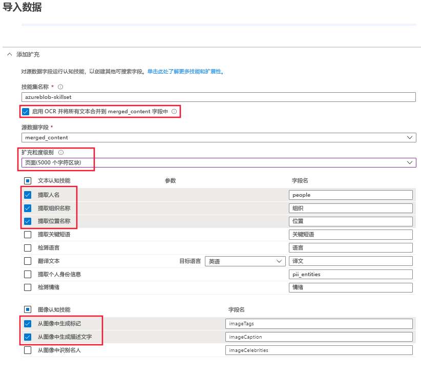

# 快速入门：使用技能和示例数据创建认知搜索管道

认知搜索（预览版）将数据提取、自然语言处理 (NLP) 和图像处理技能添加到 Azure 搜索索引管道，使不可搜索或非结构化的内容具有更高的可搜索性。 实体识别或图像分析等技能创建的信息将添加到 Azure 搜索中的索引。

本快速入门介绍如何在编写单行代码之前，在 [Azure 门户](https://portal.azure.com)中试用扩充管道：

* 从 Azure Blob 存储中的示例数据开始
* 为索引编制和扩充配置[导入数据向导](search-import-data-portal.md) 
* 运行向导（实体技能将检测人员、地点和组织）
* 使用[搜索浏览器](search-explorer.md)查询扩充的数据。

##  支持的区域

可在以下区域中创建的 Azure 搜索服务中试用认知搜索：

* 美国中西部
* 美国中南部
* 美国东部
* 美国东部 2
* 美国西部 2
* 加拿大中部
* 西欧
* 英国南部
* 北欧
* 巴西南部
* 东南亚
* 印度中部
* 澳大利亚东部

如果没有 Azure 订阅，请在开始之前创建一个[免费帐户](https://azure.microsoft.com/free/?WT.mc_id=A261C142F)。

> [!NOTE]
> 认知搜索目前提供公共预览版。 技能集执行以及图像的提取和规范化目前免费提供。 我们日后会公布这些功能的定价。 

## 先决条件

[什么是认知搜索？](cognitive-search-concept-intro.md) 介绍了扩充体系结构和组件。 

本场景专门使用了 Azure 服务。 创建所需的服务属于准备工作。

+ Azure Blob 存储提供源数据。
+ Azure 搜索处理数据引入和索引、认知搜索扩充以及全文搜索查询。

### 设置 Azure 搜索

首先注册 Azure 搜索服务。 

1. 转到 [Azure 门户](https://portal.azure.com)，使用 Azure 帐户登录。

1. 单击“创建资源”，搜索“Azure 搜索”，然后单击“创建”。 首次设置搜索服务时如需更多帮助，请参阅[在门户中创建 Azure 搜索服务](search-create-service-portal.md)。

  

1. 对于“资源组”，请创建一个资源组用于包含本快速入门中创建的所有资源。 这样可以在完成本快速入门后更轻松地清理资源。

1. 对于“位置”，请为认知搜索选择[支持的区域](#supported-regions)之一。

1. 对于“定价层”，可以创建“免费”服务来完成教程和快速入门。 要使用自己的数据进行更深入的调查，请创建一个[付费服务](https://azure.microsoft.com/pricing/details/search/)，例如“基本”或“标准”层的服务。 

  “免费”服务限制为 3 个索引、最大 16 MB 的 Blob 和 2 分钟的索引，这不足以演练认知搜索的完整功能。 要查看不同层的限制，请参阅[服务限制](search-limits-quotas-capacity.md)。

  > [!NOTE]
  > 认知搜索目前提供公共预览版。 技能集执行目前已在所有层中推出，包括免费层。 我们日后会公布此功能的定价。

1. 将服务固定到仪表板，以快速访问服务信息。

  

### 设置 Azure Blob 服务并加载示例数据

扩充管道从 [Azure 搜索索引器](search-indexer-overview.md)支持的 Azure 数据源提取数据。 本演练使用 Blob 存储来展示多种内容类型。

1. [下载示例数据](https://1drv.ms/f/s!As7Oy81M_gVPa-LCb5lC_3hbS-4)，其中包括不同类型的小型文件集。 

1. 注册 Azure Blob 存储，创建存储帐户，登录到存储资源管理器，并创建容器。 有关所有步骤的说明，请参阅 [Azure 存储资源管理器快速入门](../storage/blobs/storage-quickstart-blobs-storage-explorer.md)。

1. 使用 Azure 存储资源管理器，在创建的容器中单击“上传”以上传示例文件。

  

## 创建扩充管道

返回到 Azure 搜索服务仪表板页，单击命令栏上的“导入数据”，通过四个步骤设置扩展管道。

### 步骤 1：创建数据源

在“连接到数据” > “Azure Blob 存储”中，选择创建的帐户和容器。 为数据源命名，并对余下的设置使用默认值。 

   

单击“确定”创建数据源。

使用“导入数据”向导的优势之一在于，它还可以创建索引。 创建数据源后，向导会同时构造索引架构。 只需几秒钟就能创建索引。

### 步骤 2：添加认知技能

接下来，将扩充步骤添加到索引管道。 门户会提供图像分析和文本分析的预定义认知技能。 在门户中，技能集针对单个源字段运行。 这看上去像是一个小目标，但对于 Azure Blob 而言，`content` 字段包含大部分 Blob 文档（例如，Word 文档或 PowerPoint 幻灯片）。 因此，此字段是理想的输入，因为 Blob 的所有内容都包含在其中。

有时，你想要从主要由扫描图像组成的文件中提取文本表示形式，如由扫描仪生成的 PDF。 Azure 搜索可以自动从文档中的嵌入图像中提取内容。 为此，请选择“启用 OCR 并将所有文本合并到 merged_content 字段”选项。 这将自动创建一个 `merged_content` 字段，该字段包含从文档中提取的文本以及嵌入文档中的图像的文本表示形式。 选择此选项时，`Source data field` 将设置为 `merged_content`。

在“添加认知技能”中，选择执行自然语言处理的技能。 在本快速入门中，我们针对人员、组织和地点选择了实体识别。

单击“确定”接受定义。
   
  

自然语言处理技能针对示例数据集中的文本内容运行。 由于我们未选择图像处理选项，因此，本快速入门不会处理示例数据集中的 JPEG 文件。 

### 步骤 3：配置索引

是否记得我们使用数据源创建了索引？ 在此步骤中，我们可以查看该索引的架构，有时还能修改任何设置。 

在本快速入门中，向导能够很好地设置合理的默认值： 

+ 每个索引必须有一个名称。 对于此数据源类型，默认名称为 azureblob-index。

+ 每个文档必须有一个键。 向导会选择具有唯一值的字段。 在本快速入门中，键为 metadata_storage_path。

+ 每个字段集合必须包含字段，字段中的数据类型描述集合的值；每个字段应包含索引特性，用于描述如何在搜索方案中使用该字段。 

由于已定义技能集，因此向导假设需要源数据字段，以及技能创建的输出字段。 为此，门户为 `content`、`people`、`organizations` 和 `locations` 添加了索引字段。 请注意，向导会自动对这些字段启用 Retrievable 和 Searchable。

在“自定义索引”，查看字段中的特性，以了解字段在索引中的使用方式。 Searchable 表示字段可搜索。 Retrievable 表示可以在结果中返回该字段。 

考虑从 `content` 字段中清除 Retrievable。 在 Blob 中，此字段可能跨数千行，因此很难在“搜索浏览器”等工具中阅读。

单击“确定”接受索引定义。

  

> [!NOTE]
> 为简洁起见，未使用的字段已从屏幕截图中截掉。 如果在门户中操作，列表会显示其他字段。

### 步骤 4：配置索引器

索引器是推动索引过程的高级资源。 它指定数据源名称、索引和执行频率。 “导入数据”向导的最终结果始终是一个可以反复运行的索引器。

在“索引器”页中，为索引器命名，并使用默认设置“运行一次”来立即运行它。 

  

单击“确定”导入、扩充数据并为其编制索引。

  

索引编制和扩充可能需要一段时间，正因如此，我们建议事先探索小型数据集。 可以在 Azure 门户的“通知”页中监视索引。 

## 搜索浏览器中的查询

创建索引后，可以提交查询以返回索引中的文档。 在门户中，使用“搜索浏览器”来运行查询并查看结果。 

1. 在搜索服务仪表板页上，单击命令栏上的“搜索浏览器”。

1. 选择顶部的“更改索引”，选择创建的索引。

1. 输入要在其中查询索引的搜索字符串，例如“John F. Kennedy”。

随后会返回 JSON 格式的结果。这些结果可能非常冗长且难以阅读，尤其是出现在源自 Azure Blob 的大型文档中时。 

如果无法轻松扫描结果，请使用 CTRL-F 在文档中搜索。 对于此查询，可以在 JSON 中搜索“John F. Kennedy”，以查看该搜索词的实例。 

CTRL-F 还有助于确定有多少个文档包含在给定的结果集中。 对于 Azure Blob，门户会选择“metadata_storage_path”作为键，因为每个值是文档的唯一值。 使用 CTRL-F 搜索“metadata_storage_path”，获取文档的计数。 对于此查询，结果集中的两个文档包含搜索词“John F. Kennedy”。

  

## 要点

现已完成第一个扩充索引练习。 本快速入门旨在介绍重要概念，并引导你完成向导中的操作，以便使用自己的数据为认知搜索解决方案快速建立原型。

我们希望学习的某些重要概念也涉及到了 Azure 数据源的依赖关系。 认知搜索扩充与索引器密切相关，而索引器特定于 Azure 和源。 尽管本快速入门使用的是 Azure Blob 存储，但也可以使用其他 Azure 数据源。 有关详细信息，请参阅 [Azure 搜索中的索引器](search-indexer-overview.md)。

另一个重要概念是技能针对输入字段运行。 在门户中，必须为所有技能选择单个源字段。 在代码中，输入可以是其他字段，或上游技能的输出。

 技能的输入将映射到索引中的输出字段。 在内部，门户将设置[批注](cognitive-search-concept-annotations-syntax.md)并定义[技能集](cognitive-search-defining-skillset.md)，以建立操作顺序和常规流。 这些步骤隐藏在门户中，但开始编写代码时，这些概念就很重要。

最后，本快速入门提到可以通过查询索引来查看结果。 Azure 搜索最终提供的结果是一个可搜索的索引，可以[简单](https://docs.microsoft.com/rest/api/searchservice/simple-query-syntax-in-azure-search)或[全面扩展的查询语法](https://docs.microsoft.com/rest/api/searchservice/lucene-query-syntax-in-azure-search)来查询它。 包含扩充字段的索引与其他任何索引类似。 若要合并标准或[自定义分析器](search-analyzers.md)、[评分配置文件](https://docs.microsoft.com/rest/api/searchservice/add-scoring-profiles-to-a-search-index)、[同义词](search-synonyms.md)、[分面筛选器](search-filters-facets.md)、异地搜索或其他任何 Azure 搜索功能，完全可以这样做。

## 清理资源

完成探索后，最快的清理方式是删除包含 Azure 搜索服务和 Azure Blob 服务的资源组。  

假设已将这两个服务放在同一个组中，则删除该资源组会永久删除其中的所有内容，包括在本练习中创建的服务和任何存储内容。 在门户中，资源组名称显示在每个服务的“概述”页上。

## 后续步骤

可以结合不同的技能和源数据字段，通过重新运行该向导来体验索引和扩充功能。 若要重复步骤，请删除索引和索引器，然后使用新的选项组合重新创建索引器。

+ 在“概述” > “索引”中选择创建的索引，然后单击“删除”。

+ 在“概述”中，双击“索引器”磁贴。 找到创建的索引器并将其删除。

或者，重复使用示例数据和创建的服务，通过下一篇教程了解如何以编程方式执行相同的任务。 

> [!div class="nextstepaction"]
> [教程：了解认知搜索 REST API](cognitive-search-tutorial-blob.md)
