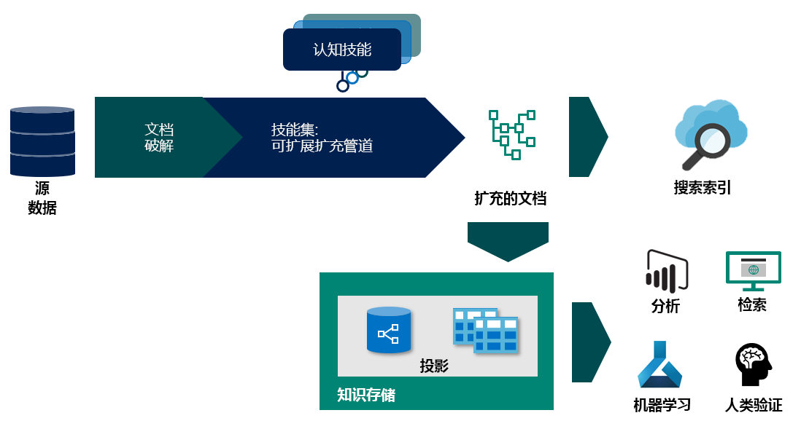

# <a name="skillset-concepts-and-composition-in-azure-cognitive-search"></a>Azure 认知搜索中的技能组合概念和组合

本文面向需要更深入地了解扩充管道工作方式的开发人员，并假设您对 AI 扩充过程有一个概念了解。 如果你是新的概念，请从开始：
+ [Azure 认知搜索中的 AI 扩充](cognitive-search-concept-intro.md)
+ [知识存储（预览版）](knowledge-store-concept-intro.md)

## <a name="specify-the-skillset"></a>指定技能集
技能组合是 Azure 认知搜索中可重复使用的资源，它指定在索引期间用于分析、转换和浓缩文本或图像内容的认知技能的集合。 通过创建技能集，可以在数据引入阶段附加文本和图像扩充，并从原始内容提取和创建新的信息与结构。

技能集有三个属性：

+   ```skills```，技能的无序集合，平台将根据每项技能所需的输入来确定这些技能的执行顺序
+   ```cognitiveServices```，为调用的认知技能计费所需的认知服务密钥
+   ```knowledgeStore```，要将扩充的文档投影到的存储帐户


技能集是以 JSON 格式创作的。 可以使用[表达式语言](https://docs.microsoft.com/azure/search/cognitive-search-skill-conditional)生成包含循环和[分支](https://docs.microsoft.com/azure/search/cognitive-search-skill-conditional)的复杂技能集。 表达式语言使用 [JSON 指针](https://tools.ietf.org/html/rfc6901)路径表示法，做出少量的修改来标识扩充树中的节点。 ```"/"``` 遍历树中的较低级别，```"*"``` 充当上下文中的 for-each 运算符。 我们将通过一个示例来全面描述这些概念。 为了演示某些概念和功能，我们将演练[酒店评论示例](knowledge-store-connect-powerbi.md)技能集。 若要在遵循导入数据工作流后查看技能集，需要使用 REST API 客户端来[获取技能集](https://docs.microsoft.com/rest/api/searchservice/get-skillset)。

### <a name="enrichment-tree"></a>扩充树

为了构想技能集如何逐步扩充文档，让我们先从文档在扩充之前的外观着手。 文档破解的输出取决于数据源以及所选的特定分析模式。 这也是在将数据添加到搜索索引时，[字段映射](search-indexer-field-mappings.md)可从中探寻内容来源的文档的状态。


将文档放入扩充管道后，它将表示为内容和关联扩充内容的树。 此树实例化为文档破解的输出。 扩充管道可以使用扩充树格式将元数据附加到平整基元数据类型。扩充树格式不是有效的 JSON 对象，但可以投影为有效的 JSON 格式。 下表显示了进入扩充管道的文档的状态：

|数据源\分析模式|默认|JSON、JSON 行 和 CSV|
|---|---|---|
|Blob 存储|/document/content<br>/document/normalized_images/*<br>…|/document/{key1}<br>/document/{key2}<br>…|
|SQL|/document/{column1}<br>/document/{column2}<br>…|不适用 |
|Cosmos DB|/document/{key1}<br>/document/{key2}<br>…|不适用|

 技能在执行时，会将新节点添加到扩充树。 然后，这些新节点可用作下游技能的输入、投影到知识存储，或映射到索引字段。 扩充是不可变的：创建节点后无法对其进行编辑。 随着技能集变得越来越复杂，扩充树也会更加复杂，但是，并非扩充树中的所有节点都需要将扩充保存到索引或知识存储中。 你可以选择性地将一部分扩充保存到索引或知识存储中。

你可以选择性地将一部分扩充保存到索引或知识存储中。
本文档的余下内容假设使用的是[酒店评论示例](https://docs.microsoft.com/azure/search/knowledge-store-connect-powerbi)，但相同的概念也适用于从所有其他数据源扩充文档。

### <a name="context"></a>上下文
每个技能都需要一个上下文。 上下文确定：
+   根据所选节点执行技能的次数。 对于类型集合的上下文值，在末尾添加 ```/*``` 会导致为该集合中的每个实例调用技能一次。 
+   在扩充树中添加技能输出的位置。 输出始终作为上下文节点的子级添加到树中。 
+   输入的形状。 对于多级别集合，将上下文设置为父集合会影响技能的输入形状。 例如，如果某个扩充树包含国家/地区列表，其中的每个国家/地区已使用包含邮政编码列表的州/省列表进行扩充。

|上下文|输入|输入的形状|技能调用|
|---|---|---|---|
|```/document/countries/*``` |```/document/countries/*/states/*/zipcodes/*``` |国家/地区中所有邮政编码的列表 |对每个国家/地区调用一次 |
|```/document/countries/*/states/*``` |```/document/countries/*/states/*/zipcodes/*``` |州/省中邮政编码的列表 | 对每个国家/地区和州/省的组合调用一次|

### <a name="sourcecontext"></a>SourceContext

`sourceContext` 仅在[整形程序技能](cognitive-search-skill-shaper.md)和[投影](knowledge-store-projection-overview.md)中使用。 它用于构造多级别嵌套对象。 `sourceContext` 可用于构造分层的匿名类型对象，如果你仅使用上下文，则需要多个技能。 下一部分将使用 `sourceContext`。

### <a name="projections"></a>投影

投影是从扩充树中选择要保存到知识存储的节点的过程。 投影是可输出为表或对象投影的文档（内容和扩充）的自定义形状。 若要详细了解如何使用投影，请参阅[使用投影](knowledge-store-projection-overview.md)。


上图描绘了根据你在扩充管道中的位置使用的选择器。

## <a name="generate-enriched-data"></a>生成扩充数据 

现在，让我们逐步了解酒店评论技能集；可以遵循该[教程](knowledge-store-connect-powerbi.md)创建技能集或[查看](https://github.com/Azure-Samples/azure-search-postman-samples/blob/master/samples/skillset.json)技能集。 我们将会探讨：

* 扩充树如何随着每个技能的执行而演变 
* 如何结合上下文和输入来确定技能的执行次数 
* 哪种输入形状基于上下文。 

由于我们使用的是索引器的分隔文本分析模式，因此扩充过程中的某个文档表示 CSV 文件中的单个行。

### <a name="skill-1-split-skill"></a>技能 #1：拆分技能 


此技能使用 ```"/document/reviews_text"``` 的技能上下文对 `reviews_text` 执行一次。 技能输出是一个列表，其中的 `reviews_text` 分块成包含 5000 个字符的段。 拆分技能的输出名为 `pages`，将添加到扩充树。 使用 `targetName` 功能可以在将技能输出添加到扩充树之前对其重命名。

现在，扩充树的技能上下文下包含一个新节点。 此节点可用于任何技能、投影或输出字段映射。


所有扩充的根节点是 `"/document"`。 使用 Blob 索引器时，`"/document"` 节点包含 `"/document/content"` 和 `"/document/normalized_images"` 的子节点。 使用 CSV 数据时（如本示例所示），列名称将映射到 `"/document"` 下的节点。 若要访问由技能添加到节点的任何扩充，需要使用扩充的完整路径。 例如，若要使用 ```pages``` 节点中的文本作为另一技能的输入，需将该节点指定为 ```"/document/reviews_text/pages/*"```。
 
 

### <a name="skill-2-language-detection"></a>技能 #2 语言检测
 尽管语言检测技能是技能集中定义的第三个技能（技能 #3），但它是下一个要执行的技能。 由于它不会受到阻止（无需输入），因此它将与前一个技能同时执行。 与前面的拆分技能一样，语言检测技能也只对每个文档调用一次。 扩充树现在包含新的语言节点。
 

上述树中的连接器颜色指示扩充由不同的技能创建，节点需要单独寻址，并且在选择父节点时不会成为返回的对象部分。

## <a name="save-enrichments-in-a-knowledge-store"></a>将扩充保存到知识存储中 

技能集还会定义一个知识存储，可在其中将扩充的文档投影为表或对象。 若要将扩充数据保存到知识存储中，可为扩充的文档定义一组投影。 若要了解有关知识库的详细信息，请参阅[知识 store 概述](knowledge-store-concept-intro.md)

### <a name="slicing-projections"></a>切片投影

定义表投影组时，可将扩充树中的单个节点切片为多个相关表。 如果添加的表的源路径是现有表投影的子级，则生成的子节点将不是现有表投影的子级，而会投影到新的相关表。 借助此切片技术，可以使用整形程序技能定义单个节点，该节点可以用作所有表投影的源。 

### <a name="shaping-projections"></a>整形投影

可通过两种方式来定义投影。 可以使用整形程序技能来创建一个新节点，该节点可充当所要投影的所有扩充的根节点。 然后，在投影中，只需引用整形程序技能的输出。 还可以在投影定义本身中内联投影整形。

整形程序方法比内联整形更繁琐，但可确保扩充树的所有变换都包含在技能中，并确保输出是可重用的对象。 内联整形可让你创建所需的形状，但它是一个匿名对象，仅适用于为它定义的投影。 这些方法可以结合使用，也可以单独使用。 在门户工作流中创建的技能集包含这两种方法。 该技能集对表投影使用整形程序技能，但同时使用内联整形来投影关键短语表。

为了延伸该示例，可以选择删除内联整形，并使用整形程序技能为关键短语创建新节点。 若要创建投影到三个表（即 `hotelReviewsDocument`、`hotelReviewsPages` 和 `hotelReviewsKeyPhrases`）的形状，请使用后续部分所述的两个选项。


#### <a name="shaper-skill-and-projection"></a>整形程序技能和投影 

> [!Note]
> 为简洁起见，本示例中已删除了文档表中的某些列。
>
```json
{
    "@odata.type": "#Microsoft.Skills.Util.ShaperSkill",
    "name": "#5",
    "description": null,
    "context": "/document",
    "inputs": [        
        {
            "name": "reviews_text",
            "source": "/document/reviews_text",
            "sourceContext": null,
            "inputs": []
        },
        {
            "name": "reviews_title",
            "source": "/document/reviews_title",
            "sourceContext": null,
            "inputs": []
        },
        {
            "name": "AzureSearch_DocumentKey",
            "source": "/document/AzureSearch_DocumentKey",
            "sourceContext": null,
            "inputs": []
        },  
        {
            "name": "pages",
            "source": null,
            "sourceContext": "/document/reviews_text/pages/*",
            "inputs": [
                {
                    "name": "SentimentScore",
                    "source": "/document/reviews_text/pages/*/Sentiment",
                    "sourceContext": null,
                    "inputs": []
                },
                {
                    "name": "LanguageCode",
                    "source": "/document/Language",
                    "sourceContext": null,
                    "inputs": []
                },
                {
                    "name": "Page",
                    "source": "/document/reviews_text/pages/*",
                    "sourceContext": null,
                    "inputs": []
                },
                {
                    "name": "keyphrase",
                    "sourceContext": "/document/reviews_text/pages/*/Keyphrases/*",
                    "inputs": [
                        {
                            "source": "/document/reviews_text/pages/*/Keyphrases/*",
                            "name": "Keyphrases"
                        }
                    ]
                }
            ]
        }
    ],
    "outputs": [
        {
            "name": "output",
            "targetName": "tableprojection"
        }
    ]
}
```

使用上述 `tableprojection` 节中定义的 `outputs` 节点，我们现在可以使用切片功能将 `tableprojection` 节点的部分投影到不同的表：

> [!Note]
> 这只是知识存储配置中的一个投影片段。
>
```json
"projections": [
    {
        "tables": [
            {
                "tableName": "hotelReviewsDocument",
                "generatedKeyName": "Documentid",
                "source": "/document/tableprojection"
            },
            {
                "tableName": "hotelReviewsPages",
                "generatedKeyName": "Pagesid",
                "source": "/document/tableprojection/pages/*"
            },
            {
                "tableName": "hotelReviewsKeyPhrases",
                "generatedKeyName": "KeyPhrasesid",
                "source": "/document/tableprojection/pages/*/keyphrase/*"
            }
        ]
    }
]
```

#### <a name="inline-shaping-projections"></a>内联整形投影

内嵌整形方法不需要整形程序技能，因为投影所需的所有形状只在有必要时才会创建。 若要投影与上一个示例相同的数据，可使用如下所示的内联投影选项：

```json
"projections": [
    {
        "tables": [
            {
                "tableName": "hotelReviewsInlineDocument",
                "generatedKeyName": "Documentid",
                "sourceContext": "/document",     
                "inputs": [
                    {
                        "name": "reviews_text",
                        "source": "/document/reviews_text"
                    },
                    {
                        "name": "reviews_title",
                        "source": "/document/reviews_title"
                    },
                    {
                        "name": "AzureSearch_DocumentKey",
                        "source": "/document/AzureSearch_DocumentKey"
                    }                             
                ]
            },
            {
                "tableName": "hotelReviewsInlinePages",
                "generatedKeyName": "Pagesid",
                "sourceContext": "/document/reviews_text/pages/*",
                "inputs": [
                        {
                    "name": "SentimentScore",
                    "source": "/document/reviews_text/pages/*/Sentiment"
                    },
                    {
                        "name": "LanguageCode",
                        "source": "/document/Language"
                    },
                    {
                        "name": "Page",
                        "source": "/document/reviews_text/pages/*"
                    }
                ]
            },
            {
                "tableName": "hotelReviewsInlineKeyPhrases",
                "generatedKeyName": "KeyPhraseId",
                "sourceContext": "/document/reviews_text/pages/*/Keyphrases/*",
                "inputs": [
                    {
                        "name": "Keyphrases",
                        "source": "/document/reviews_text/pages/*/Keyphrases/*"
                    }
                ]
            }
        ]
    }
]
```
  
使用这两种方法后，可以观察如何使用 `"Keyphrases"` 来投影 `"sourceContext"` 的值。 包含字符串集合的 `"Keyphrases"` 节点本身是页文本的子级。 但是，由于投影需要 JSON 对象并且页是基元（字符串），因此使用了 `"sourceContext"` 将关键短语包装为具有命名属性的对象。 使用此技术可以单独投影平整基元。

## <a name="next-steps"></a>后续步骤

接下来，请创建包含认知技能的第一个技能集。

> [!div class="nextstepaction"]
> [创建第一个技能集](cognitive-search-defining-skillset.md)。
