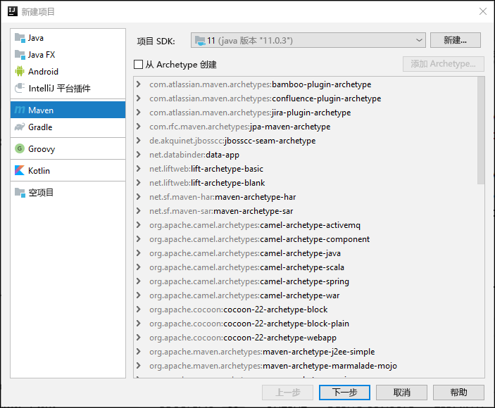
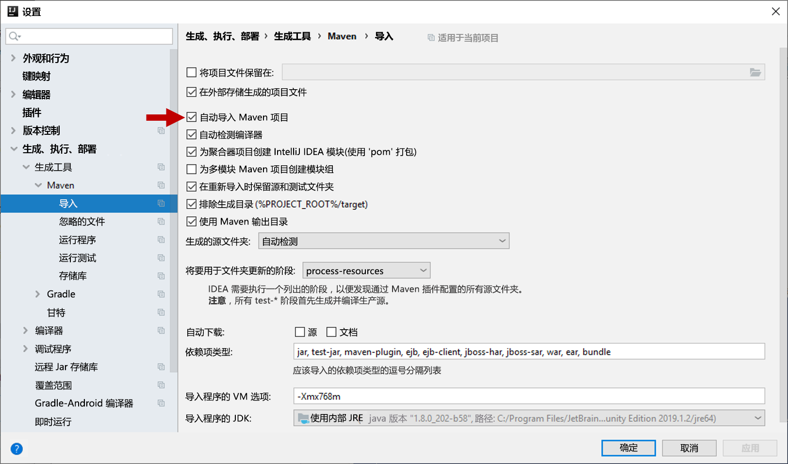
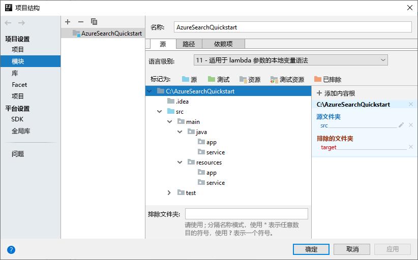
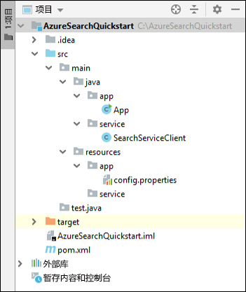
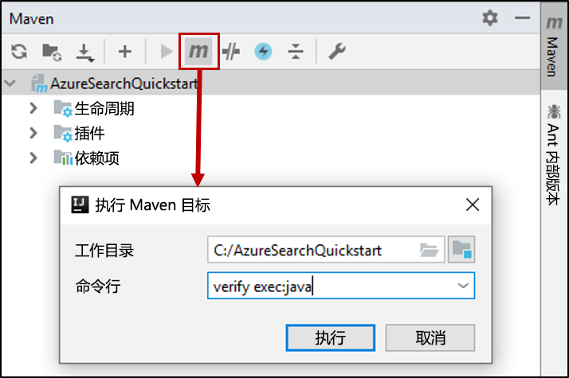

# <a name="quickstart-create-an-azure-cognitive-search-index-in-java-using-rest-apis"></a>快速入门：使用 REST API 在 Java 中创建 Azure 认知搜索索引
> [!div class="op_single_selector"]
> * [JavaScript](search-get-started-nodejs.md)
> * [C#](search-get-started-dotnet.md)
> * [Java](search-get-started-java.md)
> * [门户](search-get-started-portal.md)
> * [PowerShell](search-create-index-rest-api.md)
> * [Python](search-get-started-python.md)
> * [Postman](search-get-started-postman.md)

创建一个 Java 控制台应用程序，该应用程序使用 [IntelliJ](https://www.jetbrains.com/idea/)、[Java 11 SDK](/java/azure/jdk/?view=azure-java-stable) 和 [Azure 认知搜索 REST API](/rest/api/searchservice/) 创建、加载和查询搜索索引。 本文提供了有关创建应用程序的分步说明。 此外，还可以[下载并运行完整的应用程序](/samples/azure-samples/azure-search-java-samples/java-sample-quickstart/)。

如果没有 Azure 订阅，请在开始之前创建一个[免费帐户](https://azure.microsoft.com/free/?WT.mc_id=A261C142F)。

## <a name="prerequisites"></a>先决条件

我们使用了以下软件和服务来构建和测试本快速入门：

+ [IntelliJ IDEA](https://www.jetbrains.com/idea/)

+ [Java 11 SDK](/java/azure/jdk/?view=azure-java-stable)

+ [创建 Azure 认知搜索服务](search-create-service-portal.md)或在当前订阅下[查找现有服务](https://ms.portal.azure.com/#blade/HubsExtension/BrowseResourceBlade/resourceType/Microsoft.Search%2FsearchServices)。 可以使用本快速入门的免费服务。

<a name="get-service-info"></a>

## <a name="get-a-key-and-url"></a>获取密钥和 URL

对服务的调用要求每个请求都有一个 URL 终结点和一个访问密钥。 搜索服务是使用这二者创建的，因此，如果向订阅添加了 Azure 认知搜索，则请按以下步骤获取必需信息：

1. [登录到 Azure 门户](https://portal.azure.com/)，在搜索服务的“概述”页中获取 URL。  示例终结点可能类似于 `https://mydemo.search.windows.net`。

2. 在“设置” > “密钥”中，获取有关该服务的完全权限的管理员密钥   。 有两个可交换的管理员密钥，为保证业务连续性而提供，以防需要滚动一个密钥。 可以在请求中使用主要或辅助密钥来添加、修改和删除对象。

   也可以创建查询密钥。 最好使用只读权限发出查询请求。


发送到服务的每个请求都需要一个 API 密钥。 具有有效的密钥可以在发送请求的应用程序与处理请求的服务之间建立信任关系，这种信任关系以每个请求为基础。

## <a name="set-up-your-environment"></a>设置你的环境

首先打开 IntelliJ IDEA 并设置一个新项目。

### <a name="create-the-project"></a>创建项目

1. 打开 IntelliJ IDEA，选择“创建新项目”。 
1. 选择“Maven”。 
1. 在“项目 SDK”列表中选择“Java 11 SDK”。 

     

1. 对于“GroupId”和“ArtifactId”，请输入 `AzureSearchQuickstart`。  
1. 接受剩余的默认值以打开项目。

### <a name="specify-maven-dependencies"></a>指定 Maven 依赖项

1. 选择“文件” > “设置”。  
1. 在“设置”窗口中，选择“生成、执行、部署” > “生成工具” > “Maven” > “导入”。     
1. 选中“自动导入 Maven 项目”复选框，然后单击“确定”关闭窗口。   在下一步骤中更新 pom.xml 文件时，Maven 插件和其他依赖项将自动同步。

    

1. 打开 pom.xml 文件，将内容替换为以下 Maven 配置详细信息。 这些信息包括对 [Exec Maven 插件](https://www.mojohaus.org/exec-maven-plugin/)和 [JSON 接口 API](https://javadoc.io/doc/org.glassfish/javax.json/1.0.2) 的引用

    ```xml
    <?xml version="1.0" encoding="UTF-8"?>
    <project xmlns="http://maven.apache.org/POM/4.0.0"
             xmlns:xsi="http://www.w3.org/2001/XMLSchema-instance"
             xsi:schemaLocation="http://maven.apache.org/POM/4.0.0 http://maven.apache.org/xsd/maven-4.0.0.xsd">
        <modelVersion>4.0.0</modelVersion>
    
        <groupId>AzureSearchQuickstart</groupId>
        <artifactId>AzureSearchQuickstart</artifactId>
        <version>1.0-SNAPSHOT</version>
        <build>
            <sourceDirectory>src</sourceDirectory>
            <plugins>
                <plugin>
                    <artifactId>maven-compiler-plugin</artifactId>
                    <version>3.1</version>
                    <configuration>
                        <source>11</source>
                        <target>11</target>
                    </configuration>
                </plugin>
                <plugin>
                    <groupId>org.codehaus.mojo</groupId>
                    <artifactId>exec-maven-plugin</artifactId>
                    <version>1.6.0</version>
                    <executions>
                        <execution>
                            <goals>
                                <goal>exec</goal>
                            </goals>
                        </execution>
                    </executions>
                    <configuration>
                        <mainClass>main.java.app.App</mainClass>
                        <cleanupDaemonThreads>false</cleanupDaemonThreads>
                    </configuration>
                </plugin>
            </plugins>
        </build>
        <dependencies>
            <dependency>
                <groupId>org.glassfish</groupId>
                <artifactId>javax.json</artifactId>
                <version>1.0.2</version>
            </dependency>
        </dependencies>   
    </project>
    ```

### <a name="set-up-the-project-structure"></a>设置项目结构

1. 选择“文件” > “项目结构”。  
1. 选择“模块”，展开源树以访问 `src` >  `main` 文件夹的内容。 
1. 在 `src` >  `main` > `java` 文件夹中添加 `app` 和 `service` 文件夹。 为此，请选择 `java` 文件夹，按 Alt + Insert，然后输入文件夹名称。
1. 在 `src` >  `main` >`resources` 文件夹中添加 `app` 和 `service` 文件夹。

    完成后，项目树应如下图所示。

    

1. 单击“确定”关闭窗口。 

### <a name="add-azure-cognitive-search-service-information"></a>添加 Azure 认知搜索服务信息

1. 在“项目”窗口中，展开源树以访问 `src` >  `main` >`resources` > `app` 文件夹，并添加 `config.properties` 文件。  为此，请选择 `app` 文件夹，按 Alt + Insert，选择“文件”，然后输入文件名。 

1. 将以下设置复制到新文件中，并将 `<YOUR-SEARCH-SERVICE-NAME>`、`<YOUR-ADMIN-KEY>` 和 `<YOUR-QUERY-KEY>` 替换为自己的服务名称和密钥。 如果服务终结点是 `https://mydemo.search.windows.net`，则服务名称为“mydemo”。

    ```java
        SearchServiceName=<YOUR-SEARCH-SERVICE-NAME>
        SearchServiceAdminKey=<YOUR-ADMIN-KEY>
        SearchServiceQueryKey=<YOUR-QUERY-KEY>
        IndexName=hotels-quickstart
        ApiVersion=2019-05-06
    ```

### <a name="add-the-main-method"></a>添加主方法

1. 在 `src` >  `main` > `java` > `app` 文件夹中添加 `App` 类。 为此，请选择 `app` 文件夹，按 Alt + Insert，选择“Java 类”，然后输入类名。 
1. 打开 `App` 类，将内容替换为以下代码。 此代码包含 `main` 方法。 

    取消注释的代码将读取搜索服务参数，并使用这些参数来创建搜索服务客户端的实例。 我们将在下一部分添加搜索服务客户端代码。

    此类中带注释的代码将在本快速入门的稍后部分取消注释。

    ```java
    package main.java.app;
    
    import main.java.service.SearchServiceClient;
    import java.io.IOException;
    import java.util.Properties;
    
    public class App {
    
        private static Properties loadPropertiesFromResource(String resourcePath) throws IOException {
            var inputStream = App.class.getResourceAsStream(resourcePath);
            var configProperties = new Properties();
            configProperties.load(inputStream);
            return configProperties;
        }
    
        public static void main(String[] args) {
            try {
                var config = loadPropertiesFromResource("/app/config.properties");
                var client = new SearchServiceClient(
                        config.getProperty("SearchServiceName"),
                        config.getProperty("SearchServiceAdminKey"),
                        config.getProperty("SearchServiceQueryKey"),
                        config.getProperty("ApiVersion"),
                        config.getProperty("IndexName")
                );
    
    
    //Uncomment the next 3 lines in the 1 - Create Index section of the quickstart
    //            if(client.indexExists()){ client.deleteIndex();}
    //            client.createIndex("/service/index.json");
    //            Thread.sleep(1000L); // wait a second to create the index
    
    //Uncomment the next 2 lines in the 2 - Load Documents section of the quickstart
    //            client.uploadDocuments("/service/hotels.json");
    //            Thread.sleep(2000L); // wait 2 seconds for data to upload
    
    //Uncomment the following 5 search queries in the 3 - Search an index section of the quickstart
    //            // Query 1
    //            client.logMessage("\n*QUERY 1****************************************************************");
    //            client.logMessage("Search for: Atlanta'");
    //            client.logMessage("Return: All fields'");
    //            client.searchPlus("Atlanta");
    //
    //            // Query 2
    //            client.logMessage("\n*QUERY 2****************************************************************");
    //            client.logMessage("Search for: Atlanta");
    //            client.logMessage("Return: HotelName, Tags, Address");
    //            SearchServiceClient.SearchOptions options2 = client.createSearchOptions();
    //            options2.select = "HotelName,Tags,Address";
    //            client.searchPlus("Atlanta", options2);
    //
    //            //Query 3
    //            client.logMessage("\n*QUERY 3****************************************************************");
    //            client.logMessage("Search for: wifi & restaurant");
    //            client.logMessage("Return: HotelName, Description, Tags");
    //            SearchServiceClient.SearchOptions options3 = client.createSearchOptions();
    //            options3.select = "HotelName,Description,Tags";
    //            client.searchPlus("wifi,restaurant", options3);
    //
    //            // Query 4 -filtered query
    //            client.logMessage("\n*QUERY 4****************************************************************");
    //            client.logMessage("Search for: all");
    //            client.logMessage("Filter: Ratings greater than 4");
    //            client.logMessage("Return: HotelName, Rating");
    //            SearchServiceClient.SearchOptions options4 = client.createSearchOptions();
    //            options4.filter="Rating%20gt%204";
    //            options4.select = "HotelName,Rating";
    //            client.searchPlus("*",options4);
    //
    //            // Query 5 - top 2 results, ordered by
    //            client.logMessage("\n*QUERY 5****************************************************************");
    //            client.logMessage("Search for: boutique");
    //            client.logMessage("Get: Top 2 results");
    //            client.logMessage("Order by: Rating in descending order");
    //            client.logMessage("Return: HotelId, HotelName, Category, Rating");
    //            SearchServiceClient.SearchOptions options5 = client.createSearchOptions();
    //            options5.top=2;
    //            options5.orderby = "Rating%20desc";
    //            options5.select = "HotelId,HotelName,Category,Rating";
    //            client.searchPlus("boutique", options5);
    
            } catch (Exception e) {
                System.err.println("Exception:" + e.getMessage());
                e.printStackTrace();
            }
        }
    }
    ```

### <a name="add-the-http-operations"></a>添加 HTTP 操作

1. 在 `src` >  `main` > `java` > `service` 文件夹中添加 `SearchServiceClient` 类。 为此，请选择 `service` 文件夹，按 Alt + Insert，选择“Java 类”，然后输入类名。 
1. 打开 `SearchServiceClient` 类，将内容替换为以下代码。 此代码提供使用 Azure 认知搜索 REST API 所需的 HTTP 操作。 在稍后的部分将会添加用于创建索引、上传文档和查询索引的其他方法。

    ```java
    package main.java.service;

    import javax.json.Json;
    import javax.net.ssl.HttpsURLConnection;
    import java.io.IOException;
    import java.io.StringReader;
    import java.net.HttpURLConnection;
    import java.net.URI;
    import java.net.http.HttpClient;
    import java.net.http.HttpRequest;
    import java.net.http.HttpResponse;
    import java.nio.charset.StandardCharsets;
    import java.util.Formatter;
    import java.util.function.Consumer;
    
        /* This class is responsible for implementing HTTP operations for creating the index, uploading documents and searching the data*/
        public class SearchServiceClient {
            private final String _adminKey;
            private final String _queryKey;
            private final String _apiVersion;
            private final String _serviceName;
            private final String _indexName;
            private final static HttpClient client = HttpClient.newHttpClient();
    
        public SearchServiceClient(String serviceName, String adminKey, String queryKey, String apiVersion, String indexName) {
            this._serviceName = serviceName;
            this._adminKey = adminKey;
            this._queryKey = queryKey;
            this._apiVersion = apiVersion;
            this._indexName = indexName;
        }

        private static HttpResponse<String> sendRequest(HttpRequest request) throws IOException, InterruptedException {
            logMessage(String.format("%s: %s", request.method(), request.uri()));
            return client.send(request, HttpResponse.BodyHandlers.ofString());
        }

        private static URI buildURI(Consumer<Formatter> fmtFn)
                {
                    Formatter strFormatter = new Formatter();
                    fmtFn.accept(strFormatter);
                    String url = strFormatter.out().toString();
                    strFormatter.close();
                    return URI.create(url);
        }
    
        public static void logMessage(String message) {
            System.out.println(message);
        }
    
        public static boolean isSuccessResponse(HttpResponse<String> response) {
            try {
                int responseCode = response.statusCode();
    
                logMessage("\n Response code = " + responseCode);
    
                if (responseCode == HttpURLConnection.HTTP_OK || responseCode == HttpURLConnection.HTTP_ACCEPTED
                        || responseCode == HttpURLConnection.HTTP_NO_CONTENT || responseCode == HttpsURLConnection.HTTP_CREATED) {
                    return true;
                }
    
                // We got an error
                var msg = response.body();
                if (msg != null) {
                    logMessage(String.format("\n MESSAGE: %s", msg));
                }
    
            } catch (Exception e) {
                e.printStackTrace();
            }
    
            return false;
        }
    
        public static HttpRequest httpRequest(URI uri, String key, String method, String contents) {
            contents = contents == null ? "" : contents;
            var builder = HttpRequest.newBuilder();
            builder.uri(uri);
            builder.setHeader("content-type", "application/json");
            builder.setHeader("api-key", key);
    
            switch (method) {
                case "GET":
                    builder = builder.GET();
                    break;
                case "HEAD":
                    builder = builder.GET();
                    break;
                case "DELETE":
                    builder = builder.DELETE();
                    break;
                case "PUT":
                    builder = builder.PUT(HttpRequest.BodyPublishers.ofString(contents));
                    break;
                case "POST":
                    builder = builder.POST(HttpRequest.BodyPublishers.ofString(contents));
                    break;
                default:
                    throw new IllegalArgumentException(String.format("Can't create request for method '%s'", method));
            }
            return builder.build();
        }
    }
    
    ```

### <a name="build-the-project"></a>生成项目

1. 验证项目是否采用以下结构。

    

1. 打开“Maven”工具窗口并执行以下 Maven 目标：  `verify exec:java`


处理完成后，查看后接零 (0) 退出代码的 BUILD SUCCESS 消息。

## <a name="1---create-index"></a>1 - 创建索引

hotels 索引定义包含简单字段和一个复杂字段。 例如，“酒店名称”或“说明”是简单字段。 “地址”字段是复杂字段，因为它包含“街道地址”和“城市”等子字段。 在本快速入门中，索引定义是使用 JSON 指定的。

1. 在“项目”窗口中，展开源树以访问 `src` >  `main` >`resources` > `service` 文件夹，并添加 `index.json` 文件。  为此，请选择 `app` 文件夹，按 Alt + Insert，选择“文件”，然后输入文件名。 

1. 打开 `index.json` 文件并插入以下索引定义。

    ```json
    {
      "name": "hotels-quickstart",
      "fields": [
        {
          "name": "HotelId",
          "type": "Edm.String",
          "key": true,
          "filterable": true
        },
        {
          "name": "HotelName",
          "type": "Edm.String",
          "searchable": true,
          "filterable": false,
          "sortable": true,
          "facetable": false
        },
        {
          "name": "Description",
          "type": "Edm.String",
          "searchable": true,
          "filterable": false,
          "sortable": false,
          "facetable": false,
          "analyzer": "en.lucene"
        },
        {
          "name": "Description_fr",
          "type": "Edm.String",
          "searchable": true,
          "filterable": false,
          "sortable": false,
          "facetable": false,
          "analyzer": "fr.lucene"
        },
        {
          "name": "Category",
          "type": "Edm.String",
          "searchable": true,
          "filterable": true,
          "sortable": true,
          "facetable": true
        },
        {
          "name": "Tags",
          "type": "Collection(Edm.String)",
          "searchable": true,
          "filterable": true,
          "sortable": false,
          "facetable": true
        },
        {
          "name": "ParkingIncluded",
          "type": "Edm.Boolean",
          "filterable": true,
          "sortable": true,
          "facetable": true
        },
        {
          "name": "LastRenovationDate",
          "type": "Edm.DateTimeOffset",
          "filterable": true,
          "sortable": true,
          "facetable": true
        },
        {
          "name": "Rating",
          "type": "Edm.Double",
          "filterable": true,
          "sortable": true,
          "facetable": true
        },
        {
          "name": "Address",
          "type": "Edm.ComplexType",
          "fields": [
            {
              "name": "StreetAddress",
              "type": "Edm.String",
              "filterable": false,
              "sortable": false,
              "facetable": false,
              "searchable": true
            },
            {
              "name": "City",
              "type": "Edm.String",
              "searchable": true,
              "filterable": true,
              "sortable": true,
              "facetable": true
            },
            {
              "name": "StateProvince",
              "type": "Edm.String",
              "searchable": true,
              "filterable": true,
              "sortable": true,
              "facetable": true
            },
            {
              "name": "PostalCode",
              "type": "Edm.String",
              "searchable": true,
              "filterable": true,
              "sortable": true,
              "facetable": true
            },
            {
              "name": "Country",
              "type": "Edm.String",
              "searchable": true,
              "filterable": true,
              "sortable": true,
              "facetable": true
            }
          ]
        }
      ]
    }
    ```

    索引名称为“hotels-quickstart”。 索引字段中的属性确定如何在应用程序中搜索已编制索引的数据。 例如，`IsSearchable` 属性必须分配给每个应包含在全文搜索中的字段。 若要详细了解属性，请参阅[字段集合与字段属性](search-what-is-an-index.md#fields-collection)。
    
    此索引中的 `Description` 字段使用可选的 `analyzer` 属性来重写默认的 Lucene 语言分析器。 `Description_fr` 字段使用法语 Lucene 分析器 `fr.lucene`，因为该字段存储法语文本。 `Description` 使用可选的 Microsoft 语言分析器 en.lucene。 若要详细了解分析器，请参阅 [Azure 认知搜索中用于文本处理的分析器](search-analyzers.md)。

1. 将以下代码添加到 `SearchServiceClient` 类。 这些方法生成 Azure 认知搜索 REST 服务 URL，而这些 URL 可用于创建和删除索引，并确定索引是否存在。 这些方法还发出 HTTP 请求。

    ```java
    public boolean indexExists() throws IOException, InterruptedException {
        logMessage("\n Checking if index exists...");
        var uri = buildURI(strFormatter -> strFormatter.format(
                "https://%s.search.windows.net/indexes/%s/docs?api-version=%s&search=*",
                _serviceName,_indexName,_apiVersion));
        var request = httpRequest(uri, _adminKey, "HEAD", "");
        var response = sendRequest(request);
        return isSuccessResponse(response);
    }
    
    public boolean deleteIndex() throws IOException, InterruptedException {
        logMessage("\n Deleting index...");
        var uri = buildURI(strFormatter -> strFormatter.format(
                "https://%s.search.windows.net/indexes/%s?api-version=%s",
                _serviceName,_indexName,_apiVersion));
        var request = httpRequest(uri, _adminKey, "DELETE", "*");
        var response = sendRequest(request);
        return isSuccessResponse(response);
    }
    
    
    public boolean createIndex(String indexDefinitionFile) throws IOException, InterruptedException {
        logMessage("\n Creating index...");
        //Build the search service URL
        var uri = buildURI(strFormatter -> strFormatter.format(
                "https://%s.search.windows.net/indexes/%s?api-version=%s",
                _serviceName,_indexName,_apiVersion));
        //Read in index definition file
        var inputStream = SearchServiceClient.class.getResourceAsStream(indexDefinitionFile);
        var indexDef = new String(inputStream.readAllBytes(), StandardCharsets.UTF_8);
        //Send HTTP PUT request to create the index in the search service
        var request = httpRequest(uri, _adminKey, "PUT", indexDef);
        var response = sendRequest(request);
        return isSuccessResponse(response);
    }
    ```

1. 在 `App` 类中取消注释以下代码。 此代码删除“hotels-quickstart”索引（如果存在），并基于“index.json”文件中的索引定义创建新索引。 

    在索引创建请求的后面插入一秒暂停。 此暂停时间可确保在上传文档之前创建索引。

    ```java
        if (client.indexExists()) { client.deleteIndex();}
          client.createIndex("/service/index.json");
          Thread.sleep(1000L); // wait a second to create the index
    ```

1. 打开“Maven”工具窗口并执行以下 Maven 目标：`verify exec:java`

    运行该代码时，请查看后接 201 响应代码的“Creating index”消息。 此响应代码确认已创建索引。 运行结束时，应会显示 BUILD SUCCESS 消息以及零 (0) 退出代码。
    
## <a name="2---load-documents"></a>2 - 加载文档

1. 在“项目”窗口中，展开源树以访问 `src` >  `main` >`resources` > `service` 文件夹，并添加 `hotels.json` 文件。  为此，请选择 `app` 文件夹，按 Alt + Insert，选择“文件”，然后输入文件名。 
1. 将以下酒店文档插入到该文件中。

    ```json
    {
      "value": [
        {
          "@search.action": "upload",
          "HotelId": "1",
          "HotelName": "Secret Point Motel",
          "Description": "The hotel is ideally located on the main commercial artery of the city in the heart of New York. A few minutes away is Time's Square and the historic centre of the city, as well as other places of interest that make New York one of America's most attractive and cosmopolitan cities.",
          "Description_fr": "L'hôtel est idéalement situé sur la principale artère commerciale de la ville en plein cœur de New York. A quelques minutes se trouve la place du temps et le centre historique de la ville, ainsi que d'autres lieux d'intérêt qui font de New York l'une des villes les plus attractives et cosmopolites de l'Amérique.",
          "Category": "Boutique",
          "Tags": [ "pool", "air conditioning", "concierge" ],
          "ParkingIncluded": "false",
          "LastRenovationDate": "1970-01-18T00:00:00Z",
          "Rating": 3.60,
          "Address": {
            "StreetAddress": "677 5th Ave",
            "City": "New York",
            "StateProvince": "NY",
            "PostalCode": "10022",
            "Country": "USA"
          }
        },
        {
          "@search.action": "upload",
          "HotelId": "2",
          "HotelName": "Twin Dome Motel",
          "Description": "The hotel is situated in a  nineteenth century plaza, which has been expanded and renovated to the highest architectural standards to create a modern, functional and first-class hotel in which art and unique historical elements coexist with the most modern comforts.",
          "Description_fr": "L'hôtel est situé dans une place du XIXe siècle, qui a été agrandie et rénovée aux plus hautes normes architecturales pour créer un hôtel moderne, fonctionnel et de première classe dans lequel l'art et les éléments historiques uniques coexistent avec le confort le plus moderne.",
          "Category": "Boutique",
          "Tags": [ "pool", "free wifi", "concierge" ],
          "ParkingIncluded": "false",
          "LastRenovationDate": "1979-02-18T00:00:00Z",
          "Rating": 3.60,
          "Address": {
            "StreetAddress": "140 University Town Center Dr",
            "City": "Sarasota",
            "StateProvince": "FL",
            "PostalCode": "34243",
            "Country": "USA"
          }
        },
        {
          "@search.action": "upload",
          "HotelId": "3",
          "HotelName": "Triple Landscape Hotel",
          "Description": "The Hotel stands out for its gastronomic excellence under the management of William Dough, who advises on and oversees all of the Hotel’s restaurant services.",
          "Description_fr": "L'hôtel est situé dans une place du XIXe siècle, qui a été agrandie et rénovée aux plus hautes normes architecturales pour créer un hôtel moderne, fonctionnel et de première classe dans lequel l'art et les éléments historiques uniques coexistent avec le confort le plus moderne.",
          "Category": "Resort and Spa",
          "Tags": [ "air conditioning", "bar", "continental breakfast" ],
          "ParkingIncluded": "true",
          "LastRenovationDate": "2015-09-20T00:00:00Z",
          "Rating": 4.80,
          "Address": {
            "StreetAddress": "3393 Peachtree Rd",
            "City": "Atlanta",
            "StateProvince": "GA",
            "PostalCode": "30326",
            "Country": "USA"
          }
        },
        {
          "@search.action": "upload",
          "HotelId": "4",
          "HotelName": "Sublime Cliff Hotel",
          "Description": "Sublime Cliff Hotel is located in the heart of the historic center of Sublime in an extremely vibrant and lively area within short walking distance to the sites and landmarks of the city and is surrounded by the extraordinary beauty of churches, buildings, shops and monuments. Sublime Cliff is part of a lovingly restored 1800 palace.",
          "Description_fr": "Le sublime Cliff Hotel est situé au coeur du centre historique de sublime dans un quartier extrêmement animé et vivant, à courte distance de marche des sites et monuments de la ville et est entouré par l'extraordinaire beauté des églises, des bâtiments, des commerces et Monuments. Sublime Cliff fait partie d'un Palace 1800 restauré avec amour.",
          "Category": "Boutique",
          "Tags": [ "concierge", "view", "24-hour front desk service" ],
          "ParkingIncluded": "true",
          "LastRenovationDate": "1960-02-06T00:00:00Z",
          "Rating": 4.60,
          "Address": {
            "StreetAddress": "7400 San Pedro Ave",
            "City": "San Antonio",
            "StateProvince": "TX",
            "PostalCode": "78216",
            "Country": "USA"
          }
        }
      ]
    }
    ```

1. 将以下代码插入到 `SearchServiceClient` 类中。 此代码生成 REST 服务 URL，用于将酒店文档上传到索引，然后发出 HTTP POST 请求。

    ```java
    public boolean uploadDocuments(String documentsFile) throws IOException, InterruptedException {
        logMessage("\n Uploading documents...");
        //Build the search service URL
        var endpoint = buildURI(strFormatter -> strFormatter.format(
                "https://%s.search.windows.net/indexes/%s/docs/index?api-version=%s",
                _serviceName,_indexName,_apiVersion));
        //Read in the data to index
        var inputStream = SearchServiceClient.class.getResourceAsStream(documentsFile);
        var documents = new String(inputStream.readAllBytes(), StandardCharsets.UTF_8);
        //Send HTTP POST request to upload and index the data
        var request = httpRequest(endpoint, _adminKey, "POST", documents);
        var response = sendRequest(request);
        return isSuccessResponse(response);
    }
    ```

1. 在 `App` 类中取消注释以下代码。 此代码将“hotels.json”中的文档上传到索引。

    ```java
    client.uploadDocuments("/service/hotels.json");
    Thread.sleep(2000L); // wait 2 seconds for data to upload
    ```

    在上传请求的后面插入两秒暂停，以确保在查询索引之前完成文档加载过程。

1. 打开“Maven”工具窗口并执行以下 Maven 目标：`verify exec:java`

    由于在上一步骤中已创建“hotels-quickstart”索引，因此，该代码现在会删除该索引并重新创建它，然后加载酒店文档。

    运行该代码时，请查看后接 200 响应代码的“Uploading documents”消息。 此响应代码确认已将文档上传到索引。 运行结束时，应会显示 BUILD SUCCESS 消息以及零 (0) 退出代码。

## <a name="3---search-an-index"></a>3 - 搜索索引

现已加载酒店文档，接下来可以创建搜索查询来访问酒店数据。

1. 将以下代码添加到 `SearchServiceClient` 类。 此代码生成 Azure 认知搜索 REST 服务 URL，用于搜索已编制索引的数据并输出搜索结果。

    使用 `SearchOptions` 类和 `createSearchOptions` 方法可以指定一部分可用的 Azure 认知搜索 REST API 查询选项。 有关 REST API 查询选项的详细信息，请参阅[搜索文档（Azure 认知搜索 REST API）](/rest/api/searchservice/search-documents)。

    `SearchPlus` 方法创建搜索查询 URL、发出搜索请求，然后将结果输出到控制台。 

    ```java
    public SearchOptions createSearchOptions() { return new SearchOptions();}

    //Defines available search parameters that can be set
    public static class SearchOptions {

        public String select = "";
        public String filter = "";
        public int top = 0;
        public String orderby= "";
    }

    //Concatenates search parameters to append to the search request
    private String createOptionsString(SearchOptions options)
    {
        String optionsString = "";
        if (options != null) {
            if (options.select != "")
                optionsString = optionsString + "&$select=" + options.select;
            if (options.filter != "")
                optionsString = optionsString + "&$filter=" + options.filter;
            if (options.top != 0)
                optionsString = optionsString + "&$top=" + options.top;
            if (options.orderby != "")
                optionsString = optionsString + "&$orderby=" +options.orderby;
        }
        return optionsString;
    }
    
    public void searchPlus(String queryString)
    {
        searchPlus( queryString, null);
    }
    
    public void searchPlus(String queryString, SearchOptions options) {
    
        try {
            String optionsString = createOptionsString(options);
            var uri = buildURI(strFormatter -> strFormatter.format(
                    "https://%s.search.windows.net/indexes/%s/docs?api-version=%s&search=%s%s",
                    _serviceName, _indexName, _apiVersion, queryString, optionsString));
            var request = httpRequest(uri, _queryKey, "GET", null);
            var response = sendRequest(request);
            var jsonReader = Json.createReader(new StringReader(response.body()));
            var jsonArray = jsonReader.readObject().getJsonArray("value");
            var resultsCount = jsonArray.size();
            logMessage("Results:\nCount: " + resultsCount);
            for (int i = 0; i <= resultsCount - 1; i++) {
                logMessage(jsonArray.get(i).toString());
            }
    
            jsonReader.close();
    
        }
        catch (Exception e) {
            e.printStackTrace();
        }
    
    }
    ```

1. 在 `App` 类中取消注释以下代码。 此代码设置五个不同的查询，包括搜索文本、查询参数，以及要返回的数据字段。 

    ```java
    // Query 1
    client.logMessage("\n*QUERY 1****************************************************************");
    client.logMessage("Search for: Atlanta");
    client.logMessage("Return: All fields'");
    client.searchPlus("Atlanta");

    // Query 2
    client.logMessage("\n*QUERY 2****************************************************************");
    client.logMessage("Search for: Atlanta");
    client.logMessage("Return: HotelName, Tags, Address");
    SearchServiceClient.SearchOptions options2 = client.createSearchOptions();
    options2.select = "HotelName,Tags,Address";
    client.searchPlus("Atlanta", options2);

    //Query 3
    client.logMessage("\n*QUERY 3****************************************************************");
    client.logMessage("Search for: wifi & restaurant");
    client.logMessage("Return: HotelName, Description, Tags");
    SearchServiceClient.SearchOptions options3 = client.createSearchOptions();
    options3.select = "HotelName,Description,Tags";
    client.searchPlus("wifi,restaurant", options3);

    // Query 4 -filtered query
    client.logMessage("\n*QUERY 4****************************************************************");
    client.logMessage("Search for: all");
    client.logMessage("Filter: Ratings greater than 4");
    client.logMessage("Return: HotelName, Rating");
    SearchServiceClient.SearchOptions options4 = client.createSearchOptions();
    options4.filter="Rating%20gt%204";
    options4.select = "HotelName,Rating";
    client.searchPlus("*",options4);

    // Query 5 - top 2 results, ordered by
    client.logMessage("\n*QUERY 5****************************************************************");
    client.logMessage("Search for: boutique");
    client.logMessage("Get: Top 2 results");
    client.logMessage("Order by: Rating in descending order");
    client.logMessage("Return: HotelId, HotelName, Category, Rating");
    SearchServiceClient.SearchOptions options5 = client.createSearchOptions();
    options5.top=2;
    options5.orderby = "Rating%20desc";
    options5.select = "HotelId,HotelName,Category,Rating";
    client.searchPlus("boutique", options5);
    ```


    有两种[方法可用于在查询中匹配术语](search-query-overview.md#types-of-queries)：全文搜索和筛选器。 全文搜索查询会在索引的 `IsSearchable` 字段中搜索一个或多个术语。 筛选器是布尔表达式，该表达式通过索引中的 `IsFilterable` 字段求值。 可以配合使用全文搜索和筛选器，也可以单独使用。

1. 打开“Maven”工具窗口并执行以下 Maven 目标：`verify exec:java`

    查看每个查询的摘要及其结果。 运行完成时，应会显示 BUILD SUCCESS 消息以及零 (0) 退出代码。

## <a name="clean-up-resources"></a>清理资源

在自己的订阅中操作时，最好在项目结束时删除不再需要的资源。 持续运行资源可能会产生费用。 可以逐个删除资源，也可以删除资源组以删除整个资源集。

可以使用左侧导航窗格中的“所有资源”或“资源组”链接   ，在门户中查找和管理资源。

如果使用的是免费服务，请记住只能设置三个索引、索引器和数据源。 可以在门户中删除单个项目，以不超出此限制。 

## <a name="next-steps"></a>后续步骤

在此 Java 快速入门中，你已完成一系列任务：创建索引、使用文档加载索引，以及运行查询。 如果你熟悉基本概念，则建议参阅下文，其中列出了 REST 中的索引器操作。

> [!div class="nextstepaction"]
> [索引器操作](/rest/api/searchservice/indexer-operations)
