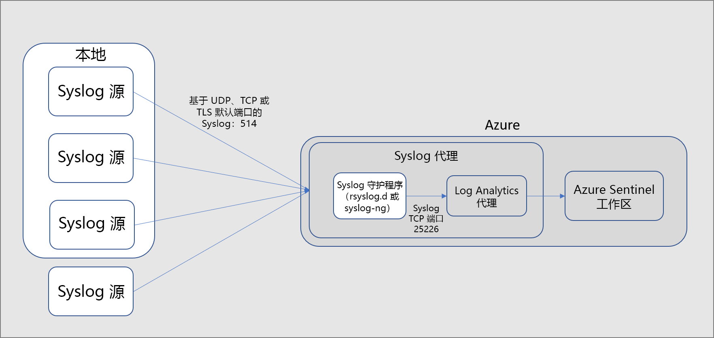

# 使用通用事件格式连接外部解决方案

> [!IMPORTANT]
> Azure Sentinel 当前为公共预览版。
> 此预览版在提供时没有附带服务级别协议，不建议将其用于生产工作负荷。 某些功能可能不受支持或者受限。 有关详细信息，请参阅 [Microsoft Azure 预览版补充使用条款](https://azure.microsoft.com/support/legal/preview-supplemental-terms/)。

可以通过外部解决方案连接 Azure Sentinel, 使你能够在 Syslog 中保存日志文件。 如果你的设备可以将日志另存为 Syslog 通用事件格式 (CEF), 则通过与 Azure Sentinel 集成, 你可以轻松地跨数据运行分析和查询。

> [!NOTE] 
> 数据存储在运行 Azure Sentinel 的工作区的地理位置。

## 工作原理

Azure Sentinel 与 CEF 设备之间的连接分为三个步骤:

1. 在设备上, 需要设置这些值, 以便设备根据 Microsoft Monitoring Agent 将必要的格式的必要日志发送到 Azure Sentinel Syslog 代理。 你可以在设备中修改这些参数, 只要你还在 Azure Sentinel 代理上的 Syslog 后台程序中修改它们即可。
    - Protocol = UDP
    - 端口 = 514
    - 设施 = Local4
    - Format = CEF
2. Syslog 代理收集数据并将其安全地发送到 Log Analytics, 并对其进行分析和扩充。
3. 代理将数据存储在 Log Analytics 工作区中, 以便可以根据需要使用分析、相关规则和仪表板来查询数据。

> [!NOTE]
> 代理可以从多个源收集日志, 但必须在专用计算机上安装日志。

 

或者，可以在现有的 Azure VM 上、在其他云中的 VM 上或者在本地计算机上手动部署代理。 

 

## 步骤 1：配置 Syslog VM

需要在专用 Linux 计算机 (VM 或本地) 上部署代理, 以支持设备与 Azure Sentinel 之间的通信。 

> [!NOTE]
> 请确保根据组织的安全策略配置计算机的安全性。 例如, 你可以将网络配置为与你的企业网络安全策略一致, 并更改守护程序中的端口和协议以符合你的要求。 

1. 在 Azure Sentinel 门户中, 单击 "**数据连接器**", 然后选择 "**通用事件格式 (CEF)** ", 然后单击 "**连接器" 页**。 

1. 在 "**下载并安装 Syslog 代理**" 下, 选择你的计算机类型 (Azure 或本地)。 
1. 在打开的 "**虚拟机**" 屏幕中, 选择要使用的计算机, 然后单击 "**连接**"。
1. 如果**为 Azure Linux 虚拟机选择 "下载并安装代理**", 请选择该计算机, 然后单击 "**连接**"。 如果为**非 Azure Linux 虚拟机选择了 "下载并安装代理**", 请在 "**直接代理**" 屏幕中, 运行**下载和板载 agent for Linux**中的脚本。
1. 在 CEF 连接器屏幕上的 "**配置和转发 syslog**" 下, 设置 syslog 守护程序是**rsyslog**还是**syslog-ng**。 
1. 复制以下命令并在设备上运行它们:
    - 如果选择了 rsyslog:
              
       1. 告诉 Syslog 守护程序侦听设备 local_4, 并使用端口25226将 Syslog 消息发送到 Azure Sentinel 代理。 `sudo bash -c "printf 'local4.debug  @127.0.0.1:25226' > /etc/rsyslog.d/security-config-omsagent.conf"`
            
       2. 下载并安装[security_events 配置文件](https://aka.ms/asi-syslog-config-file-linux), 该文件将 Syslog 代理配置为在端口25226上侦听。 `sudo wget -O /etc/opt/microsoft/omsagent/{0}/conf/omsagent.d/security_events.conf "https://aka.ms/syslog-config-file-linux"`{0}应将替换为工作区 GUID。
            
       1. 重新启动 syslog 守护程序`sudo service rsyslog restart`  有关详细信息, 请参阅[rsyslog 文档](https://www.rsyslog.com/doc/v8-stable/tutorials/tls_cert_summary.html)
           
    - 如果选择了 syslog-ng:
       1. 告诉 Syslog 守护程序侦听设备 local_4, 并使用端口25226将 Syslog 消息发送到 Azure Sentinel 代理。 `sudo bash -c "printf 'filter f_local4_oms { facility(local4); };\n  destination security_oms { tcp(\"127.0.0.1\" port(25226)); };\n  log { source(src); filter(f_local4_oms); destination(security_oms); };' > /etc/syslog-ng/security-config-omsagent.conf"`
       2. 下载并安装[security_events 配置文件](https://aka.ms/asi-syslog-config-file-linux), 该文件将 Syslog 代理配置为在端口25226上侦听。 `sudo wget -O /etc/opt/microsoft/omsagent/{0}/conf/omsagent.d/security_events.conf "https://aka.ms/syslog-config-file-linux"`{0}应将替换为工作区 GUID。

        3. 重新启动 syslog 守护程序`sudo service syslog-ng restart`  有关详细信息, 请参阅[syslog-ng 文档](https://www.syslog-ng.com/technical-documents/doc/syslog-ng-open-source-edition/3.16/mutual-authentication-using-tls/2)
1. 使用以下命令重新启动 Syslog 代理:`sudo /opt/microsoft/omsagent/bin/service_control restart [{workspace GUID}]`
1. 通过运行以下命令确认代理日志中没有任何错误:`tail /var/opt/microsoft/omsagent/log/omsagent.log`

若要在 CEF 事件的 Log Analytics 中使用相关架构, 请搜索`CommonSecurityLog`。

## 步骤 2：将通用事件格式 (CEF) 日志转发到 Syslog 代理

设置安全解决方案, 以 CEF 格式将 Syslog 消息发送到 Syslog 代理。 请确保使用的参数与代理配置中显示的参数相同。 这通常是:

- 端口514
- 设施 local4

## 步骤 3：验证连接

可能需要长达20分钟的时间, 日志才会开始出现在 Log Analytics 中。 

1. 请确保使用正确的工具。 设备在设备和 Azure Sentinel 中必须相同。 可以在 Azure Sentinel 中检查要使用的工具文件, 并在文件`security-config-omsagent.conf`中对其进行修改。 

2. 确保日志在 Syslog 代理中获得正确的端口。 在 Syslog 代理计算机上运行以下命令:`tcpdump -A -ni any  port 514 -vv`此命令显示从设备流向 Syslog 计算机的日志。 请确保在正确的端口和适当的设备上从源设备接收日志。

3. 请确保发送的日志符合[RFC 3164](https://tools.ietf.org/html/rfc3164)。

4. 在运行 Syslog 代理的计算机上, 使用命令`netstat -a -n:`确保这些端口514、25226处于打开和侦听状态。 有关使用此命令的详细信息, 请参阅[netstat (8)-Linux 手册页](https://linux.die.net/man/8/netstat)。 如果侦听正确, 你将看到:

    

5. 确保在要向其发送日志的端口514上设置守护程序侦听。
    - 对于 rsyslog: 确保该文件`/etc/rsyslog.conf`包括以下配置:

           # provides UDP syslog reception
           module(load="imudp")
           input(type="imudp" port="514")
        
           # provides TCP syslog reception
           module(load="imtcp")
           input(type="imtcp" port="514")

      有关详细信息, 请[参阅 imudp:UDP Syslog 输入模块](https://www.rsyslog.com/doc/v8-stable/configuration/modules/imudp.html#imudp-udp-syslog-input-module)和[imtcp:TCP Syslog 输入模块](https://www.rsyslog.com/doc/v8-stable/configuration/modules/imtcp.html#imtcp-tcp-syslog-input-module)

   - 对于 syslog-ng: 确保该文件`/etc/syslog-ng/syslog-ng.conf`包括以下配置:

           # source s_network {
            network( transport(UDP) port(514));
             };
     有关详细信息, 请参阅[syslog-Ng 开源 Edition 3.16-管理指南](https://www.syslog-ng.com/technical-documents/doc/syslog-ng-open-source-edition/3.16/administration-guide/19#TOPIC-956455)。

1. 检查 Syslog 守护程序和代理之间是否存在通信。 在 Syslog 代理计算机上运行以下命令:`tcpdump -A -ni any  port 25226 -vv`此命令显示从设备流向 Syslog 计算机的日志。 确保还会在代理上接收日志。

6. 如果这两个命令均提供了成功的结果, 请查看 Log Analytics 查看日志是否到达。 从这些装置流式传输的所有事件都以原始形式出现`CommonSecurityLog`在 "类型" 下的 "Log Analytics 中。

7. 若要检查是否存在错误, 或日志是否未到达, 请查看`tail /var/opt/microsoft/omsagent/<workspace id>/log/omsagent.log`。 如果出现日志格式不匹配错误, 请访问`/etc/opt/microsoft/omsagent/{0}/conf/omsagent.d/security_events.conf "https://aka.ms/syslog-config-file-linux"`并查看文件`security_events.conf`, 确保日志与你在此文件中看到的 regex 格式匹配。

8. 请确保 Syslog 消息默认大小限制为2048字节 (2 KB)。 如果日志太长, 请使用以下命令更新 security_events:`message_length_limit 4096`

## 后续步骤
本文档介绍了如何将 CEF 设备连接到 Azure Sentinel。 要详细了解 Azure Sentinel，请参阅以下文章：
- 了解如何了解[你的数据以及潜在的威胁](quickstart-get-visibility.md)。
- 开始[通过 Azure Sentinel 检测威胁](tutorial-detect-threats.md)。

