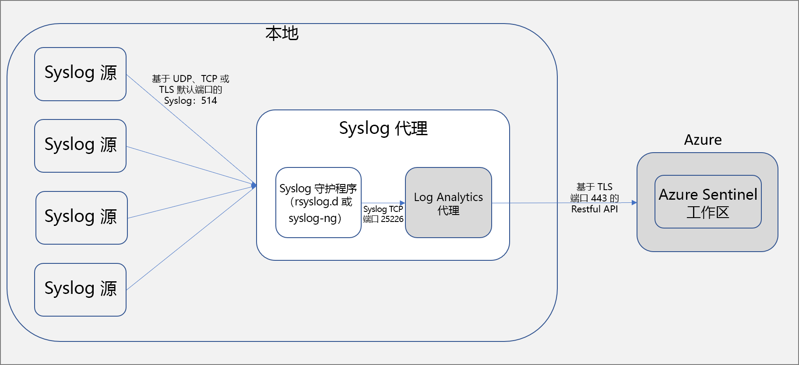

# 将 Palo Alto Networks 连接到 Azure Sentinel

本文介绍了如何将 Palo Alto 网络设备连接到 Azure Sentinel。 Palo Alto Networks 数据连接器可让你轻松连接 Palo Alto 网络日志和 Azure Sentinel，查看仪表板、创建自定义警报，以及改进调查。 使用 Azure 上的 Palo Alto 网络可以更深入地了解组织的 Internet 使用情况，并增强其安全操作功能。 

## 工作原理

需要在专用 Linux 计算机（VM 或本地）上部署代理，以支持 Palo Alto 网络与 Azure Sentinel 之间的通信。 下图说明了 Azure 中 Linux VM 的情况下的设置。

 

或者，如果你在其他云中或本地计算机中使用 VM，则会存在此设置。 

 

## 安全注意事项

请确保根据组织的安全策略配置计算机的安全性。 例如，你可以将网络配置为与你的企业网络安全策略一致，并更改守护程序中的端口和协议以符合你的要求。 你可以使用以下说明来改善计算机安全配置：  [Azure 中的安全 VM](../virtual-machines/linux/security-policy.md)、[网络安全的最佳做法](../security/fundamentals/network-best-practices.md)。

若要在安全解决方案和 Syslog 计算机之间使用 TLS 通信，需要将 Syslog 守护程序（rsyslog 或 syslog-ng）配置为在 TLS 中进行通信：[使用 tls Rsyslog 加密 Syslog 流量](https://www.rsyslog.com/doc/v8-stable/tutorials/tls_cert_summary.html)，[使用 tls 加密日志消息–syslog-ng](https://support.oneidentity.com/technical-documents/syslog-ng-open-source-edition/3.22/administration-guide/60#TOPIC-1209298)。

 
## 必备组件
请确保用作代理的 Linux 计算机运行的是以下操作系统之一：

- 64 位
  - CentOS 6 和 7
  - Amazon Linux 2017.09
  - Oracle Linux 6 和 7
  - Red Hat Enterprise Linux Server 6 和 7
  - Debian GNU/Linux 8 和 9
  - Ubuntu Linux 14.04 LTS、16.04 LTS 和 18.04 LTS
  - SUSE Linux Enterprise Server 12
- 32 位
   - CentOS 6
   - Oracle Linux 6
   - Red Hat Enterprise Linux Server 6
   - Debian GNU/Linux 8 和 9
   - Ubuntu Linux 14.04 LTS 和 16.04 LTS
 
 - 守护程序版本
   - Syslog-ng： 2.1-3.22。1
   - Rsyslog： v8
  
 - 支持的 Syslog Rfc
   - Syslog RFC 3164
   - Syslog RFC 5424
 
请确保您的计算机还满足以下要求： 
- 权限
    - 您的计算机上必须具有提升的权限（sudo）。 
- 软件要求
    - 请确保在计算机上运行 Python
## 步骤1：部署代理

在此步骤中，需要选择将充当 Azure Sentinel 和安全解决方案之间代理的 Linux 计算机。 你将需要在代理计算机上运行脚本：
- 安装 Log Analytics 代理，并根据需要对其进行配置，以便通过 TCP 侦听端口514上的 Syslog 消息，并将 CEF 消息发送到 Azure Sentinel 工作区。
- 使用端口25226将 Syslog 守护程序配置为将 CEF 消息转发到 Log Analytics 代理。
- 设置 Syslog 代理以收集数据并将其安全地发送到 Log Analytics，并对其进行分析和扩充。
 
 
1. 在 Azure Sentinel 门户中，单击 "**数据连接器**"，选择 " **Palo Alto Networks** "，然后单击 "**连接器" 页**。 

1. 在 "**安装并配置 Syslog 代理**" 下，选择你的计算机类型（Azure、其他云或本地）。 
   > [!NOTE]
   > 因为下一步中的脚本会安装 Log Analytics 代理，并将计算机连接到 Azure Sentinel 工作区，请确保此计算机未连接到任何其他工作区。
1. 您的计算机上必须具有提升的权限（sudo）。 请确保使用以下命令在计算机上具有 Python： `python –version`

1. 在代理计算机上运行以下脚本。
   `sudo wget https://raw.githubusercontent.com/Azure/Azure-Sentinel/master/DataConnectors/CEF/cef_installer.py&&sudo python cef_installer.py [WorkspaceID] [Workspace Primary Key]`
1. 脚本运行时，请检查以确保没有收到任何错误或警告消息。

 
## 步骤2：将 Palo Alto Networks 日志转发到 Syslog 代理

将 Palo Alto Networks 配置为通过 Syslog 代理将 Syslog 消息以 CEF 格式转发到 Azure 工作区：
1.  请参阅[通用事件格式（CEF）配置指南](https://docs.paloaltonetworks.com/resources/cef)，并下载适用于你的设备类型的 pdf。 按照指南中的所有说明设置 Palo Alto Networks 设备，收集 CEF 事件。 

1.  转到 "[配置 Syslog 监视](https://aka.ms/asi-syslog-paloalto-forwarding)"，然后执行步骤2和步骤3，将 CEF 事件从 Palo Alto 网络设备转发到 Azure Sentinel。

    1. 请确保将**Syslog 服务器格式**设置为**BSD**。

       > [!NOTE]
       > PDF 中的复制/粘贴操作可能会更改文本并插入随机字符。 若要避免这种情况，请将文本复制到编辑器，并在粘贴之前删除可能会破坏日志格式的任何字符，如本示例中所示。
 
        

2. 若要在 Palo Alto Networks 事件的 Log Analytics 中使用相关架构，请搜索**CommonSecurityLog**。

## 步骤3：验证连接性

1. 打开 Log Analytics，确保使用 CommonSecurityLog 架构接收日志。  可能需要长达20分钟的时间，日志才会开始出现在 Log Analytics 中。 

1. 在运行该脚本之前，我们建议您从安全解决方案发送消息，以确保将这些消息转发到您配置的 Syslog 代理计算机。 
1. 您的计算机上必须具有提升的权限（sudo）。 请确保使用以下命令在计算机上具有 Python： `python –version`
1. 运行以下脚本，检查代理、Azure Sentinel 和安全解决方案之间的连接。 它会检查是否正确配置了守护程序转发，侦听了正确的端口，并且没有阻止守护程序与 Log Analytics 代理之间的通信。 该脚本还会发送模拟消息 "TestCommonEventFormat" 来检查端到端连接。  
 `sudo wget https://raw.githubusercontent.com/Azure/Azure-Sentinel/master/DataConnectors/CEF/cef_troubleshoot.py&&sudo python cef_troubleshoot.py [WorkspaceID]`

## 后续步骤
本文档介绍了如何将 Palo Alto 网络设备连接到 Azure Sentinel。 要详细了解 Azure Sentinel，请参阅以下文章：
- 了解如何了解[你的数据以及潜在的威胁](quickstart-get-visibility.md)。
- 开始[通过 Azure Sentinel 检测威胁](tutorial-detect-threats-built-in.md)。

