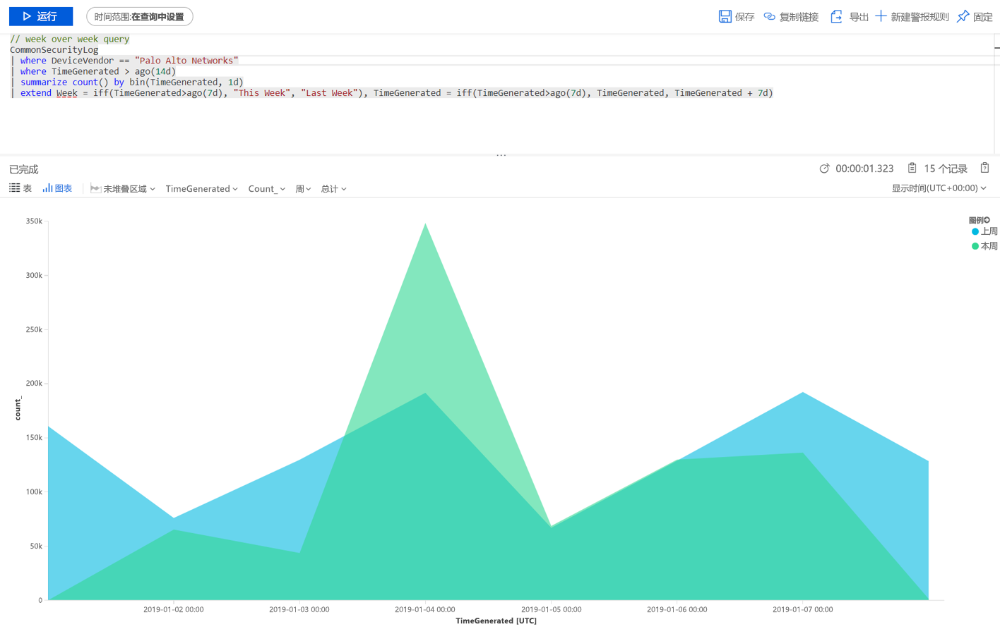
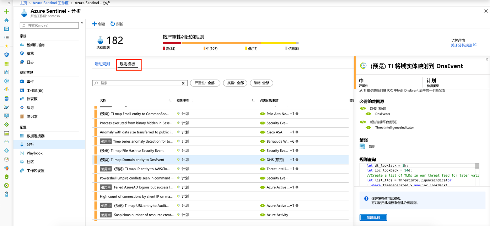

# <a name="quickstart-get-started-with-azure-sentinel"></a>快速入门：Azure Sentinel 入门


本快速入门介绍如何使用 Azure Sentinel 快速查看和监视整个环境中发生的情况。 将数据源连接到 Azure Sentinel 之后，可以即时可视化和分析数据，以了解所有已连接的数据源中发生的情况。 Azure Sentinel 提供工作簿，让你利用 Azure 中已提供的工具的强大功能，并提供内置的表和图表，用于分析日志与查询。 可以使用内置的工作簿，或者从头开始或基于现有的工作簿轻松创建新的工作簿。 

## <a name="get-visualization"></a>获取可视化效果

若要可视化和分析环境中发生的情况，请先查看概述仪表板，以大致了解组织的安全态势。 可以单击这些磁贴的每个元素，向下钻取到创建这些元素时所依据的原始数据。 为了帮助降低干扰并尽量减少需要检查和调查的警报数目，Azure Sentinel 使用一种融合技术将警报关联到事件。 “事件”是相关警报的分组，它们共同创建了可以调查和解决的可处理事件。

- 在 Azure 门户中选择“Azure Sentinel”，然后选择要监视的工作区。

  

- 顶部工具栏会告知在选定的时间段发生了多少个事件，并将该数字与过去 24 小时的事件数进行比较。 工具栏会告知，在这些事件中触发了哪些警报（较小的数字表示与过去 24 小时的变化），然后告知其中哪些事件未予处理、正在处理和已结案。 检查事件数是否不存在明显的增加或减少。 如果事件数减少，可能表示某个连接已停止向 Azure Sentinel 报告。 如果事件数增加，可能表示发生了可疑的情况。 检查是否有新的警报。

   

概述页的主体提供工作区安全状态的概览：

- **一段时间的事件和警报数** ：列出事件数，以及基于这些事件创建的警报数。 如果看到了异常的高峰，应会看到相应的警报 - 如果出现事件高峰时发生了某种异常，但未看到警报，则可能需要引以关注。

- **潜在的恶意事件** ：检测到来自已知恶意的源的流量时，Azure Sentinel 会在地图上发出警报。 橙色表示入站流量：有人正在尝试从已知恶意的 IP 地址访问你的组织。 如果看到出站（红色）活动，表示网络中的数据正在从你的组织流向已知恶意的 IP 地址。

   

- **最新事件** ：查看最近的事件、其严重性及其关联的警报数。 如果特定类型的警报出现突发性的高峰，可能意味着某种攻击正在活跃地进行。 例如，如果 Microsoft Defender for Identity（之前称为 Azure ATP）中突然引发了多达 20 个传递哈希事件，可能意味着某人正在试图攻击你。

- **数据源异常** ：Microsoft 的数据分析师创建了模型用于不间断地搜索数据源中数据的异常。 如果未出现任何异常，则不会显示任何信息。 如果检测到异常，则你应该进行深入调查，以确定发生了什么情况。 例如，单击“Azure 活动”中的高峰。 可以单击“图表”了解高峰是何时发生的，然后筛选在该时间段发生的活动，以确定哪些因素造成了高峰。

   

## <a name="use-built-in-workbooks"></a>使用内置工作簿<a name="dashboards"></a>

内置工作簿提供连接的数据源中的集成数据，让你深入调查这些服务中生成的事件。 内置工作簿包括 Azure AD、Azure 活动事件和本地信息，这些数据可能来自服务器的 Windows 事件、第一方警报或任何第三方（包括防火墙流量日志、Office 365 和基于 Windows 事件的不安全协议）。 这些工作簿基于 Azure Monitor 工作簿，为你提供增强的可定制性和灵活性，方便你设计自己的工作簿。 有关详细信息，请参阅[工作簿](../azure-monitor/platform/workbooks-overview.md)。

1. 在“设置”下，选择“工作簿”。 在“已安装”下，可以看到所有已安装的工作簿。 在“全部”下，可以看到可供安装的整个内置工作簿库。 
2. 搜索特定的工作簿以查看整个列表，以及每个工作簿的功能说明。 
3. 假设你使用 Azure AD，若要正常运行 Azure Sentinel，我们建议至少安装以下工作簿：
   - **Azure AD** ：使用以下两项中的一个或两个：
       - “Azure AD 登录”可分析不同时间的登录活动，以确定是否存在异常。 此工作簿按应用程序、设备和位置列出失败的登录，使你能够即时注意到有异常情况发生。 请注意是否出现了多个失败的登录活动。 
       - “Azure AD 审核日志”可分析管理活动，例如用户更改（添加、删除等）、组创建和修改。  

   - 添加防火墙工作簿。 例如，添加 Palo Alto 工作簿。 工作簿可分析防火墙流量，在防火墙数据与威胁事件之间提供关联，并突出显示各个实体的可疑事件。 工作簿提供有关流量趋势的信息，并允许向下钻取和筛选结果。 

      


可以通过编辑主要查询来自定义工作簿。 可以单击按钮 转到 [Log Analytics 以编辑查询](../azure-monitor/log-query/get-started-portal.md)；可以选择省略号 (...) 并选择“自定义磁贴数据”，以编辑主要时间筛选器，或者从工作簿中删除特定的磁贴。

有关使用查询的详细信息，请参阅[教程：Log Analytics 中的视觉数据](../azure-monitor/learn/tutorial-logs-dashboards.md)

### <a name="add-a-new-tile"></a>添加新磁贴

若要添加新磁贴，可将其添加到现有工作簿 - 你创建的工作簿，或 Azure Sentinel 的内置工作簿。 
1. 在 Log Analytics 中，遵照以下教程中的说明创建磁贴：[教程：Log Analytics 中的视觉数据](../azure-monitor/learn/tutorial-logs-dashboards.md)。 
2. 创建磁贴后，在“固定”下，选择要在其中显示该磁贴的工作簿。

## <a name="create-new-workbooks"></a>创建新工作簿
可以从头开始创建新工作簿，或者基于某个内置工作簿创建新工作簿。

1. 若要从头开始创建新工作簿，请选择“工作簿”，然后选择“+新建工作簿”。 
2. 选择要在其中创建该工作簿的订阅，并为其指定一个描述性的名称。 与其他任何元素一样，每个工作簿都是一个 Azure 资源，你可为其分配角色 (Azure RBAC) 以定义和限制哪些用户可以访问它。 
3. 若要使其显示在要将可视化效果固定到的工作簿中，必须将其共享。 依次单击“共享”、“管理用户”。  
 
1. 像设置其他任何 Azure 资源一样，使用“检查访问权限”和“角色分配”。  有关详细信息，请参阅[使用 Azure RBAC 共享 Azure 工作簿](../azure-portal/azure-portal-dashboard-share-access.md)。


## <a name="new-workbook-examples"></a>新工作簿示例

使用以下示例查询可以比较不同周次的流量趋势。 可以轻松切换要对其运行查询的设备供应商和数据源。 此示例使用来自 Windows 的 SecurityEvent。可将其切换为针对其他任何防火墙中的 AzureActivity 或 CommonSecurityLog 运行。

```console
 |where DeviceVendor == "Palo Alto Networks":
  // week over week query
  SecurityEvent
  | where TimeGenerated > ago(14d)
  | summarize count() by bin(TimeGenerated, 1d)
  | extend Week = iff(TimeGenerated>ago(7d), "This Week", "Last Week"), TimeGenerated = iff(TimeGenerated>ago(7d), TimeGenerated, TimeGenerated + 7d)
```

可以创建一个查询用于合并多个源中的数据。 可以创建一个查询，用于在 Azure Active Directory 审核日志中查找刚刚创建的新用户，然后检查 Azure 日志，以确定该用户在创建后的 24 小时内，是否开始进行角色分配更改。 该可疑活动会显示在此仪表板上：

```console
AuditLogs
| where OperationName == "Add user"
| project AddedTime = TimeGenerated, user = tostring(TargetResources[0].userPrincipalName)
| join (AzureActivity
| where OperationName == "Create role assignment"
| project OperationName, RoleAssignmentTime = TimeGenerated, user = Caller) on user
| project-away user1
```

可以基于用户的角色创建不同的工作簿，以查看该用户的数据并了解其正在查找哪些信息。 例如，可以针对网络管理员创建包含防火墙数据的工作簿。 此外，可以根据数据的查找频率创建工作簿，不管这些数据是每日都要查看的数据，还是每隔一小时检查一次的其他项（例如，你可能想要每隔一小时查看自己的 Azure AD 登录，以搜索异常）。 

## <a name="create-new-detections"></a>创建新的检测

在[连接到 Azure Sentinel 的数据源](connect-data-sources.md)上生成检测，以调查组织中的威胁。

创建新的检测时，请利用 Microsoft 安全研究人员为你连接的数据源量身定制的内置检测。

若要查看所有现成的检测，请转到 **Analytics** ，然后转到“规则模板”。 此选项卡包含所有的 Azure Sentinel 内置规则。

   

若要详细了解如何获取现成的检测，请参阅[教程：获取内置分析](tutorial-detect-threats-built-in.md)。
 
## <a name="next-steps"></a>后续步骤
本快速入门介绍了如何开始使用 Azure Sentinel。 请继续学习有关[如何检测威胁](tutorial-detect-threats-built-in.md)的教程。
> [!div class="nextstepaction"]
> [创建自定义威胁检测规则](tutorial-detect-threats-custom.md)，以便自动针对威胁做出响应。

