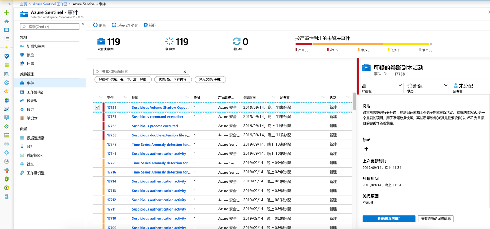
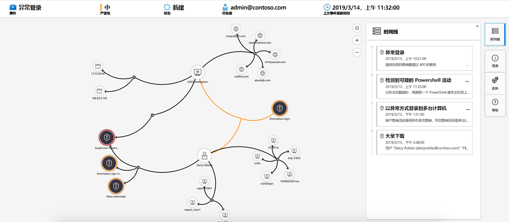

# 教程：使用 Azure 哨兵调查事件

> [!IMPORTANT]
> 调查图当前处于公共预览版中。
> 此功能在没有服务级别协议的情况下提供，不建议用于生产工作负载。
> 有关详细信息，请参阅 [Microsoft Azure 预览版补充使用条款](https://azure.microsoft.com/support/legal/preview-supplemental-terms/)。

本教程可帮助您使用 Azure Sentinel 调查事件。 将数据源连接到 Azure Sentinel 后，希望在发生可疑情况时收到通知。 为了使您能够执行此操作，Azure Sentinel 允许您创建高级警报规则，这些规则可生成可以分配和调查的事件。

本文介绍：
> [!div class="checklist"]
> * 调查事件
> * 使用调查图
> * 应对威胁

事件可以包括多个警报。 它是特定调查的所有相关证据的聚合。 事件是根据您在 **"分析"** 页中创建的分析规则创建的。 与警报相关的属性（如严重性）和状态在事件级别设置。 让 Azure Sentinel 知道要查找哪些类型的威胁以及如何查找这些威胁后，可以通过调查事件来监视检测到的威胁。

## 先决条件
只有在设置分析规则时使用实体映射字段，才能调查事件。 调查图要求您的原始事件包括实体。

## 如何调查事件

1. 选择**事件**。 通过"**事件"** 页，您可以知道发生了多少次事件、打开的事件数、已设置为"**正在进行中**"的事件数以及已关闭的事件数。 对于每个事件，您可以看到事件发生的时间以及事件的状态。 查看严重性，决定首先处理哪些事件。

    

1. 您可以根据需要筛选事件，例如按状态或严重性进行筛选。

1. 要开始调查，请选择特定事件。 在右侧，您可以看到事件的详细信息，包括其严重性、涉及的实体数摘要、触发此事件的原始事件以及事件的唯一 ID。

1. 要查看事件中的警报和实体的更多详细信息，请选择 **"查看事件页面中的完整详细信息**"，并查看汇总事件信息的相关选项卡。 在 **"警报"** 选项卡中，查看警报本身。 您可以看到有关警报的所有相关信息 - 触发警报的查询、每个查询返回的结果数以及在警报上运行行动手册的能力。 要进一步深入到事件，请选择**事件**数。 这将打开生成结果的查询以及日志分析中触发警报的事件。 在"**实体"** 选项卡中，您可以看到作为警报规则定义一部分映射的所有实体。

    

1. 如果您正在积极调查事件，最好将事件的状态设置为 **"正在进行"，** 直到您关闭它。

1. 可以将事件分配给特定用户。 对于每个事件，您可以通过设置**事件所有者**字段来分配所有者。 所有事件都以未分配开始。 您还可以添加注释，以便其他分析人员能够了解您调查的内容以及您对该事件的关注。

    

1. 选择 **"调查"** 以查看调查地图。

## 使用调查图进行深度潜水

调查图使分析人员能够针对每次调查提出正确的问题。 调查图通过将相关数据与任何相关实体相关联，帮助您了解潜在安全威胁的范围并找出根本原因。 您可以通过选择图形中显示的任何实体并在不同的扩展选项之间进行选择，从而深入挖掘并调查图形中显示的任何实体。  
  
调查图为您提供：

- **来自原始数据的可视上下文**：实时可视图形显示从原始数据自动提取的实体关系。 这使您能够轻松查看不同数据源之间的连接。

- **全面调查范围发现**：使用内置的勘探查询扩大调查范围，以显示违规的全部范围。

- **内置调查步骤**：使用预定义的探索选项，以确保您在面对威胁时提出正确的问题。

要使用调查图：

1. 选择事件，然后选择 **"调查**"。 这带你到调查图。 该图提供了直接连接到警报的实体和进一步连接的每个资源的说明性地图。

   > [!IMPORTANT] 
   > 只有在设置分析规则时使用实体映射字段，才能调查事件。 调查图要求您的原始事件包括实体。

   

1. 选择要打开 **"实体"** 窗格的实体，以便查看该实体上的信息。

    
  
1. 通过将鼠标悬停在每个实体上展开您的调查，以显示由我们的安全专家和分析人员根据实体类型设计的问题列表，以深化您的调查。 我们称这些选项**为探索查询**。

    

   例如，在计算机上，您可以请求相关的警报。 如果选择探用查询，则生成的授权将添加回图形。 在此示例中，选择 **"相关警报"** 将以下警报返回到图形中：

    

1. 对于每个查询查询，您可以选择通过选择**事件\>** 来打开原始事件结果和日志分析中使用的查询的选项。

1. 为了了解事件，图形为您提供了一个并行时间线。

    

1. 将鼠标悬停在时间线上，查看图形上发生在某个时间点的事情。

    

## 后续步骤
在本教程中，您学习了如何使用 Azure Sentinel 开始调查事件。 继续教程，[了解如何使用自动行动手册响应威胁](tutorial-respond-threats-playbook.md)。
> [!div class="nextstepaction"]
> [响应威胁](tutorial-respond-threats-playbook.md)，自动响应威胁。

