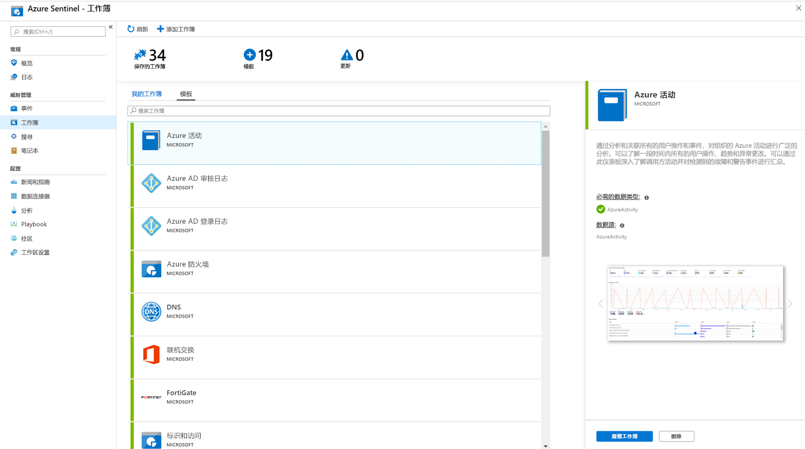

# 教程：可视化和监控数据

 [将数据源](quickstart-onboard.md) 连接到 Azure Sentinel 后，可以使用 Azure Sentinel 采用 Azure 监视器工作簿来可视化和监视数据，从而在创建自定义仪表板时提供多功能性。 虽然工作簿在 Azure Sentinel 中以不同的方式显示，但了解如何[使用 Azure 监视器工作簿 创建交互式报表](../azure-monitor/app/usage-workbooks.md)可能很有用。 Azure Sentinel 可让你跨数据创建自定义工作簿，并且还附带了内置的工作簿模板，使你可以在连接数据源后快速获得对数据的见解。

本教程可帮助您在 Azure Sentinel 中可视化数据。
> [!div class="checklist"]
> * 使用内置工作簿
> * 创建新工作簿

## 先决条件

- 在 Azure Sentinel 工作区的资源组上，必须至少具有工作簿阅读器或工作簿参与者权限。

> [!NOTE]
> 可在 Azure Sentinel 中看到的工作簿保存在 Azure Sentinel 工作区资源组中，并由创建这些工作簿的工作区标记。

## 使用内置工作簿

1. 转到**工作簿**，然后选择**模板**以查看 Azure Sentinel 内置工作簿的完整列表。 要查看哪些数据类型与您连接的数据类型相关，如果已经将相关数据流式传输到 Azure Sentinel，则每个工作簿中的 **"必需数据类型"** 字段将列出绿色复选标记旁边的数据类型。
  
1. 单击 **"查看工作簿"** 以查看使用数据填充的模板。
  
1. 要编辑工作簿，请选择 **"保存**"，然后选择要保存模板的 json 文件的位置。 

   > [!NOTE]
   > 这将基于相关模板创建 Azure 资源，并保存模板 Json 文件本身，而不是数据。

1. 选择 **"查看工作簿**"。 然后，单击顶部的 **"编辑"** 按钮。 您现在可以编辑工作簿，并根据需要对其进行自定义。 有关如何自定义工作簿的详细信息，请参阅如何使用[Azure 监视器工作簿创建交互式报表](../azure-monitor/app/usage-workbooks.md)。

1. 进行更改后，可以保存工作簿。 

1. 您还可以克隆工作簿：选择 **"编辑"，** 然后**另存为**，请确保在同一订阅和资源组下用另一个名称保存工作簿。 这些工作簿显示在"**我的工作簿"** 选项卡下。

## 创建新工作簿

1. 转到**工作簿**，然后选择 **"添加工作簿"** 以从头开始创建新的工作簿。
  

1. 要编辑工作簿，请选择 **"编辑**"，然后根据需要添加文本、查询和参数。 有关如何自定义工作簿的详细信息，请参阅如何使用[Azure 监视器工作簿创建交互式报表](../azure-monitor/app/usage-workbooks.md)。 

1. 生成查询时，将**数据源**设置为 **"日志**"，**将资源类型**设置为 **"日志分析"，** 然后选择相关工作区。 

1. 创建工作簿后，请保存工作簿，以确保将其保存在 Azure Sentinel 工作区的订阅和资源组下。

1. 如果要让组织中的其他人使用工作簿，请在 **"保存"** 下选择 **"共享报表**"。 如果希望此工作簿仅对您可用，请选择 **"我的报表**"。

1. 要在工作区中的工作簿之间切换，可以在任何工作簿的顶部窗格](./media/tutorial-monitor-data/switch.png)中选择 **"打开**

## 如何删除工作簿

您可以删除从 Azure Sentinel 模板创建的工作簿。 

要删除自定义工作簿，请在工作簿页中选择要删除的已保存工作簿，然后选择 **"删除**"。 这将删除保存的工作簿。

> [!NOTE]
> 这将删除资源以及对模板所做的任何更改。 原始模板将保持可用状态。

## 后续步骤

在本教程中，您学习了如何在 Azure Sentinel 中查看数据。

要了解如何自动响应威胁，请参阅在 Azure [Sentinel 中设置自动威胁响应](tutorial-respond-threats-playbook.md)。
