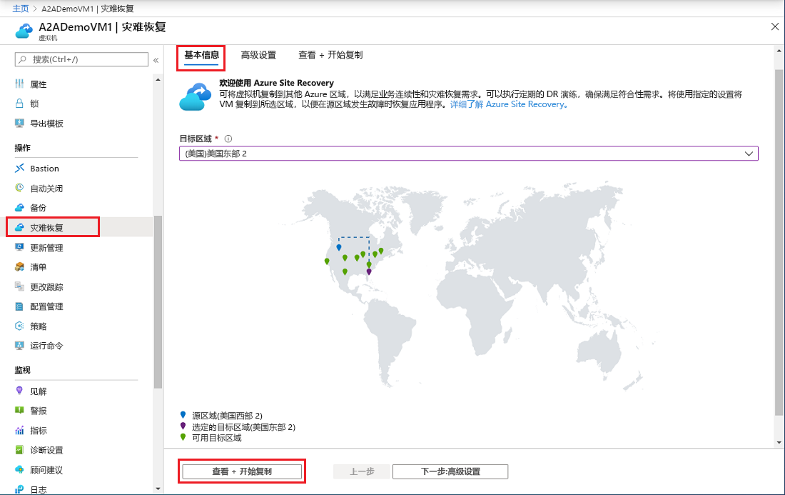

# 将 Azure VM 复制到另一个 Azure 区域（预览）

[Azure Site Recovery](site-recovery-overview.md) 服务通过在计划内和计划外停机期间使商业应用程序保持启动和运行可用状态，帮助实施业务连续性和灾难恢复 (BCDR) 策略。 Site Recovery 管理并安排本地计算机和 Azure 虚拟机 (VM) 的灾难恢复，包括复制、故障转移和恢复。

本快速入门介绍如何将 Azure VM 复制到不同的 Azure 区域。

如果你还没有 Azure 订阅，可以在开始前创建一个 [免费帐户](https://azure.microsoft.com/free/?WT.mc_id=A261C142F)。

## 登录 Azure

通过 http://portal.azure.com 登录到 Azure 门户。

## 为 Azure VM 启用复制

1. 在 Azure 门户中，单击“虚拟机”，并选择要复制的 VM。

2. 在“设置”中，单击“灾难恢复(预览)”。
3. 在“配置灾难恢复” > “目标区域”中，选择要复制到的目标区域。
4. 在本快速入门中，接受其他默认设置。
5. 单击“启用复制”。 这将启动用于为 VM 启用复制的作业。

    

## 验证设置

复制作业完成后，可以检查复制状态、修改复制设置和测试部署。

1. 在 VM 菜单中，单击“灾难恢复(预览)”。
2. 可以验证复制运行状况、已创建的恢复点以及映射中的源和目标区域。

   

## 清理资源

对主要区域中的 VM 禁用复制时，该 VM 会停止复制：

- 将自动清除源复制设置。
- 对 VM 的 Site Recovery 计费也会停止。

请按如下所述停止复制：

1. 选择 VM。
2. 在“灾难恢复(预览)”中，单击“更多”。
3. 单击“禁用复制”。

   

## 后续步骤

在本快速入门中，将单个 VM 复制到了次要区域。

> [!div class="nextstepaction"]
> [为 Azure VM 配置灾难恢复](azure-to-azure-tutorial-enable-replication.md)
