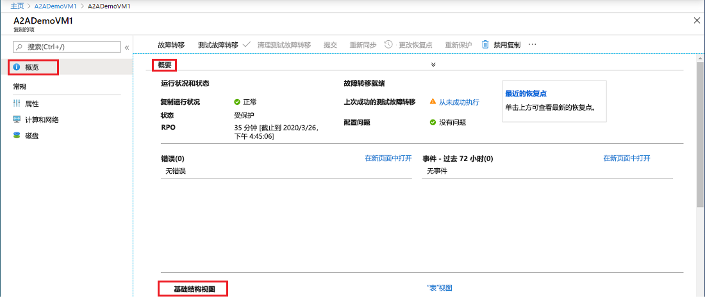

# 将 Azure VM 移到可用性区域中
数据中心发生故障时，Azure 中的可用性区域可以保护应用程序和数据。 每个可用性区域都由一个或多个数据中心组成，这些数据中心单独配置了电源、散热和网络设备。 为确保能够进行复原，所有已启用的区域中必须至少有三个单独的区域。 区域中可用性区域的物理隔离可以在发生数据中心故障的情况下保护应用程序和数据。 Azure 凭借可用性区域提供一流的 99.99% VM 运行时间 SLA。 [此处](https://docs.microsoft.com/azure/availability-zones/az-overview#regions-that-support-availability-zones)所述的选定区域支持可用性区域。 

如果你将虚拟机作为“单一实例”部署到了特定的区域，并想要通过将其移到可用性区域来提高可用性，可以使用 Azure Site Recovery。 此过程进一步分类为：

- 将单一实例 VM 移到目标区域中的可用性区域
- 将可用性集中的 VM 移到目标区域中的可用性区域

> [!IMPORTANT]
> 目前，Azure Site Recovery 支持将 VM 从一个区域移到另一个区域，而不支持在一个区域中移动。 

## 验证先决条件

- 验证目标区域是否[支持可用性区域](https://docs.microsoft.com/azure/availability-zones/az-overview#regions-that-support-availability-zones) - 验证所选的[源区域 - 目标区域组合是否受支持](https://docs.microsoft.com/azure/site-recovery/azure-to-azure-support-matrix#region-support)，并在目标区域方面做出明智的决策。
- 请确保了解[方案体系结构和组件](azure-to-azure-architecture.md)。
- 查看[支持限制和要求](azure-to-azure-support-matrix.md)。
- 验证帐户权限：如果你刚刚创建了免费 Azure 帐户，那么你就是订阅的管理员。 如果你不是订阅管理员，请与管理员一起分配你所需的权限。 若要为 VM 启用复制，并使用 Azure Site Recovery 将数据最终复制到目标，必须：

    1. 在 Azure 资源中创建 VM 的权限。 “虚拟机参与者”内置角色具有这些权限，这包括：
        - 在所选资源组中创建 VM 的权限
        - 在所选虚拟网络中创建 VM 的权限
        - 向所选存储帐户进行写入的权限

    2. 你还需要管理 Azure Site Recovery 操作的权限。 “Site Recovery 参与者”角色拥有管理恢复服务保管库中 Site Recovery 操作所需的全部权限。

## 准备源 VM

1. 若要使用 Site Recovery 将 VM 移到可用性区域，这些 VM 应使用托管磁盘。 可以转换使用非托管磁盘的现有 Windows 虚拟机 (VM)；可以遵循[此处](https://docs.microsoft.com/azure/virtual-machines/windows/convert-unmanaged-to-managed-disks)所述的步骤，将 VM 转换为使用托管磁盘。 为此，请确保可用性集配置为“托管”。 
2. 检查要移动的 Azure VM 上是否存在所有最新的根证书。 如果没有最新的根证书，则会出于安全约束的原因，无法实现将数据复制到目标区域。

3. 对于 Windows VM，请在 VM 上安装所有最新的 Windows 更新，使所有受信任的根证书位于该计算机上。 在未联网的环境中，请按照你的组织的标准 Windows 更新和证书更新过程执行操作。

4. 对于 Linux VM，请遵循 Linux 分销商提供的指导，在 VM 上获取最新的受信任根证书和证书吊销列表。
5. 确保未使用身份验证代理来控制要移动的 VM 的网络连接。

6. 如果要移动的 VM 无法访问 Internet，并且使用防火墙代理来控制出站访问，请检查[此处](azure-to-azure-tutorial-enable-replication.md#configure-outbound-network-connectivity)所述的要求。

7. 标识源网络布局以及当前正在使用的所有资源 - 包括要验证的负载均衡器、NSG、公共 IP，等等。

## 准备目标区域

1. 验证 Azure 订阅是否允许在用于灾难恢复的目标区域中创建 VM。 如果需要，请联系支持人员启用所需的配额。

2. 确保订阅中有足够的资源，能够支持大小与源 VM 匹配的 VM。 如果使用 Site Recovery 将数据复制到目标区域，Site Recovery 会为目标 VM 选择相同的大小或尽可能接近的大小。

3. 确保为源网络布局中标识的每个组件创建目标资源。 只有这样，才能确保在转接到目标区域之后，VM 具有源中的所有功能和特性。

    > [!NOTE]
    > 为源 VM 启用复制时，Azure Site Recovery 会自动发现并创建虚拟网络和存储帐户；或者，你也可以预先创建这些资源，并在启用复制的过程中将其分配到 VM。 但是，需要按如下所述，在目标区域中手动创建其他任何资源。

     请参阅以下文档，根据源 VM 配置创建最常用的相关网络资源。

    - [网络安全组](https://docs.microsoft.com/azure/virtual-network/manage-network-security-group)
    - [负载均衡器](https://docs.microsoft.com/azure/load-balancer/#step-by-step-tutorials
        
     - [公共 IP](https://docs.microsoft.com/azure/load-balancer/#step-by-step-tutorials)
    
   对于其他任何网络组件，请参阅网络[文档](https://docs.microsoft.com/azure/#pivot=products&panel=network)。 

> [!IMPORTANT]
> 确保在目标中使用区域冗余的负载均衡器。 可在[此处](https://docs.microsoft.com/azure/load-balancer/load-balancer-standard-availability-zones)了解详细信息。

4. 若要在最终转接到目标区域之前测试配置，请在目标区域中手动[创建非生产网络](https://docs.microsoft.com/azure/virtual-network/quick-create-portal)。 这可以尽量减少对生产环境造成的干扰，也是建议的做法。

> [!NOTE]
> 以下步骤适用于单个 VM。可对多个 VM 应用相同的方法：导航到恢复服务保管库，单击“+ 复制”并同时选择多个相关的 VM 即可。

## 启用复制
以下步骤引导你使用 Azure Site Recovery 将数据复制到目标区域，最终将其移到可用性区域。

1. 在 Azure 门户中单击“虚拟机”，然后选择要移到可用性区域中的 VM。
2. 在“操作”中，单击“灾难恢复”。
3. 在“配置灾难恢复” > “目标区域”中，选择要复制到的目标区域。 确保此区域[支持](https://docs.microsoft.com/azure/availability-zones/az-overview#regions-that-support-availability-zones)可用性区域。

1. 选择“下一步:高级设置”
2. 为目标订阅、目标 VM 资源组和虚拟网络选择适当的值。
3. 在“可用性”部分，选择要将 VM 移到的可用性区域。 
> [!NOTE]
> 如果未看到可用性集或可用性区域的选项，请确保符合[先决条件](#prepare-the-source-vms)，并且源 VM 的[准备](#prepare-the-source-vms)工作已完成。

   

7. 单击“启用复制”。 这将启动用于为 VM 启用复制的作业。

## 验证设置

复制作业完成后，可以检查复制状态、修改复制设置和测试部署。

1. 在 VM 菜单中，单击“灾难恢复”。
2. 可以验证复制运行状况、已创建的恢复点以及映射中的源和目标区域。

   

## 测试配置

1. 在虚拟机菜单中，单击“灾难恢复”。
2. 单击“测试故障转移”图标。
3. 在“测试故障转移”中，选择要用于故障转移的恢复点：

   - **最新处理**：将 VM 故障转移到由 Site Recovery 服务处理的最新恢复点。 将显示时间戳。 使用此选项时，无需费时处理数据，因此 RTO（恢复时间目标）会较低
   - **最新的应用一致**：此选项将所有 VM 故障转移到最新的应用一致恢复点。 将显示时间戳。
   - **自定义**：选择任何恢复点。

3. 选择要将 Azure VM 移到的测试目标 Azure 虚拟网络，以测试配置。 

> [!IMPORTANT]
> 我们建议使用单独的 Azure VM 网络来测试故障，而不要使用 VM 最终要移到的目标区域中的生产网络。

4. 若要开始测试移动，请单击“确定”。 若要跟踪进度，请单击 VM 以打开其属性。 或者，可以在保管库名称 >“设置” > “作业” > “Site Recovery 作业”中单击“测试故障转移”作业。
5. 故障转移完成后，副本 Azure VM 会显示在 Azure 门户 >“虚拟机”中。 请确保 VM 正在运行、大小适当并已连接到相应的网络。
6. 若要删除测试移动期间创建的 VM，请在“复制的项”中单击“清理测试故障转移”。 在“说明”中，记录并保存与测试关联的任何观测结果。

## 执行移到目标区域的操作并确认。

1.  在虚拟机菜单中，单击“灾难恢复”。
2. 单击“故障转移”图标。
3. 在“故障转移”中，选择“最新”。 
4. 选择“在开始故障转移前关闭计算机”。 Site Recovery 在触发故障转移之前会尝试关闭源 VM。 即使关机失败，故障转移也仍会继续。 可以在“作业”页上跟踪故障转移进度。 
5. 作业完成后，检查 VM 是否按预期显示在目标 Azure 区域中。
6. 在“复制的项”中，右键单击 VM >“提交”。 这会完成移到目标区域的过程。 请等待提交作业完成。

## 丢弃源区域中的资源 

1. 导航到 VM。  单击“禁用复制”。  这会停止复制 VM 数据的过程。  

> [!IMPORTANT]
> 必须执行上述步骤才能避免移动后 Site Recovery 复制产生费用。 将自动清除源复制设置。 请注意，作为复制的一部分安装的 Site Recovery 扩展未删除，需要手动删除。 

## 后续步骤

在本教程中，你已通过将 Azure VM 移到可用性集或可用性区域提高了其可用性。 现在，你可以为移动的 VM 配置灾难恢复。

> [!div class="nextstepaction"]
> [在迁移后设置灾难恢复](azure-to-azure-quickstart.md)

