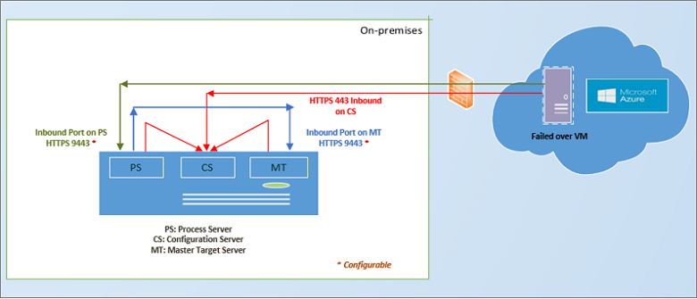

# 物理服务器到 Azure 的灾难恢复体系结构

本文介绍了使用 [Azure Site Recovery](site-recovery-overview.md) 服务在本地站点与 Azure 之间对物理 Windows 和 Linux 服务器进行复制、故障转移和恢复时使用的体系结构和过程。

## 体系结构组件

下面的表和图提供了用于将物理服务器复制到 Azure 的组件的概要视图。  

组件  | **要求** | **详细信息**
--- | --- | ---
**Azure** | Azure 订阅和 Azure 网络。 | 从本地物理计算机器复制的数据存储在 Azure 托管磁盘中。 运行从本地到 Azure 的故障转移时，将使用复制的数据创建 Azure VM。 创建 Azure VM 后，它们将连接到 Azure 虚拟网络。
**配置服务器** | 需要部署单台本地物理机或 VMware VM 来运行所有非本地 Site Recovery 组件。 VM 运行配置服务器、进程服务器和主目标服务器。 | 配置服务器在本地和 Azure 之间协调通信并管理数据复制。
 **进程服务器**：  | 默认与配置服务器安装在一起。 | 充当复制网关。 接收复制数据，通过缓存、压缩和加密对其进行优化，然后将数据发送到 Azure 存储。   进程服务器还在要复制的服务器上安装移动服务。   随着部署扩大，可以另外添加单独的进程服务器来处理更大的复制流量。
 **主目标服务器** | 默认与配置服务器安装在一起。 | 处理从 Azure 进行故障回复期间产生的复制数据。   对于大型部署，可以另外添加一个单独的主目标服务器用于故障回复。
**复制的服务器** | 移动服务安装在复制的每台服务器上。 | 建议允许从进程服务器自动安装。 另外，也可以手动安装此服务，或者使用诸如 System Center Configuration Manager 的自动部署方法。

**物理机到 Azure 体系结构**

## 复制过程

1. 创建部署，包括本地和 Azure 组件。 在恢复服务保管库中，指定复制源和目标，设置配置服务器，创建复制策略并启用复制。
2. 计算机根据复制策略进行复制，服务器数据的初始副本将复制到 Azure 存储中。
3. 完成初始复制后，开始将增量更改复制到 Azure。 计算机的受跟踪更改保存在 .hrl 文件中。
    - 计算机通过 HTTPS 443 入站端口与配置服务器通信，进行复制管理。
    - 计算机通过 HTTPS 9443 入站端口（可修改）将复制数据发送到进程服务器。
    - 配置服务器通过 HTTPS 443 出站端口来与 Azure 协调复制管理。
    - 进程服务器从源计算机接收数据、优化和加密数据，然后通过 443 出站端口将其发送到 Azure 存储。
    - 如果启用了多 VM 一致性，则复制组中的计算机将通过端口 20004 相互通信。 如果将多台计算机分组到复制组，并且这些组在故障转移时共享崩溃一致且应用一致的恢复点，请使用多 VM 方案。 如果计算机运行相同的工作负荷并需要保持一致，这种做法非常有用。
4. 流量通过 Internet 复制到 Azure 存储公共终结点。 或者，可以使用 Azure ExpressRoute [公共对等互连](../expressroute/expressroute-circuit-peerings.md#publicpeering)。 不支持通过站点到站点 VPN 将流量从本地站点复制到 Azure。

**物理机到 Azure 的复制过程**

## 故障转移和故障回复过程

在设置复制并运行故障恢复演练（测试故障转移）来检查是否一切都按预期工作后，可以根据需要运行故障转移和故障回复。 请注意：

- 不支持计划内故障转移。
- 必须故障回复到本地 VMware VM。 这意味着，即使在将本地物理服务器复制到 Azure 时，也需要本地 VMware 基础结构。
- 对单台计算机进行故障转移，或者创建恢复计划来同时对多台计算机进行故障转移。
- 运行故障转移时，将使用 Azure 存储中的已复制数据创建 Azure VM。
- 触发初始故障转移之后，可提交它来开始访问 Azure VM 中的工作负荷。
- 当本地主站点再次可用时，便可以故障回复。
- 需要设置故障回复基础结构，包括：
    - **Azure 中的临时进程服务器**：若要从 Azure 进行故障回复，需要设置用作进程服务器的 Azure VM，以处理从 Azure 进行的复制。 故障回复完成后，可以删除此 VM。
    - **VPN 连接**：若要故障回复，需要设置从 Azure 网络到本地站点的 VPN 连接（或 Azure ExpressRoute）。
    - **单独的主目标服务器**：默认情况下，在本地 VMware VM 上与配置服务器一起安装的主目标服务器用于处理故障回复。 不过，如果需要对大量流量进行故障回复，应设置专用于此用途的单独的本地主目标服务器。
    - **故障回复策略**：若要复制回到本地站点，需要创建故障回复策略。 这是在创建从本地到 Azure 的复制策略时自动创建的。
    - **VMware 基础结构**：需要一个用于故障回复的 VMware 基础结构。 不能故障回复到物理服务器。
- 所有组件均就位后，故障回复分三个阶段进行：
    - 阶段 1：重新保护 Azure VM，以便它们可以从 Azure 复制回本地 VMware VM。
    - 阶段 2：运行到本地站点的故障转移。
    - 阶段 3：在工作负荷进行故障回复后，重新启用复制。

**从 Azure 进行 VMware 故障回复**

## 后续步骤

按照[此教程](physical-azure-disaster-recovery.md)启用物理服务器到 Azure 的复制。
