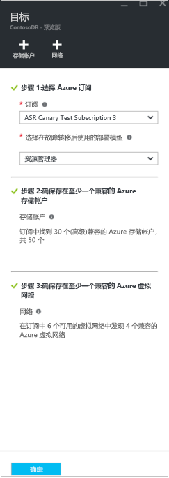
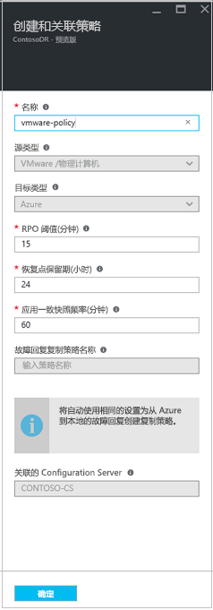

# 在“Azure 政府”区域和“公用”区域之间移动 Azure VM 

为提高现有 VM 的可用性，改善可管理性或出于治理原因，你可能希望在“Azure 政府”区域和“公用”区域之间移动 IaaS VM，详见[此处](azure-to-azure-move-overview.md)。

除了使用 [Azure Site Recovery](site-recovery-overview.md) 服务管理和协调本地计算机和 Azure VM 的灾难恢复以实现业务连续性和灾难恢复 (BCDR) 外，还可以使用 Site Recovery 来管理以另一个区域为目的地的 Azure VM 移动。       

本教程介绍如何使用 Azure Site Recovery 在“Azure 政府”区域和“公用”区域之间移动 Azure VM。 该方法同样可扩展用于在不属相同地理群集的区域对之间移动 VM。 本教程介绍如何执行下列操作：

> [!div class="checklist"]
> * 验证先决条件
> * 准备源 VM
> * 准备目标区域
> * 将数据复制到目标区域
> * 测试配置
> * 执行移动
> * 丢弃源区域中的资源

> [!IMPORTANT]
> 本教程介绍如何在“Azure 政府”区域和“公用”区域之间移动 Azure VM 或者在 Azure VM 的常规灾难恢复解决方案不支持的区域对之间移动 Azure VM。 如果源和目标区域对受[支持](https://docs.microsoft.com/azure/site-recovery/azure-to-azure-support-matrix#region-support)，请参阅此[文档](azure-to-azure-tutorial-migrate.md)进行移动。 如果你的要求是通过将一个可用性集中的 VM 移动到另一区域中区域固定的 VM 来提高可用性，请参阅[此教程](move-azure-VMs-AVset-Azone.md)。

> [!IMPORTANT]
> 不建议使用此方法在不支持的区域对之间配置 DR，因为定义这些对时要考虑到数据延迟，这对于 DR 方案至关重要。

## 验证先决条件

> [!NOTE]
> 请确保了解此方案的[体系结构和组件](physical-azure-architecture.md)。 通过将 VM 视为物理服务器，此体系结构将用于移动 Azure VM。

- 查看所有组件的[支持要求](vmware-physical-secondary-support-matrix.md)。
- 请确保想要复制的服务器符合 [Azure VM 要求](vmware-physical-secondary-support-matrix.md#replicated-vm-support)。
- 准备一个帐户用于在要复制的每个服务器上自动安装移动服务。

- 请注意，在 Azure 中的目标区域失败后，无法直接执行故障恢复到源区域。 必须再次将复制设置回目标。

### 验证 Azure 帐户权限

请确保 Azure 帐户具有将 VM 复制到 Azure 的权限。

- 查看将计算机复制到 Azure 所需的[权限](site-recovery-role-based-linked-access-control.md#permissions-required-to-enable-replication-for-new-virtual-machines)。
- 验证和修改[基于角色的访问](../role-based-access-control/role-assignments-portal.md)权限。 

### 设置 Azure 网络

设置目标 [Azure 网络](../virtual-network/quick-create-portal.md)。

- 在故障转移后创建 Azure VM 时，Azure VM 将置于此网络中。
- 该网络应位于与恢复服务保管库相同的区域

### 设置 Azure 存储帐户

设置 [Azure 存储帐户](../storage/common/storage-quickstart-create-account.md)。

- Site Recovery 将本地计算机复制到 Azure 存储。 发生故障转移后，将从存储中创建 Azure VM。
- 存储帐户必须位于与恢复服务保管库相同的区域。

## 准备源 VM

### 准备一个帐户用于安装移动服务

必须在要复制的每个服务器上安装 Mobility Service。 为服务器启用复制后，Site Recovery 会自动安装此服务。 若要自动安装，需要准备一个由 Site Recovery 用于访问服务器的帐户。

- 可以使用域或本地帐户
- 对于 Windows VM，如果使用的不是域帐户，则在本地计算机上禁用远程用户访问控制。 为此，请在注册表中的 **HKEY_LOCAL_MACHINE\SOFTWARE\Microsoft\Windows\CurrentVersion\Policies\System** 下添加值为 1 的 DWORD 项 **LocalAccountTokenFilterPolicy**。
- 若要添加注册表项以禁用 CLI 中的设置，请键入：``REG ADD HKEY_LOCAL_MACHINE\SOFTWARE\Microsoft\Windows\CurrentVersion\Policies\System /v LocalAccountTokenFilterPolicy /t REG_DWORD /d 1.``
- 对于 Linux，该帐户应是源 Linux 服务器上的根。

## 准备目标区域

1. 验证 Azure 订阅是否允许在用于灾难恢复的目标区域中创建 VM。 请联系支持部门，启用所需配额。

2. 确保订阅中有足够的资源，能够支持大小与源 VM 匹配的 VM。 如果使用 Site Recovery 将数据复制到目标区域，Site Recovery 会为目标 VM 选择相同的大小或尽可能接近的大小。

3. 确保为源网络布局中标识的每个组件创建目标资源。 只有这样，才能确保在转接到目标区域之后，VM 具有源中的所有功能和特性。

    > [!NOTE]
    > 为源 VM 启用复制时，Azure Site Recovery 会自动发现并创建虚拟网络；或者，你也可以预先创建网络，并在用户流中将其分配到 VM，以启用复制。 但是，需要按如下所述，在目标区域中手动创建其他任何资源。

     请参阅以下文档，根据源 VM 配置创建最常用的相关网络资源。

    - [网络安全组](https://docs.microsoft.com/azure/virtual-network/manage-network-security-group)
    - [负载均衡器](https://docs.microsoft.com/azure/load-balancer/#step-by-step-tutorials)
    - [公共 IP](https://docs.microsoft.com/azure/load-balancer/#step-by-step-tutorials)
    
    对于其他任何网络组件，请参阅网络[文档](https://docs.microsoft.com/azure/#pivot=products&panel=network)。 

4. 若要在最终转接到目标区域之前测试配置，请在目标区域中手动[创建非生产网络](https://docs.microsoft.com/azure/virtual-network/quick-create-portal)。 这可以尽量减少对生产造成的干扰，也是建议的做法。

## 将数据复制到目标区域
以下步骤引导你使用 Azure Site Recovery 将数据复制到目标区域。

### 在除了源区域之外的任意区域中创建保管库。

1. 登录到 [Azure 门户](https://portal.azure.com) > **恢复服务**。
2. 单击“创建资源” > “管理工具” > “备份和 Site Recovery”。
3. 在“名称”中，指定友好名称 **ContosoVMVault**。 如果有多个 订阅，请选择适当的订阅。
4. 创建资源组 **ContosoRG**。
5. 指定 Azure 区域。 若要查看受支持的区域，请参阅 [Azure Site Recovery 定价详细信息](https://azure.microsoft.com/pricing/details/site-recovery/)中的“地域可用性”。
6. 在“恢复服务保管库”中，单击“概述” > “ConsotoVMVault” > “+复制”
7. 选择“到 Azure” > “未虚拟化/其他”。

### 设置配置服务器以发现 VM。

设置配置服务器，将它注册到保管库中，并且发现 VM。

1. 单击“Site Recovery” > “准备基础结构” > “源”。
2. 如果没有配置服务器，请单击“+ 配置服务器”。
3. 在“添加服务器”中，检查“配置服务器”是否已显示在“服务器类型”中。
4. 下载站点恢复统一安装程序安装文件。
5. 下载保管库注册密钥。 运行统一安装程序时需要用到此密钥。 生成的密钥有效期为 5 天。

   

### 在保管库中注册配置服务器

开始之前，请执行以下操作： 

#### 验证时间准确性
在配置服务器计算机上，确保将系统时钟与[时间服务器](https://technet.microsoft.com/windows-server-docs/identity/ad-ds/get-started/windows-time-service/windows-time-service)进行同步。 它应与之匹配。 如果它提前或落后 15 分钟，安装程序可能会失败。

#### 验证连接性
确保计算机可以根据你的环境访问这些 URL： 

[!INCLUDE [site-recovery-URLS](../../includes/site-recovery-URLS.md)]  

基于 IP 地址的防火墙规则应允许通过 HTTPS (443) 端口与上面列出的所有 Azure URL 进行通信。 为了简化和限制 IP 范围，建议进行 URL 筛选。

- **商用 IP**：允许 [Azure 数据中心 IP 范围](https://www.microsoft.com/download/confirmation.aspx?id=41653)和 HTTPS (443) 端口。 允许订阅的 Azure 区域的 IP 地址范围以支持 AAD、备份、复制和存储 URL。  
- **政府 IP**：允许所有 USGov 区域（弗吉尼亚州、德克萨斯州、亚利桑那州和爱荷华州）的 [Azure 政府数据中心 IP 范围](https://www.microsoft.com/en-us/download/details.aspx?id=57063)和 HTTPS (443) 端口，以支持 AAD、备份、复制和存储 URL。  

#### 运行安装程序
以本地管理员身份运行统一安装程序，安装配置服务器。 进程服务器和主目标服务器也默认安装在配置服务器上。

[!INCLUDE [site-recovery-add-configuration-server](../../includes/site-recovery-add-configuration-server.md)]

注册完成后，配置服务器会显示在保管库的“设置” > “服务器”页中。

### 配置复制的目标设置

选择并验证目标资源。

1. 单击“准备基础结构” > “目标”，并选择要使用的 Azure 订阅。
2. 指定目标部署模型。
3. Site Recovery 会检查是否有一个或多个兼容的 Azure 存储帐户和网络。

   

### 创建复制策略

1. 若要创建新的复制策略，请单击“Site Recovery 基础结构” > “复制策略” > “+ 复制策略”。
2. 在“创建复制策略”中指定策略名称。
3. 在“RPO 阈值”中，指定恢复点目标 (RPO) 限制。 此值指定创建数据恢复点的频率。 如果连续复制超出此限制，将生成警报。
4. 在“恢复点保留期”中，指定每个恢复点的保留期时长（以小时为单位）。 可以将复制的虚拟机恢复到窗口中的任何点。 复制到高级存储的计算机最多支持 24 小时的保留期，复制到标准存储的计算机最多支持 72 小时的保留期。
5. 在“应用一致性快照频率”中，指定创建包含应用程序一致性快照的恢复点的频率（以分钟为单位）。 单击“确定”创建该策略。

    

此策略自动与配置服务器关联。 默认情况下会自动创建一个匹配策略以用于故障回复。 例如，如果复制策略是 rep-policy，则创建故障回复策略 rep-policy-failback。 从 Azure 启动故障回复之前，不会使用此策略。

### 启用复制

- 启用复制后，Site Recovery 会安装移动服务。
- 为服务器启用复制后，可能要等 15 分钟或更长时间，更改才会生效并显示在门户中。

1. 单击“复制应用程序” > “源”。
2. 在“源”中选择配置服务器。
3. 在“计算机类型”中，选择“物理计算机”。
4. 选择进程服务器（配置服务器）。 然后单击“确定”。
5. 在“目标”中，选择故障转移后要在其中创建 Azure VM 的订阅和资源组。 选择要在 Azure 中使用的部署模型（经典或资源管理）。
6. 选择要用于复制数据的 Azure 存储帐户。 
7. 选择 Azure VM 在故障转移后创建时所要连接的 Azure 网络和子网。
8. 选择“立即为选定的计算机配置”，将网络设置应用到选择保护的所有计算机。 选择“稍后配置”以选择每个计算机的 Azure 网络。 
9. 在“物理计算机”中，单击“+物理计算机”。 指定名称和 IP 地址。 选择要复制的计算机的操作系统。 发现和列出服务器需要几分钟的时间。 

   > [!WARNING]
   > 需要输入要移动的 Azure VM 的 IP 地址

10. 在“属性” > “配置属性”中，选择进程服务器在计算机上自动安装移动服务时使用的帐户。
11. 在“复制设置” > “配置复制设置”中，检查是否选择了正确的复制策略。 
12. 单击“启用复制”。 可以在“设置” > “作业” > “Site Recovery 作业”中，跟踪“启用保护”作业的进度。 在“完成保护”作业运行之后，计算机就可以进行故障转移了。

若要监视添加的服务器，可在“配置服务器” > “上次联系位置”查看上次发现服务器的时间。 若要添加计算机而不想要等待计划的发现时间，请突出显示配置服务器（不要单击它），并单击“刷新”。

## 测试配置

1. 导航到保管库，在“设置” > “复制的项”中，单击要移到目标区域的虚拟机，然后单击“+测试故障转移”图标。
2. 在“测试故障转移”中，选择要用于故障转移的恢复点：

   - **最新处理**：将 VM 故障转移到由 Site Recovery 服务处理的最新恢复点。 将显示时间戳。 使用此选项时，无需费时处理数据，因此 RTO（恢复时间目标）会较低
   - **最新的应用一致**：此选项将所有 VM 故障转移到最新的应用一致恢复点。 将显示时间戳。
   - **自定义**：选择任何恢复点。

3. 选择要将 Azure VM 移到的目标 Azure 虚拟网络，以测试配置。 

   > [!IMPORTANT]
   > 建议使用单独的 Azure VM 网络（而不要使用生产网络）进行测试故障转移，生产网络是 VM 最终驻留的目标位置，是在启用复制时设置的。

4. 若要开始测试移动，请单击“确定”。 若要跟踪进度，请单击 VM 以打开其属性。 或者，可以在保管库名称 >“设置” > “作业” > “Site Recovery 作业”中单击“测试故障转移”作业。
5. 故障转移完成后，副本 Azure VM 会显示在 Azure 门户 >“虚拟机”中。 请确保 VM 正在运行、大小适当并已连接到相应的网络。
6. 若要删除测试移动期间创建的 VM，请在“复制的项”中单击“清理测试故障转移”。 在“说明”中，记录并保存与测试关联的任何观测结果。

## 执行移到目标区域的操作并确认。

1. 导航到保管库，在“设置” > “复制的项”中单击虚拟机，然后单击“故障转移”。
2. 在“故障转移”中，选择“最新”。 
3. 选择“在开始故障转移前关闭计算机”。 Site Recovery 在触发故障转移之前会尝试关闭源 VM。 即使关机失败，故障转移也仍会继续。 可以在“作业”页上跟踪故障转移进度。 
4. 作业完成后，检查 VM 是否按预期显示在目标 Azure 区域中。
5. 在“复制的项”中，右键单击 VM >“提交”。 这会完成移到目标区域的过程。 请等待提交作业完成。

## 丢弃源区域中的资源 

- 导航到 VM。  单击“禁用复制”。  这会停止复制 VM 数据的过程。  

   > [!IMPORTANT]
   > 只有执行此步骤才能避免 ASR 复制产生费用。

如果你不打算重复使用任何源资源，请继续执行下一组步骤。

1. 继续删除在[准备源 VM](#prepare-the-source-vms) 的步骤 4 中列出的、位于源区域中的所有相关网络资源。 
2. 删除源区域中的相应存储帐户。

## 后续步骤

在本教程中，你将 Azure VM 移动到了一个不同的 Azure 区域。 现在，你可以为移动的 VM 配置灾难恢复。

> [!div class="nextstepaction"]
> [在迁移后设置灾难恢复](azure-to-azure-quickstart.md)
