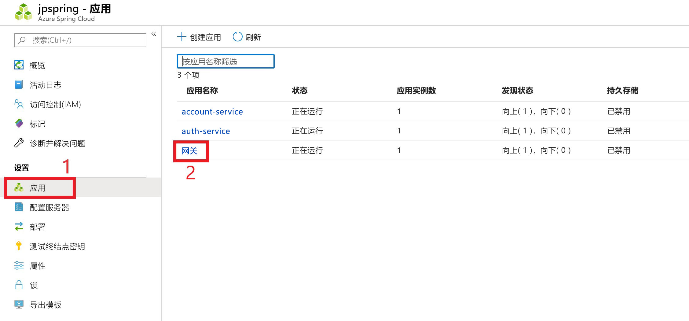

# <a name="use-persistent-storage-in-azure-spring-cloud"></a>在 Azure Spring Cloud 中使用永久性存储

Azure 春季云为应用程序提供了两种类型的存储：持久的和临时的。

默认情况下，Azure 春季云为每个应用程序实例提供临时存储。 对于每个实例，临时存储限制为每个实例为 5 GB，默认安装路径为/tmp。

> [!WARNING]
> 如果重新启动应用程序实例，则会永久删除关联的临时存储。

永久性存储是由 Azure 管理并按应用程序分配的文件共享容器。 存储在持久性存储中的数据由应用程序的所有实例共享。 Azure 春季云实例最多可以有10个已启用持久存储的应用程序。 每个应用程序分配 50 GB 的持久存储。 持久存储的默认装入路径为/persistent。

> [!WARNING]
> 如果禁用应用程序的持久性存储，则所有存储空间都将释放，并且存储的所有数据都将丢失。

## <a name="use-the-azure-portal-to-enable-persistent-storage"></a>使用 Azure 门户启用持久存储

1. 在 Azure 门户的**主页**中，选择 "**所有资源**"。

    >

1. 选择需要永久存储的 Azure 春季云资源。 在此示例中，所选应用程序名为**upspring**。

    > 

1. 在 "**设置**" 标题下，选择 "**应用**"。

1. Azure 春季云服务显示在表中。  选择要将持久存储添加到的服务。 在此示例中，选择了**网关**服务。

    > 

1. 从服务的配置页中，选择 "**配置**"

1. 选择 "**永久存储**" 选项卡，然后选择 "**启用**"。

    > 

启用永久存储后，其大小和路径将显示在 "配置" 页上。

## <a name="use-the-azure-cli-to-modify-persistent-storage"></a>使用 Azure CLI 修改持久性存储

如有必要，请为 Azure CLI 安装春季云扩展：

```azurecli
az extension add --name spring-cloud
```
其他操作：

* 若要创建启用持久存储的应用：

    ```azurecli
    az spring-cloud app create -n <app> -g <resource-group> -s <service-name> --enable-persistent-storage true
    ```

* 若要为现有应用启用持久存储：

    ```azurecli
    az spring-cloud app update -n <app> -g <resource-group> -s <service-name> --enable-persistent-storage true
    ```

* 在现有应用中禁用持久性存储：

    ```azurecli
    az spring-cloud app update -n <app> -g <resource-group> -s <service-name> --enable-persistent-storage false
    ```

    > [!WARNING]
    > 如果禁用应用程序的持久性存储，则将释放所有存储空间，并且所有存储的数据都将永久丢失。

## <a name="next-steps"></a>后续步骤

* 了解[应用程序和服务配额](spring-cloud-quotas.md)。
* 了解如何[手动缩放应用程序](spring-cloud-tutorial-scale-manual.md)。
