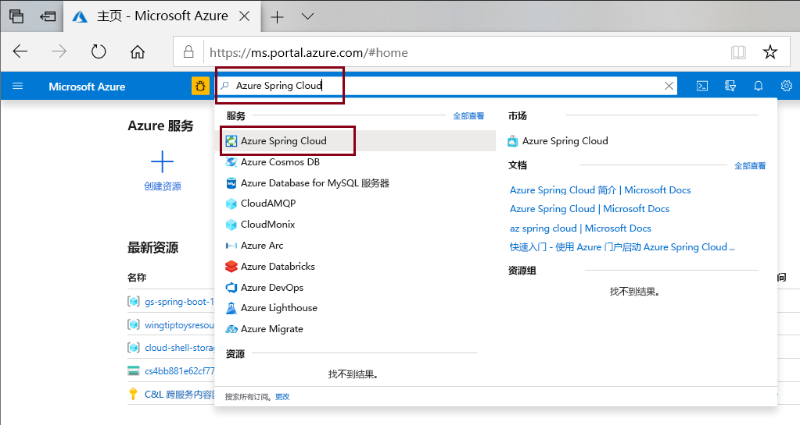
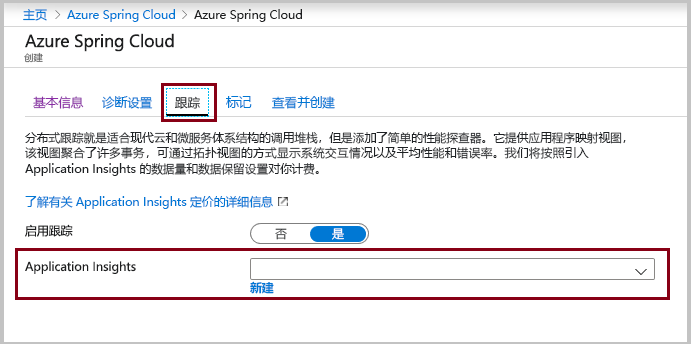
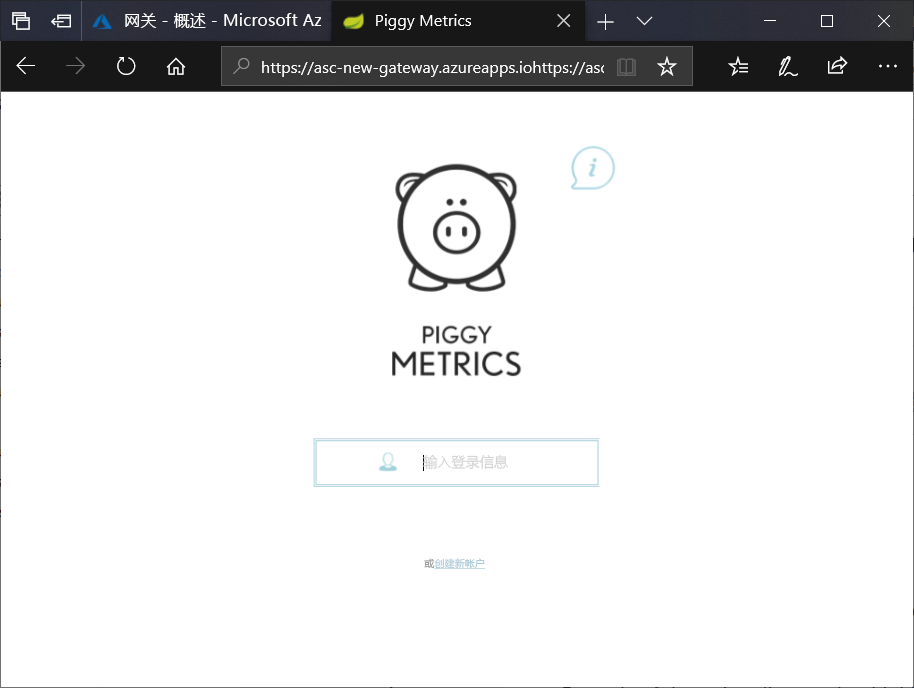

# <a name="quickstart-launch-an-existing-azure-spring-cloud-application-using-the-azure-portal"></a>快速入门：使用 Azure 门户启动现有 Azure Spring Cloud 应用程序

本快速入门介绍如何将现有的 Spring Cloud 应用程序部署到 Azure。 使用 Azure Spring Cloud 可以在 Azure 上轻松运行基于 Spring Cloud 的微服务应用程序。 

可以在 [GitHub 示例存储库](https://github.com/Azure-Samples/PiggyMetrics)中找到本教程中使用的示例应用程序代码。 完成后，可以在线访问所提供的示例应用程序，并可通过 Azure 门户对其进行管理。

本快速入门介绍如何执行以下操作：

> [!div class="checklist"]
> * 预配服务实例
> * 为实例设置配置服务器
> * 在本地构建微服务应用程序
> * 部署每个微服务
> * 为应用程序分配公共终结点

## <a name="prerequisites"></a>先决条件

>[!Note]
> Azure Spring Cloud 目前以公共预览版的形式提供。 使用公共预览版产品/服务，客户可以在产品/服务正式发布之前体验新功能。  公共预览功能和服务并非供生产使用。  有关预览期间支持的详细信息，请参阅[常见问题解答](https://azure.microsoft.com/support/faq/)或提交[支持请求](https://docs.microsoft.com/azure/azure-portal/supportability/how-to-create-azure-support-request)。

>[!TIP]
> Azure Cloud Shell 是免费的交互式 shell，可以使用它运行本文中的步骤。  它预装有常用的 Azure 工具，其中包括最新版的 Git、JDK、Maven 和 Azure CLI。 如果你已登录到 Azure 订阅，请从 shell.azure.com 启动 [Azure Cloud Shell](https://shell.azure.com)。  若要详细了解 Azure Cloud Shell，请[阅读我们的文档](../cloud-shell/overview.md)

完成本快速入门教程需要：

1. [安装 Git](https://git-scm.com/)
2. [安装 JDK 8](https://docs.microsoft.com/java/azure/jdk/?view=azure-java-stable)
3. [安装 Maven 3.0 或更高版本](https://maven.apache.org/download.cgi)
4. [安装 Azure CLI 2.0.67 或更高版本](https://docs.microsoft.com/cli/azure/install-azure-cli?view=azure-cli-latest)
5. [注册 Azure 订阅](https://azure.microsoft.com/free/)

## <a name="install-the-azure-cli-extension"></a>安装 Azure CLI 扩展

使用以下命令安装用于 Azure CLI 的 Azure Spring Cloud 扩展

```azurecli
az extension add --name spring-cloud
```

## <a name="provision-a-service-instance-on-the-azure-portal"></a>在 Azure 门户中预配服务实例

1. 在新选项卡中，打开 [Azure 门户](https://ms.portal.azure.com/)。 

2. 在顶部搜索框中，搜索“Azure Spring Cloud”。

3. 从结果中选择“Azure Spring Cloud”。

 

4. 在“Azure Spring Cloud”页上，单击“+ 添加”。

 

5. 在 Azure Spring Cloud“创建”页中填写表单。  遵循以下指南：
    - 订阅：选择要在其中收取此资源费用的订阅。  请确保此订阅已添加到 Azure Spring Cloud 的允许列表。
    - 资源组：最佳做法是为新资源创建新的资源组。
    - **服务详细信息/名称**：指定服务实例的名称。  该名称必须为 4 到 32 个字符，只能包含小写字母、数字及连字符。  服务名称的第一个字符必须是字母，最后一个字符必须是字母或数字。
    - 位置：选择服务实例的位置。 目前支持的位置包括：美国东部、美国西部 2、西欧和东南亚。

    

6. 单击“诊断设置”选项卡，打开以下对话框。

7. 可以将“启用日志”设置为“是”，或根据你的要求设置为“否”。

    

8. 单击“跟踪”选项卡。

9. 可以将“启用跟踪”设置为“是”，或根据你的要求设置为“否”。  如果将“启用跟踪”设置为“是”，请选择现有的应用程序见解，或创建一个新的。 如果没有 **Application Insights** 规范，将会出现验证错误。


    

10. 单击“审阅并创建”。

11. 验证你的规范，并单击“创建”。

部署服务大约需要 5 分钟的时间。  部署后，会显示服务实例的“概述”页。

> [!div class="nextstepaction"]
> [我遇到了问题](https://www.research.net/r/javae2e?tutorial=asc-portal-quickstart&step=provision)


## <a name="set-up-your-configuration-server"></a>设置配置服务器

1. 转到服务的“概览”页，选择“配置服务器”。 

2. 在“默认存储库”部分，将“URI”设置为“https://github.com/Azure-Samples/piggymetrics-config” 。

3. 选择“应用”以保存所做的更改。

    

> [!div class="nextstepaction"]
> [我遇到了问题](https://www.research.net/r/javae2e?tutorial=asc-portal-quickstart&step=config-server)

## <a name="build-and-deploy-microservice-applications"></a>生成并部署微服务应用程序

1. 打开 [Azure Cloud Shell](https://shell.azure.com)，将示例应用存储库克隆到本地计算机。  我们先在此处创建一个名为 `source-code` 的临时目录，然后再克隆应用。

    ```console
    mkdir source-code
    cd source-code
    git clone https://github.com/Azure-Samples/piggymetrics
    ```

2. 构建克隆包。

    ```console
    cd piggymetrics
    mvn clean package -DskipTests
    ```

3. 为资源组和服务指定名称。 请务必将以下占位符替换为之前在本教程中预配的资源组名称和服务名称。

    ```azurecli
    az configure --defaults group=<resource group name>
    az configure --defaults spring-cloud=<service instance name>
    ```

4. 创建 `gateway` 应用程序并部署 JAR 文件。  以下步骤需要 Spring Cloud 扩展。 如果安装未满足先决条件，请运行以下命令：

    ```azurecli
    az extension add --name spring-cloud
    ```

    使用 Spring Cloud 扩展创建应用：

    ```azurecli
    az spring-cloud app create -n gateway
    az spring-cloud app deploy -n gateway --jar-path ./gateway/target/gateway.jar
    ```

5. 遵循相同的模式创建 `account-service` 和 `auth-service` 应用程序，并部署其 JAR 文件。

    ```azurecli
    az spring-cloud app create -n account-service
    az spring-cloud app deploy -n account-service --jar-path ./account-service/target/account-service.jar
    az spring-cloud app create -n auth-service
    az spring-cloud app deploy -n auth-service --jar-path ./auth-service/target/auth-service.jar
    ```

6. 完成应用程序部署需要几分钟的时间。 若要确认是否已部署这些应用程序，请在 Azure 门户中转到“应用”边栏选项卡。 应会看到，这三个应用程序各占一行。

> [!div class="nextstepaction"]
> [我遇到了问题](https://www.research.net/r/javae2e?tutorial=asc-portal-quickstart&step=deploy)

## <a name="assign-a-public-endpoint-to-gateway"></a>将公共终结点分配到网关

1. 打开左侧菜单中的“应用”选项卡。

2. 选择 `gateway` 应用程序以显示“概述”页。

3. 选择“分配终结点”，将一个公共终结点分配到网关。 这可能需要几分钟的时间。

    

4. 在浏览器中输入分配的公共终结点（标记为 **URL**）以查看正在运行的应用程序。

    

> [!div class="nextstepaction"]
> [我遇到了问题](https://www.research.net/r/javae2e?tutorial=asc-portal-quickstart&step=public-endpoint)

## <a name="next-steps"></a>后续步骤

在此快速入门中，读者学习了如何：

> [!div class="checklist"]
> * 预配服务实例
> * 为实例设置配置服务器
> * 在本地构建微服务应用程序
> * 部署每个微服务
> * 为应用程序网关分配公共终结点

> [!div class="nextstepaction"]
> [准备好要部署的 Azure Spring Cloud 应用程序](spring-cloud-tutorial-prepare-app-deployment.md)

GitHub 中提供了更多示例：[Azure Spring Cloud 示例](https://github.com/Azure-Samples/Azure-Spring-Cloud-Samples/tree/master/service-binding-cosmosdb-sql)。
