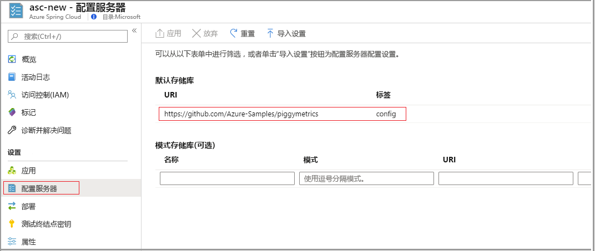

# <a name="tutorial-set-up-a-spring-cloud-config-server-for-your-service"></a>教程：为服务设置 Spring Cloud 配置服务器

本教程介绍如何将 Spring Cloud 配置服务器连接到 Azure Spring Cloud 服务。

Spring Cloud Config 为分布式系统中的外部化配置提供服务器和客户端支持。 使用配置服务器可在一个中心位置管理所有环境中应用程序的外部属性。 有关详细信息，请访问 [Spring Cloud 配置服务器参考](https://spring.io/projects/spring-cloud-config)。

## <a name="prerequisites"></a>先决条件
* Azure 订阅。 如果没有 Azure 订阅，请在开始之前创建一个[免费帐户](https://azure.microsoft.com/free/?WT.mc_id=A261C142F)。 
* 一个已预配的处于运行状态的 Azure Spring Cloud 服务。  完成[此快速入门](spring-cloud-quickstart-launch-app-cli.md)，了解如何预配并启动 Azure Spring Cloud 服务。

## <a name="restriction"></a>限制

在后端上使用__配置服务器__时存在一些限制。 某些属性将自动注入到应用程序环境，以访问“配置服务器”和“服务发现”   。 如果你同时从**配置服务器**文件配置了这些属性，可能会遇到冲突和意外的行为。 属性包括： 

```yaml
eureka.client.service-url.defaultZone
eureka.client.tls.keystore
server.port
spring.cloud.config.tls.keystore
spring.application.name
```
> [!CAUTION]
> 我们强烈建议__不要__将上述属性放入__配置服务器__应用程序文件中。

## <a name="create-your-config-server-files"></a>创建配置服务器文件

Azure Spring Cloud 支持使用 Azure DevOps、GitHub、GitLab 和 Bitbucket 来存储配置服务器文件。 准备好存储库后，请按照以下说明创建配置文件，并将其存储到这些位置。

此外，某些可配置的属性仅适用于某些类型。 以下小节列出了每个存储库类型的属性。

### <a name="public-repository"></a>公共存储库

使用公共存储库时，可配置属性的受限程度更严重。

下面列出了用于设置公共 `Git` 存储库的所有可配置属性。

> [!NOTE]
> 使用连字符（“-”）分隔单词是目前唯一受支持的命名约定。 例如，可以使用 `default-label`，但不能使用 `defaultLabel`。

| 属性        | 必选 | Feature                                                      |
| :-------------- | -------- | ------------------------------------------------------------ |
| `uri`           | `yes`    | 用作配置服务器后端的 `Git` 存储库的 `uri` 应以 `http://`、`https://`、`git@` 或 `ssh://` 开头。 |
| `default-label` | `no`     | `Git` 存储库的默认标签应为存储库的 `branch name`、`tag name` 或 `commit-id`。 |
| `search-paths`  | `no`     | 用于搜索 `Git` 存储库子目录的字符串数组。 |

------

### <a name="private-repository-with-ssh-authentication"></a>使用 SSH 身份验证的专用存储库

下面列出了用于设置使用 `Ssh` 的专用 `Git` 存储库的所有可配置属性。

> [!NOTE]
> 使用连字符（“-”）分隔单词是目前唯一受支持的命名约定。 例如，可以使用 `default-label`，但不能使用 `defaultLabel`。

| 属性                   | 必选 | Feature                                                      |
| :------------------------- | -------- | ------------------------------------------------------------ |
| `uri`                      | `yes`    | 用作配置服务器后端的 `Git` 存储库的 `uri` 应以 `http://`、`https://`、`git@` 或 `ssh://` 开头。 |
| `default-label`            | `no`     | `Git` 存储库的默认标签应为存储库的 `branch name`、`tag name` 或 `commit-id`。 |
| `search-paths`             | `no`     | 用于搜索 `Git` 存储库子目录的字符串数组。 |
| `private-key`              | `no`     | 用于访问 `Git` 存储库的 `Ssh` 私钥，如果 `uri` 以 `git@` 或 `ssh://` 开头，则此属性是必需的  。 |
| `host-key`                 | `no`     | Git 存储库服务器的主机密钥，不应包含 `host-key-algorithm` 涵盖的算法前缀。 |
| `host-key-algorithm`       | `no`     | 主机密钥算法应为 `ssh-dss`、`ssh-rsa`、`ecdsa-sha2-nistp256`、`ecdsa-sha2-nistp384` 或 `ecdsa-sha2-nistp521`。 仅当 `host-key` 存在时才是必需的。 |
| `strict-host-key-checking` | `no`     | 指示在利用专用 `host-key` 时配置服务器是否无法启动。 应为 `true`（默认值）或 `false`。 |

-----

### <a name="private-repository-with-basic-authentication"></a>使用基本身份验证的专用存储库

下面列出了用于设置使用基本身份验证的专用 Git 存储库的所有可配置属性。

> [!NOTE]
> 使用连字符（“-”）分隔单词是目前唯一受支持的命名约定。 例如，使用 `default-label` 而不是 `defaultLabel`。

| 属性        | 必选 | Feature                                                      |
| :-------------- | -------- | ------------------------------------------------------------ |
| `uri`           | `yes`    | 用作配置服务器后端的 `Git` 存储库的 `uri` 应以 `http://`、`https://`、`git@` 或 `ssh://` 开头。 |
| `default-label` | `no`     | `Git` 存储库的默认标签应为存储库的 `branch name`、`tag name` 或 `commit-id`。 |
| `search-paths`  | `no`     | 用于搜索 `Git` 存储库子目录的字符串数组。 |
| `username`      | `no`     | 用于访问 `Git` 存储库服务器的 `username`，如果 `Git` 存储库服务器支持 `Http Basic Authentication`，则此属性是必需的  。 |
| `password`      | `no`     | 用于访问 `Git` 存储库服务器的密码，如果 `Git` 存储库服务器支持 `Http Basic Authentication`，则此属性是必需的  。 |

> [!NOTE]
> 许多 `Git` 存储库服务器都支持对 `HTTP Basic Authentication` 使用令牌，而不支持使用密码。 某些存储库（如 GitHub）允许令牌无限期保留。 但是，某些 Git 存储库服务器（包括 Azure DevOps）会在数小时内强制令牌过期。 导致令牌过期的存储库不应在 Azure Spring Cloud 中使用基于令牌的身份验证。

### <a name="git-repositories-with-pattern"></a>带模式的 Git 存储库

下面列出了用于设置带模式的 Git 存储库的所有可配置属性。

> [!NOTE]
> 使用连字符（“-”）分隔单词是目前唯一受支持的命名约定。 例如，使用 `default-label` 而不是 `defaultLabel`。

| 属性                           | 必选         | Feature                                                      |
| :--------------------------------- | ---------------- | ------------------------------------------------------------ |
| `repos`                            | `no`             | 包含具有给定名称的 `Git` 存储库的设置的图。 |
| `repos."uri"`                      | `repos` 上的 `yes` | 用作配置服务器后端的 `Git` 存储库的 `uri` 应以 `http://`、`https://`、`git@` 或 `ssh://` 开头。 |
| `repos."name"`                     | `repos` 上的 `yes` | 用于标识一个 `Git` 存储库的名称，仅当 `repos` 存在时才是必需的  。 例如上面的 `team-A` 和 `team-B`。 |
| `repos."pattern"`                  | `no`             | 用于匹配应用程序名称的字符串数组。 对于每个模式，使用带有通配符的 `{application}/{profile}` 格式。 |
| `repos."default-label"`            | `no`             | `Git` 存储库的默认标签应为存储库的 `branch name`、`tag name` 或 `commit-id`。 |
| `repos."search-paths`"             | `no`             | 用于搜索 `Git` 存储库子目录的字符串数组。 |
| `repos."username"`                 | `no`             | 用于访问 `Git` 存储库服务器的 `username`，如果 `Git` 存储库服务器支持 `Http Basic Authentication`，则此属性是必需的  。 |
| `repos."password"`                 | `no`             | 用于访问 `Git` 存储库服务器的密码，如果 `Git` 存储库服务器支持 `Http Basic Authentication`，则此属性是必需的  。 |
| `repos."private-key"`              | `no`             | 用于访问 `Git` 存储库的 `Ssh` 私钥，如果 `uri` 以 `git@` 或 `ssh://` 开头，则此属性是必需的  。 |
| `repos."host-key"`                 | `no`             | Git 存储库服务器的主机密钥，不应包含 `host-key-algorithm` 涵盖的算法前缀。 |
| `repos."host-key-algorithm"`       | `no`             | 主机密钥算法应为 `ssh-dss`、`ssh-rsa`、`ecdsa-sha2-nistp256`、`ecdsa-sha2-nistp384` 或 `ecdsa-sha2-nistp521`。 仅当 `host-key` 存在时才是__必需的__。 |
| `repos."strict-host-key-checking"` | `no`             | 指示在利用专用 `host-key` 时配置服务器是否无法启动。 应为 `true`（默认值）或 `false`。 |

## <a name="attaching-your-config-server-repository-to-azure-spring-cloud"></a>将配置服务器存储库附加到 Azure Spring Cloud

将配置文件保存到存储库后，需要将 Azure Spring Cloud 连接到该存储库。

1. 登录到 [Azure 门户](https://portal.azure.com)。

1. 导航到 Azure Spring Cloud 的“概览”页。 

1. 选择要配置的服务。

1. 在服务页上的左侧菜单中，选择“设置”标题下的“配置服务器”选项卡。  



### <a name="input-repository-information-directly-to-the-azure-portal"></a>将存储库信息直接输入到 Azure 门户

#### <a name="default-repository"></a>默认存储库

* 公共存储库：在“默认存储库”  部分中，将存储库 URI 粘贴到“Uri”  部分。  将“标签”  设置为 `config`。 确保“身份验证”  设置为“公共”  ，然后选择“应用”  以完成操作。 

* 专用存储库：Azure Spring Cloud 支持基本的基于密码/令牌的身份验证和 SSH。

    * 基本身份验证：在“默认存储库”  部分中，将存储库 URI 粘贴到“Uri”  部分，然后单击“身份验证”  。 选择“基本”  作为你的“身份验证类型”  ，并输入你的用户名和密码/令牌来授予对 Azure Spring Cloud 的访问权限。 单击“确定”和“应用”完成配置服务器的设置。   。

    
    
    > [!CAUTION]
    > 某些 Git 存储库服务器（例如 GitHub）使用 `personal-token` 或 `access-token`（如密码）进行基本身份验证  。 你可以在 Azure Spring Cloud 中使用这种类型的令牌作为密码，因为它将永不过期。 但对于其他 Git 存储库服务器（例如 BitBucket 和 Azure DevOps），`access-token` 将在一到两小时后过期。 这意味着，在将这些存储库服务器与 Azure Spring Cloud 一起使用时，此选项是不可行的。

    * SSH：在“默认存储库”  部分中，将存储库 URI 粘贴到“Uri”  部分，然后单击“身份验证”  。 选择“SSH”  作为“身份验证类型”  ，然后输入“私钥”  。 可以根据需要指定“主机密钥”和“主机密钥算法”   。 请确保在配置服务器存储库中包含公钥。 单击“确定”和“应用”完成配置服务器的设置。   。

    

#### <a name="pattern-repository"></a>模式存储库

如果要使用可选的“模式存储库”  来配置服务，请使用与“默认存储库”  相同的方式指定“URI”  和“身份验证”  。 请确保为模式包含“名称”  ，然后单击“应用”  以将其附加到实例。 

### <a name="enter-repository-information-into-a-yaml-file"></a>将存储库信息输入 YAML 文件

如果已使用存储库设置编写 YAML 文件，则可以将 YAML 文件直接从本地计算机导入到 Azure Spring Cloud。 使用基本身份验证的专用存储库的简单 YAML 文件如下所示：

```yml
spring:
    cloud:
        config:
            server:
                git:
                    uri: https://github.com/azure-spring-cloud-samples/config-server-repository.git
                    username: <username>
                    password: <password/token>

```

单击“导入设置”  按钮，然后从项目目录中选择 `.yml` 文件。 单击“导入”  ，然后将弹出“通知”  中的 `async` 操作。 1-2 分钟后，它应报告成功。


你应看到 YAML 文件中的信息显示在 Azure 门户中。 单击“应用”  以完成操作。 


## <a name="delete-your-app-configuration"></a>删除应用配置

保存配置文件后，“配置”选项卡中会显示“删除应用配置”按钮。   单击此按钮会彻底清除现有的设置。 如果你希望将配置服务器连接到另一个源（例如，从 GitHub 移到 Azure DevOps），则应执行此操作。


## <a name="next-steps"></a>后续步骤

本教程已介绍如何启用和配置配置服务器。 若要详细了解如何管理应用程序，请继续学习有关手动缩放应用的教程。

> [!div class="nextstepaction"]
> [了解如何手动缩放 Azure Spring Cloud 应用程序](spring-cloud-tutorial-scale-manual.md)。

