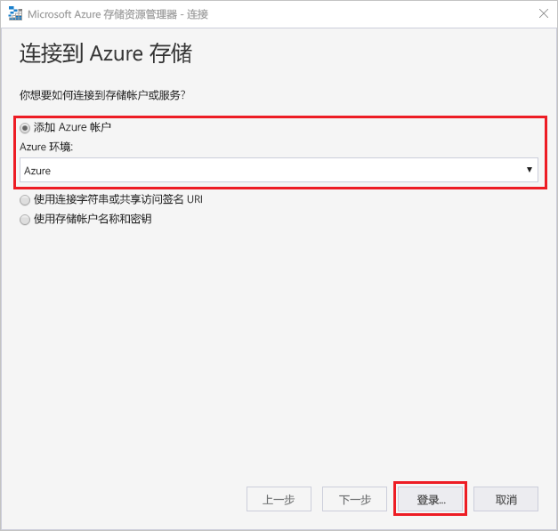
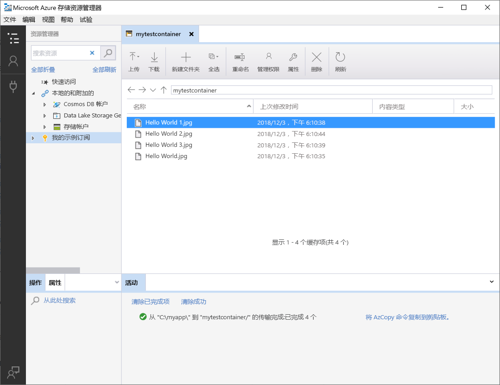
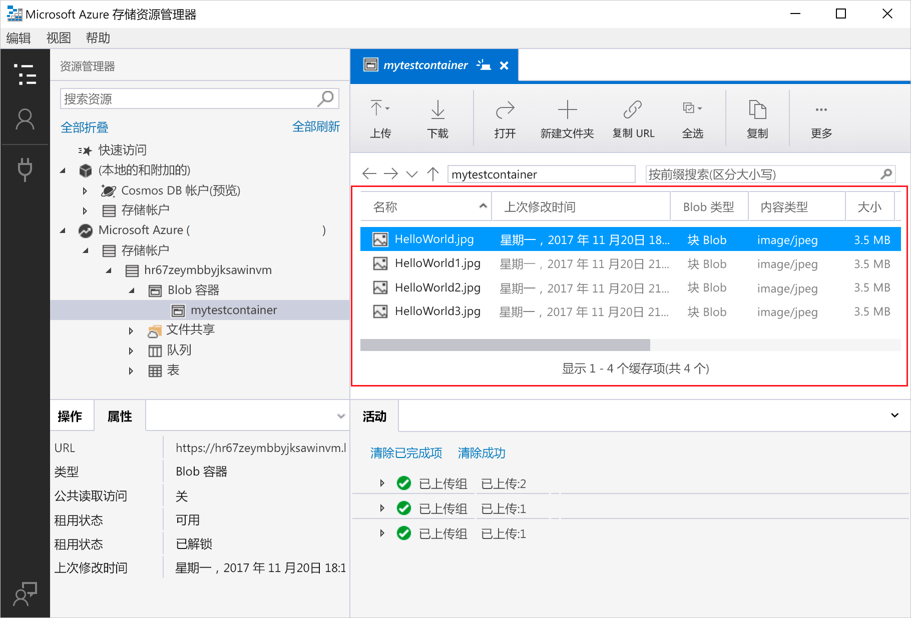

# Use Azure Storage Explorer with Azure Data Lake Storage Gen2

In this article, you'll learn how to use [Azure Storage Explorer](https://azure.microsoft.com/features/storage-explorer/) to create a directory and a blob. 接下来，介绍如何将 blob 下载到本地计算机，以及如何在目录中查看所有 blob。 此外，还将了解如何创建 blob 快照、管理目录访问策略以及创建共享访问签名。

## 必备组件

[!INCLUDE [storage-quickstart-prereq-include](../../../includes/storage-quickstart-prereq-include.md)]

本快速入门要求安装 Azure 存储资源管理器。 若要安装适用于 Windows、Macintosh 或 Linux 的 Azure 存储资源管理器，请参阅 [Azure 存储资源管理器](https://azure.microsoft.com/features/storage-explorer/)。

## 登录到存储资源管理器

首次启动时，会显示“Microsoft Azure 存储资源管理器 - 连接”窗口。 尽管存储资源管理器提供了几种连接到存储帐户的方法，但是目前只有一种方法支持管理 ACL。

|任务|用途|
|---|---|
|添加 Azure 帐户 | 将你重定向到组织的登录页，向 Azure 进行身份验证。 目前，如果想管理和设置 ACL，这是唯一支持的身份验证方法。 |

Select **Add an Azure Account** and click **Sign in..** . Follow the on-screen prompts to sign into your Azure account.

完成连接以后，Azure 存储资源管理器会进行加载并显示“资源管理器”选项卡。 以下视图可以查看通过 [Azure 存储模拟器](../common/storage-use-emulator.md?toc=%2fazure%2fstorage%2fblobs%2ftoc.json)、[Cosmos DB](../../cosmos-db/storage-explorer.md?toc=%2fazure%2fstorage%2fblobs%2ftoc.json) 帐户或 [Azure Stack](/azure-stack/user/azure-stack-storage-connect-se?toc=%2fazure%2fstorage%2fblobs%2ftoc.json) 环境配置的所有 Azure 存储帐户和本地存储。

## 创建容器

始终将 Blob 上传到目录中。 这样，就能够整理 blob 组，就像在计算机的文件夹中整理文件一样。

要创建目录，请展开在前面的步骤中创建的存储帐户。 选择“Blob 容器”，然后右键单击并选择“创建 Blob 容器”。 Enter the name for your container. When complete, press **Enter** to create the container. 成功创建 Blob 目录后，该目录会显示在所选存储帐户的“Blob 容器”文件夹下。

## 将 blob 上传到目录

Blob 存储支持块 blob、追加 blob 和页 blob。 用于备份 IaaS VM 的 VHD 文件是页 Blob。 追加 blob 用于日志记录，例如有时需要写入到文件，再继续添加更多信息。 Blob 存储中存储的大多数文件都是块 blob。

在目录功能区中，选择“上传”。 此操作提供上传文件夹或文件的选项。

选择要上传的文件或文件夹。 选择“Blob 类型”。 可以接受的选项是“追加”、“页”或“块”Blob。

如果上传 .vhd 或 .vhdx 文件，请选择“将 .vhd/.vhdx 文件作为页 Blob 上传(推荐)”。

在“上传到文件夹(可选)”字段中输入一个文件夹名称，用于在目录下的文件夹中存储文件或文件夹。 如果没有选择任何文件夹，文件会直接上传到目录。

选择“确定”以后，所选文件会排队上传。每个文件都会上传。 上传完成后，结果显示在“活动”窗口中。

## 查看目录中的 Blob

在 Azure 存储资源管理器应用程序的存储帐户下选择一个目录。 主窗格会显示一个列表，包含所选目录中的所有 Blob。

## 下载 Blob

若要使用 **Azure 存储资源管理器**下载 Blob，请在选中某个 Blob 的情况下，从功能区选择“下载”。 此时会打开一个文件对话框，用于输入文件名。 选择“保存”，开始将 Blob 下载到本地位置。

## 后续步骤

本快速入门介绍了如何使用 **Azure 存储资源管理器**在本地磁盘和 Azure Blob 存储之间转移文件。 要了解如何在文件和目录上设置 ACL，请继续阅读该主题的“操作说明”。

> [!div class="nextstepaction"]
> [如何在文件和目录上设置 ACL](data-lake-storage-how-to-set-permissions-storage-explorer.md)
