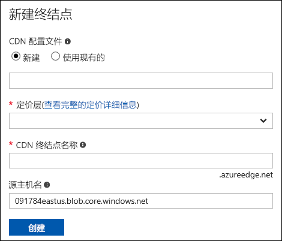

# 将静态网站与 Azure CDN 集成

可以启用[Azure 内容交付网络（CDN）](../../cdn/cdn-overview.md)来缓存 azure 存储帐户中托管的[静态网站](storage-blob-static-website.md)的内容。 可以使用 Azure CDN 为静态网站配置自定义域终结点，设置自定义 SSL 证书，并配置自定义重写规则。 配置 Azure CDN 会产生额外的费用，但会从世界各地的任何位置为网站提供一致的低延迟。 Azure CDN 还为 SSL 加密提供了自己的证书。 

有关 Azure CDN 定价的信息，请参阅[Azure CDN 定价](https://azure.microsoft.com/pricing/details/cdn/)。

## 为静态网站启用 Azure CDN

你可以直接从你的存储帐户启用静态网站 Azure CDN。 如果要为 CDN 终结点指定高级配置设置（例如[大文件下载优化](../../cdn/cdn-optimization-overview.md#large-file-download)），可以改为使用[Azure CDN 扩展](../../cdn/cdn-create-new-endpoint.md)来创建 cdn 配置文件和终结点。

1. 在 Azure 门户中找到存储帐户，并显示帐户概述。

2. 选择 " **Blob 服务**" 菜单下的 " **Azure CDN** " 以配置 Azure CDN。

    此时将显示 " **Azure CDN** " 页。

    

3. 在 " **CDN 配置文件**" 部分中，指定新的或现有的 CDN 配置文件。 

4. 为 CDN 终结点指定定价层。 若要了解有关定价的详细信息，请参阅[内容分发网络定价](https://azure.microsoft.com/pricing/details/cdn/)。 有关每个层提供的功能的详细信息，请参阅[比较 Azure CDN 产品功能](../../cdn/cdn-features.md)。

5. 在 " **cdn 终结点名称**" 字段中，指定 CDN 终结点的名称。 CDN 终结点在 Azure 中必须是唯一的。

6. 指定你是 "**源主机名**" 字段中的静态网站终结点。 

   若要查找你的静态网站终结点，请导航到你的存储帐户的**静态网站**设置。  复制主终结点，并将其粘贴到 CDN 配置中。

   > [!IMPORTANT]
   > 请确保删除 URL 中的协议标识符（*如*HTTPS）和尾随斜杠。 例如，如果 `https://mystorageaccount.z5.web.core.windows.net/`静态网站终结点，则可以在 "**源主机名**" 字段中指定 `mystorageaccount.z5.web.core.windows.net`。

   下图显示了一个示例终结点配置：

   

7. 选择 "**创建**"，然后等待它传播。 创建终结点后，它将显示在终结点列表中。

8. 若要验证是否已正确配置 CDN 终结点，请单击终结点以导航到其设置。 从存储帐户的 CDN 概述中，找到终结点主机名，然后导航到终结点，如下图所示。 CDN 终结点的格式将类似于 `https://staticwebsitesamples.azureedge.net`。

    

9. CDN 终结点传播完成后，导航到 CDN 终结点将显示之前上传到静态网站的索引 .html 文件的内容。

10. 若要查看 CDN 终结点的源设置，请导航到 CDN 终结点的 "**设置**" 部分下的 "**源**"。 你将看到 "**源类型**" 字段设置为 "*自定义源*" 并且 "**源主机名**" 字段显示你的静态网站终结点。

    

## 删除 Azure CDN 的内容

如果不再想要在 Azure CDN 中缓存对象，则可以执行以下步骤之一：

* 使容器专用而不是公共。 有关详细信息，请参阅[管理对容器和 blob 的匿名读取访问](storage-manage-access-to-resources.md)。
* 使用 Azure 门户禁用或删除 CDN 终结点。
* 修改托管服务，使其不再响应对象的请求。

已在 Azure CDN 中缓存的对象将保持缓存状态，直到该对象的生存时间到期，或直至[清除](../../cdn/cdn-purge-endpoint.md)终结点为止。 当生存时间到期时，Azure CDN 确定 CDN 终结点是否仍然有效，并且仍可通过匿名方式访问该对象。 否则，将不再缓存该对象。

## 后续步骤

可有可无将自定义域添加到 Azure CDN 终结点。 请参阅[教程：将自定义域添加到 Azure CDN 终结点](../../cdn/cdn-map-content-to-custom-domain.md)。
