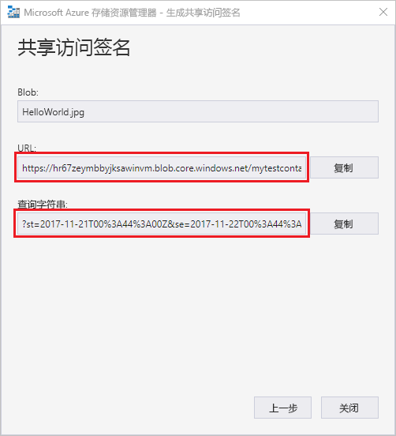

# 快速入门：使用 Azure 存储资源管理器在对象存储中创建 blob

本快速入门介绍如何使用 [Azure 存储资源管理器](https://azure.microsoft.com/features/storage-explorer/)创建容器和 blob。 接下来，将了解如何将 blob 下载到本地计算机，以及如何在容器中查看所有 blob。 此外，还将了解如何创建 blob 快照、管理容器访问策略以及创建共享访问签名。

## 先决条件

[!INCLUDE [storage-quickstart-prereq-include](../../../includes/storage-quickstart-prereq-include.md)]

本快速入门要求安装 Azure 存储资源管理器。 若要安装适用于 Windows、Macintosh 或 Linux 的 Azure 存储资源管理器，请参阅 [Azure 存储资源管理器](https://azure.microsoft.com/features/storage-explorer/)。

## 登录到存储资源管理器

首次启动时，会显示“Microsoft Azure 存储资源管理器 - 连接”窗口。 存储资源管理器提供了多种连接到存储帐户的方式。 下表列出了不同的连接方式：

|任务|目的|
|---|---|
|添加 Azure 帐户 | 将你重定向到组织的登录页，向 Azure 进行身份验证。 |
|使用连接字符串或共享访问签名 URI | 可以用来通过 SAS 令牌或共享的连接字符串直接访问容器或存储帐户。 |
|使用存储帐户名称和密钥| 使用存储帐户的名称和密钥连接到 Azure 存储。|

选择“添加 Azure 帐户”，然后单击“登录...”。按照屏幕提示操作，登录到 Azure 帐户。

完成连接以后，Azure 存储资源管理器会进行加载并显示“资源管理器”选项卡。 以下视图可以查看通过 [Azure 存储模拟器](../common/storage-use-emulator.md?toc=%2fazure%2fstorage%2fblobs%2ftoc.json)、[Cosmos DB](../../cosmos-db/storage-explorer.md?toc=%2fazure%2fstorage%2fblobs%2ftoc.json) 帐户或 [Azure Stack](/azure-stack/user/azure-stack-storage-connect-se?toc=%2fazure%2fstorage%2fblobs%2ftoc.json) 环境配置的所有 Azure 存储帐户和本地存储。

## 创建容器

始终将 Blob 上传到容器中。 这样，就能够整理 blob 组，就像在计算机的文件夹中整理文件一样。

若要创建容器，请展开在前面的步骤中创建的存储帐户。 选择“Blob 容器”，然后右键单击并选择“创建 Blob 容器”。 输入 Blob 容器的名称。 参阅[创建容器和设置权限](storage-quickstart-blobs-dotnet.md#create-the-container-and-set-permissions)部分，获取有关 Blob 容器命名规则和限制的列表。 完成后，按 **Enter** 创建 Blob 容器。 成功创建 Blob 容器后，该容器会显示在所选存储帐户的“Blob 容器”文件夹下。

## 将 blob 上传到容器

blob 存储支持块 blob、追加 blob 和页 blob。 用于备份 IaaS VM 的 VHD 文件都是页 blob。 追加 blob 用于日志记录，例如有时需要写入到文件，再继续添加更多信息。 Blob 存储中存储的大多数文件都是块 blob。

在容器功能区中，选择“上传”。 此操作提供上传文件夹或文件的选项。

选择要上传的文件或文件夹。 选择“Blob 类型”。 可以接受的选项是“追加”、“页”或“块”Blob。

如果上传 .vhd 或 .vhdx 文件，请选择“将 .vhd/.vhdx 文件作为页 Blob 上传(推荐)”。

在“上传到文件夹(可选)”字段中输入一个文件夹名称，用于在容器下的文件夹中存储文件或文件夹。 如果没有选择任何文件夹，文件会直接上传到容器下。

选择“确定”以后，所选文件会排队上传。每个文件都会上传。 上传完成后，结果显示在“活动”窗口中。

## 查看容器中的 Blob

在 **Azure 存储资源管理器**应用程序的存储帐户下选择一个容器。 主窗格会显示一个列表，包含所选容器中的 Blob。

## 下载 Blob

若要使用 **Azure 存储资源管理器**下载 Blob，请在选中某个 Blob 的情况下，从功能区选择“下载”。 此时会打开一个文件对话框，用于输入文件名。 选择“保存”，开始将 Blob 下载到本地位置。

## 管理快照

Azure 存储资源管理器提供拍摄和管理 Blob [快照](storage-blob-snapshots.md)的功能。 若要拍摄 Blob 的快照，请右键单击 Blob，然后选择“创建快照”。 若要查看 Blob 的快照，请右键单击 Blob，然后选择“管理快照”。 此时会在当前选项卡中显示 Blob 的快照列表。

## 管理访问策略

存储资源管理器提供在其用户界面中管理容器的访问策略的功能。 有两种类型的安全访问策略 (SAS)，分别为服务级别的和帐户级别的。 帐户级别 SAS 针对存储帐户，适用于多个服务和资源。 服务级别 SAS 基于特定服务下的资源而定义。 若要生成服务级别 SAS，请右键单击任意容器，然后选择“管理访问策略...”。若要生成帐户级别 SAS，请右键单击存储帐户。

选择“添加”添加新的访问策略，然后定义该策略的权限。 完成后选择“保存”，保存此访问策略。 此策略现在可以用于配置共享访问签名。

## 使用共享访问签名

共享访问签名 (SAS) 可以通过存储资源管理器进行检索。 右键单击存储帐户、容器或 Blob，然后选择“获取共享访问签名...”。选择 SAS URL 的开始时间和过期时间以及权限，然后选择“创建”。 包含查询字符串的完整 URL 以及查询字符串本身都已提供，可以从下一屏幕复制。

## 后续步骤

本快速入门介绍了如何使用 **Azure 存储资源管理器**在本地磁盘和 Azure Blob 存储之间转移文件。 要深入了解如何使用 Blob 存储，请继续学习 Blob 存储操作说明。

> [!div class="nextstepaction"]
> [Blob 存储操作说明](storage-how-to-use-blobs-powershell.md)
