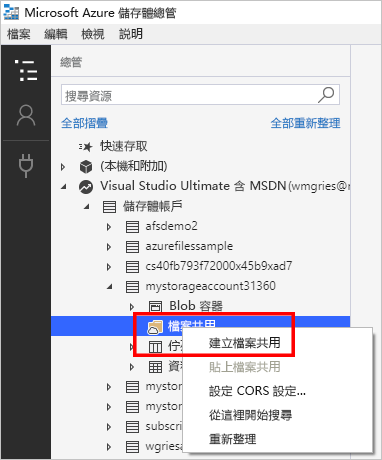
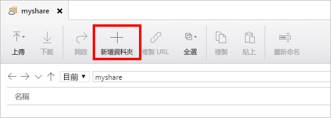

# 使用 Azure 存储资源管理器管理 Azure 文件共享 
[Azure 文件](storage-files-introduction.md)是 Microsoft 推出的易用云文件系统。 本指南介绍通过 [Azure 存储资源管理器](https://azure.microsoft.com/features/storage-explorer/)来使用 Azure 文件共享的基本知识。 Azure 存储资源管理器是一种适用于 Windows、macOS 和 Linux 的常用客户端工具，可以管理 Azure 文件共享和其他存储资源。

本快速入门要求安装 Azure 存储资源管理器。 如需安装该管理器，请通过 [Azure 存储资源管理器](https://azure.microsoft.com/features/storage-explorer/)进行下载。

本文介绍如何执行以下操作：

> [!div class="checklist"]
> * 创建资源组和存储帐户
> * 创建 Azure 文件共享 
> * 创建目录
> * 上传文件
> * 下载文件
> * 创建和使用共享快照

如果还没有 Azure 订阅，可以在开始前创建一个[免费帐户](https://azure.microsoft.com/free/?WT.mc_id=A261C142F)。

## 创建存储帐户
Azure 存储资源管理器不能创建新资源，因此为了完成本演示，请通过 [Azure 门户](https://portal.azure.com/)创建存储帐户。 

[!INCLUDE [storage-files-create-storage-account-portal](../../../includes/storage-files-create-storage-account-portal.md)]

## 将 Azure 存储资源管理器连接到 Azure 资源
首次启动时，会显示“Microsoft Azure 存储资源管理器 - 连接”窗口。 Azure 存储资源管理器提供了多种连接到存储帐户的方式： 

- **通过 Azure 帐户登录**：可以通过组织或 Microsoft 帐户的用户凭据登录。 
- **使用连接字符串或 SAS 令牌连接到特定的存储帐户**：连接字符串是一种特殊的字符串，其中包含的存储帐户名称和存储帐户密钥/SAS 令牌允许 Azure 存储资源管理器直接访问存储帐户（而不是只查看 Azure 帐户中的所有存储帐户）。 若要详细了解连接字符串，请参阅[配置 Azure 存储连接字符串](../common/storage-configure-connection-string.md?toc=%2fazure%2fstorage%2ffiles%2ftoc.json)。
- **使用存储帐户名称和密钥连接到特定的存储帐户**：使用存储帐户的名称和密钥连接到 Azure 存储。

对于本快速入门，请使用 Azure 帐户登录。 选择“添加 Azure 帐户”，然后单击“登录”。 按照屏幕提示操作，登录到 Azure 帐户。

### 创建文件共享
若要在 *storageacct<random number>* 存储帐户中创建第一个 Azure 文件共享，请执行以下操作：

1. 展开所创建的存储帐户。
2. 右键单击“文件共享”，然后选择“创建文件共享”。  
    

3. 键入 *myshare* 作为文件共享，然后按 **Enter**。

> [!Important]  
> 共享名必须全部采用小写字母、数字和单个连字符，但不能以连字符开头。 有关命名文件共享和文件的完整详细信息，请参阅 [命名和引用共享、目录、文件和元数据](https://docs.microsoft.com/rest/api/storageservices/Naming-and-Referencing-Shares--Directories--Files--and-Metadata)。

创建文件共享以后，右窗格会为文件共享打开一个选项卡。 

## 操作 Azure 文件共享的内容
创建 Azure 文件共享以后，即可使用 SMB 在 [Windows](storage-how-to-use-files-windows.md)、[Linux](storage-how-to-use-files-linux.md) 或 [macOS](storage-how-to-use-files-mac.md) 上装载该文件共享。 也可通过 Azure 门户操作 Azure 文件共享。 所有通过 Azure 门户发出的请求都是通过文件 REST API 发出的，因此不需 SMB 访问权限即可在客户端创建、修改和删除文件和目录。

### 创建目录
添加目录就是提供管理文件共享所需的层次结构。 可以创建多个级别，但在创建子目录之前，必须确保所有父目录都存在。 例如，对于路径 myDirectory/mySubDirectory，必须先创建目录 *myDirectory*，然后创建 *mySubDirectory*。 

1. 在文件共享对应的选项卡的顶部菜单中，单击“+ 新建文件夹”按钮。 此时会打开“创建新目录”页。
    

2. 键入 *myDirectory* 作为名称，然后单击“确定”。 

*myDirectory* 目录会列在 *myshare* 文件共享对应的选项卡上。

### 上传文件 
将文件从本地计算机上传到文件共享中的新目录。 可以上传整个文件夹，也可以只上传单个文件。

1. 在顶部菜单中，选择“上传”。 这样就可以选择是上传文件夹还是文件。

2. 选择“上传文件”，然后从本地计算机选择要上传的文件。

3. 在“上传到目录”中，键入 *myDirectory*，然后单击“上传”。 

完成后，文件会显示在 **myDirectory** 页的列表中。

### 下载文件
若要下载文件共享中某个文件的副本，可右键单击该文件，然后选择“下载”。 选择要在本地计算机的哪个位置放置该文件，然后单击“保存”。

可以在窗口底部的“活动”窗格中看到下载进度。

## 创建和修改共享快照
快照保存 Azure 文件共享在某个时间点的副本。 文件共享快照类似于你可能已经熟悉的其他技术，例如：
- 适用于 Windows 文件系统（例如 NTFS 和 ReFS）的[卷影复制服务 (VSS)](https://docs.microsoft.com/previous-versions/windows/it-pro/windows-server-2008-R2-and-2008/ee923636)。
- 适用于 Linux 系统的[逻辑卷管理器 (LVM)](https://en.wikipedia.org/wiki/Logical_Volume_Manager_(Linux)#Basic_functionality) 快照。
- 适用于 macOS 的 [Apple 文件系统 (APFS)](https://developer.apple.com/library/content/documentation/FileManagement/Conceptual/APFS_Guide/Features/Features.html) 快照。 

若要创建共享快照，请执行以下操作：

1. 打开 *myshare* 文件共享对应的选项卡。
2. 在选项卡顶部的菜单中，单击“创建快照”（此按钮可能隐藏在“...更多”后面，具体取决于 Azure 存储资源管理器的窗口尺寸）。  
    

### 列出并浏览共享快照
创建快照以后，即可单击“查看文件共享的快照”（此按钮可能隐藏在“...更多”后面，具体取决于 Azure 存储资源管理器的窗口尺寸），列出文件共享的快照。 双击共享快照即可对其进行浏览。

### 从共享快照还原
若要演示如何从共享快照还原某个文件，需先将文件从实时 Azure 文件共享中删除。 导航到 *myDirectory* 文件夹中，右键单击已上传的文件，然后单击“删除”。 然后，若要从共享快照还原该文件，请执行以下操作：

1. 单击“查看文件共享的快照”（此按钮可能隐藏在“...更多”后面，具体取决于 Azure 存储资源管理器的窗口尺寸）。
2. 从列表中选择一个共享快照，双击进行导航。
3. 通过快照进行导航，直至找到已删除的文件，选中该文件，然后单击“还原快照”（此按钮可能隐藏在“...更多”后面，具体取决于 Azure 存储资源管理器的窗口尺寸）。 此时会出现一个警告，指出还原该文件会覆盖文件共享的内容，而且此操作不能撤消。 选择“确定”。
4. 该文件现在应该在其实时 Azure 文件共享下的原始位置。

### 删除共享快照
若要删除共享快照，请[导航到共享快照的列表](#list-and-browse-share-snapshots)。 右键单击要删除的共享快照，然后选择“删除”。

## 清理资源
Azure 存储资源管理器不能删除资源；可以通过 [Azure 门户](https://portal.azure.com/)清理本快速入门中的资源。 

[!INCLUDE [storage-files-clean-up-portal](../../../includes/storage-files-clean-up-portal.md)]

## 后续步骤
- [使用 Azure 门户管理文件共享](storage-how-to-use-files-portal.md)
- [使用 Azure PowerShell 管理文件共享](storage-how-to-use-files-powershell.md)
- [使用 Azure CLI 管理文件共享](storage-how-to-use-files-cli.md)
- [规划 Azure 文件部署](storage-files-planning.md)