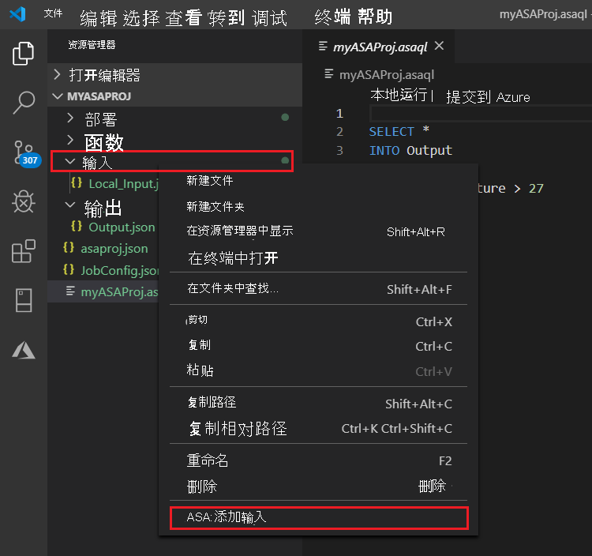
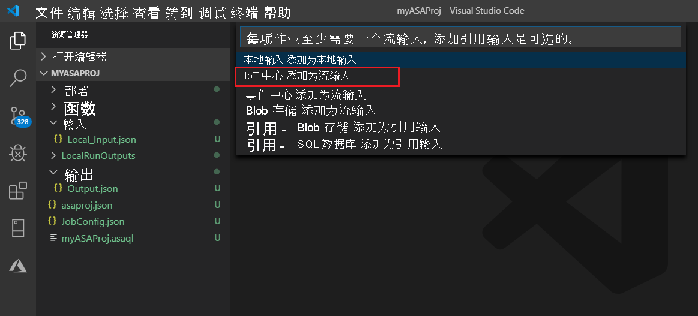

# 使用 Visual Studio Code 通过实时流输入在本地测试流分析查询

可以使用适用于 Visual Studio Code 的 Azure 流分析工具通过实时流输入在本地测试流分析作业。 输入可以来自诸如 Azure 事件中心或 Azure IoT 中心的源。 输出结果以 JSON 文件的形式发送到项目中名为 **LocalRunOutputs** 的文件夹。

## 先决条件

* 安装 [.NET Core SDK](https://dotnet.microsoft.com/download) 并重启 Visual Studio Code。

* 使用此[快速入门](quick-create-visual-studio-code.md)了解如何使用 Visual Studio Code 创建流分析作业。

## 定义实时流输入

1. 右键单击流分析项目中的“输入”文件夹  。 然后从上下文菜单中选择“ASA:  添加输入”。

   

   还可以选择 **Ctrl+Shift+P** 以打开命令面板，然后输入 **ASA:Add Input**。

   

2. 从下拉列表中选择一个输入源类型。

   

3. 如果从命令面板添加了输入，请选择将使用该输入的流分析查询脚本。 该脚本中应会自动填充 myASAproj.asaql 的文件路径  。

   

4. 从下拉菜单中选择“从 Azure 订阅中选择”  。

    

5. 配置新生成的 JSON 文件。 可以借助 CodeLens 功能来输入字符串，从下拉列表中选择值，或者直接在文件中更改文本。 以下屏幕截图显示了“从订阅中选择”示例  。

   

## 预览输入

若要确保输入数据能够到来，请在你的实时输入配置文件中从顶部行中选择“预览数据”  。 某些输入数据来自 IoT 中心，并显示在预览窗口中。 预览可能需要几秒钟才会出现。

 

## 在本地运行查询

返回到查询编辑器，并选择“在本地运行”  。 然后从下拉列表中选择“使用实时输入”  。

结果将显示在右侧窗口中，并且每 3 秒刷新一次。 你可以选择“运行”  以再次测试。 还可以选择“在文件夹中打开”  以在文件资源管理器中查看结果文件，并使用 Visual Studio Code 或 Excel 之类的工具将其打开。 请注意，结果文件仅以 JSON 格式提供。

作业开始创建输出的默认时间设置为“立即”  。 你可以通过选择结果窗口中的“输出开始时间”  按钮来自定义时间。

## 后续步骤

* [使用 Visual Studio Code（预览版）浏览 Azure 流分析作业](visual-studio-code-explore-jobs.md)

* [使用 npm 包设置 CI/CD 管道](setup-cicd-vs-code.md)
