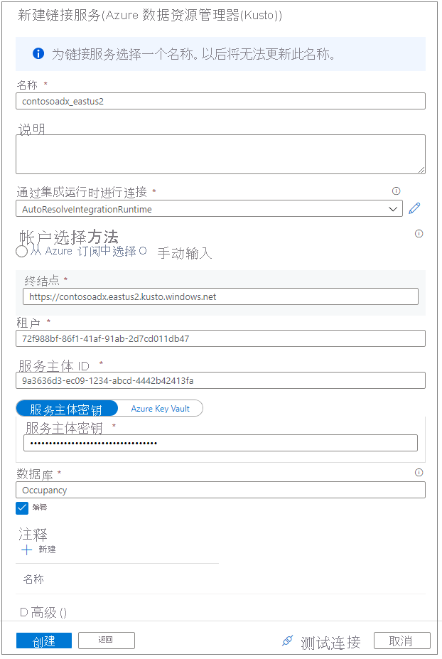
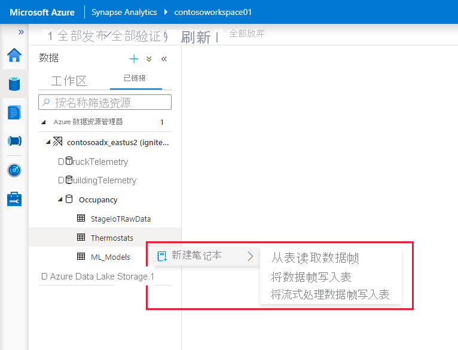

# 使用 Synapse Apache Spark 连接到 Azure 数据资源管理器

本文介绍如何使用 Synapse Apache Spark 从 Synapse Studio 访问 Azure 数据资源管理器数据库。 

## 先决条件

* [创建 Azure 数据资源管理器群集和数据库](/azure/data-explorer/create-cluster-database-portal)。
* 现有的 Synapse 工作区或按照此[快速入门](./quickstart-create-workspace.md)创建一个新工作区 
* 现有的 Synapse Apache Spark 池或按照此[快速入门](./quickstart-create-apache-spark-pool-portal.md)创建一个新的池
* [预配 Azure AD 应用程序以创建 Azure AD 应用。](/azure/data-explorer/kusto/management/access-control/how-to-provision-aad-app)
* 按照[管理 Azure 数据资源管理器数据库权限](/azure/data-explorer/manage-database-permissions)授予 Azure AD 应用访问数据库的权限

## 导航到 Synapse Studio

在 Synapse 工作区中，选择“启动 Synapse Studio”。 在 Synapse Studio 主页上，选择“数据”，这会将你转到“数据对象资源管理器” 。

## 将 Azure 数据资源管理器数据库连接到 Synapse 工作区

将 Azure 数据资源管理器数据库连接到工作区是通过链接服务完成的。 Azure 数据资源管理器链接服务使用户能够浏览和发现数据，从 Apache Spark for Azure Synapse Analytics 读取和写入数据，并在管道中运行集成作业。

从数据对象资源管理器中，按照以下步骤直接连接 Azure 数据资源管理器群集：

1. 选择数据旁边的 + 图标
2. 选择“连接到外部数据”
3. 选择“Azure 数据资源管理器(Kusto)”
5. 选择“继续”
6. 命名链接服务。 该名称将显示在对象资源管理器中，并由 Synapse 运行时用于连接到数据库。 建议使用易记名称
7. 从订阅中选择 Azure 数据 资源管理器群集或输入 URI。
8. 输入“服务主体 ID”和“服务主体密钥”（确保此服务主体在数据库上具有查看访问权限，以进行读取操作并对引入数据具有引入器访问权限）
9. 输入 Azure 数据资源管理器数据库名称
10. 单击“测试连接”以确保你具有正确的权限
11. 选择“创建”

    

    > [!NOTE]
    > （可选）测试连接不会验证写入访问权限，请确保服务主体 ID 对 Azure 数据资源管理器数据库具有写入访问权限。

12. Azure 数据资源管理器群集和数据库在 Azure 数据资源管理器部分“链接”选项卡下可见。 

    

    > [!NOTE] 
    > 在当前版本中，将根据你在 Azure 数据资源管理器数据库上的 AAD 帐户权限填充数据库对象。 运行 Apache Spark 笔记本或集成作业时，将使用链接服务中的凭据（即服务主体）。

## 与代码生成的操作快速交互

* 右键单击某一数据库或表时，你将会获得一个手势列表，该列表将触发一个示例 Spark 笔记本，用于读取数据、写入数据、将数据流式传输到 Azure 数据资源管理器。 
    

* 下面是读取数据的示例。 已将笔记本附加到 Spark 池，并运行单元格

   > [!NOTE] 
   > 首次执行时，可能需要三分多钟才能启动 Spark 会话。 后续执行的速度要快得多。  

## 限制
Azure 数据资源管理器连接器目前不支持 Azure Synapse 托管 VNET。

## 后续步骤

* [具有高级选项的示例代码](https://github.com/Azure/azure-kusto-spark/blob/master/samples/src/main/python/SynapseSample.py)
* [Azure 数据资源管理器 (Kusto) Spark 连接器](https://github.com/Azure/azure-kusto-spark)