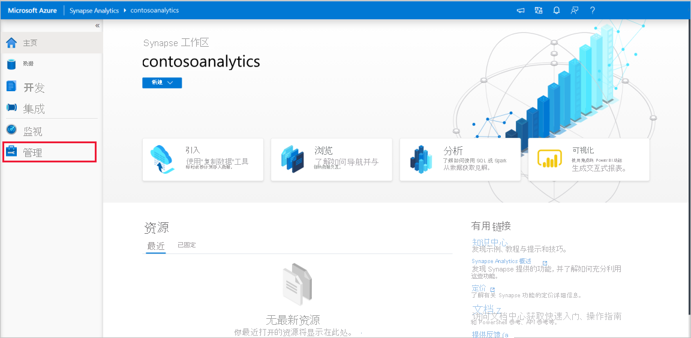
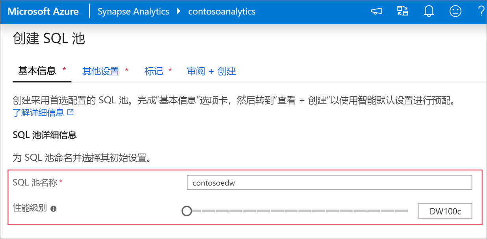
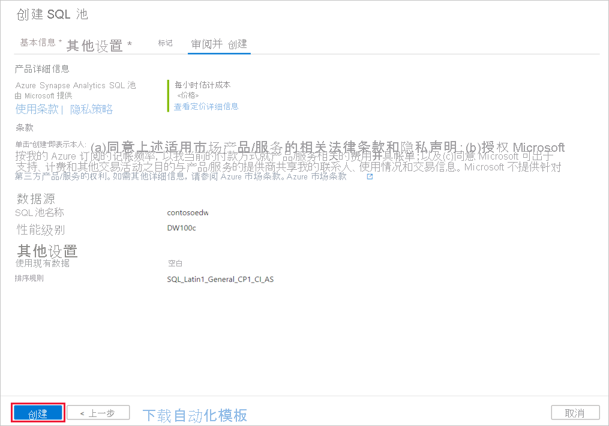
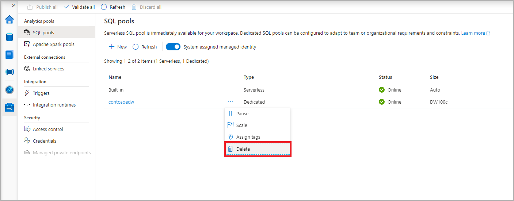
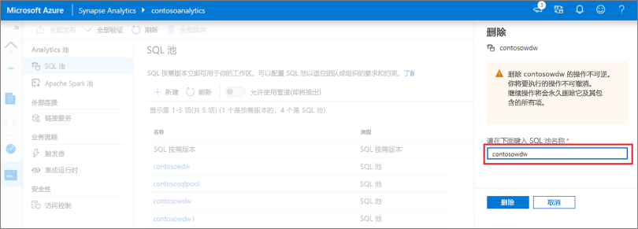

# 快速入门：使用 Synapse Studio 创建 Synapse SQL 池

Azure Synapse Analytics 提供了各种分析引擎，可帮助你引入、转换和分析数据，以及对数据建模。 SQL 池提供基于 T-SQL 的计算和存储功能。 在 Synapse 工作区中创建 SQL 池后，可以加载、处理和提供数据以及为数据建模，更快地获取分析见解。

本快速入门介绍了使用 Synapse Studio 在 Synapse 工作区中创建 SQL 池的步骤。

如果没有 Azure 订阅，请[在开始之前创建一个免费帐户](https://azure.microsoft.com/free/)。

## 先决条件

- Azure 订阅 - [创建免费帐户](https://azure.microsoft.com/free/)
- [Synapse 工作区](quickstart-create-workspace.md)

## 登录到 Azure 门户

登录到 [Azure 门户](https://portal.azure.com/)

## 导航到 Synapse 工作区

1. 导航到要在其中创建 SQL 池的 Synapse 工作区，方法是在搜索栏中键入服务名称（或直接键入资源名称）。

1. 从工作区列表中，键入要打开的工作区的名称（或名称的一部分）。 在此示例中，我们将使用名为 contosoanalytics 的工作区。

## 启动 Synapse Studio

1. 从工作区概述中，选择“启动 Synapse Studio”以打开将在其中创建 SQL 池的位置。 直接在搜索栏中键入服务名称或资源名称。

## 在 Synapse Studio 中创建 SQL 池

1. 在 Synapse Studio 主页上，选择“管理”图标以导航到左侧导航栏中的“管理中心” 。

1. 进入管理中心后，导航到“SQL 池”部分，查看工作区中可用的 SQL 池的当前列表。

1. 选择“+ 新建”命令，随即会显示新 SQL 池创建向导。 

1. 在“基本信息”选项卡中输入以下详细信息：

    | 设置 | 建议的值 | 说明 |
    | :------ | :-------------- | :---------- |
    | **SQL 池名称** | contosoedw | 这是 SQL 池要使用的名称。 |
    | **性能级别** | DW100c | 请将此项设置为最小大小，以降低本快速入门的成本 |

    
    > [!IMPORTANT]
    > 请注意，SQL 池可以使用的名称有特定的限制。 名称不能包含特殊字符，不能多于 15 个字符，不能包含保留字，并且在工作区中必须是独一无二的。

4. 在下一个选项卡“其他设置”中，选择“无”来预配没有数据的 SQL 池 。 让默认排序规则保持选中状态。

1. 目前不会添加任何标记，因此请选择“下一步:查看 + 创建”。

1. 在“查看 + 创建”选项卡中，根据前面输入的内容，确保详细信息正确，然后按“创建” 。 

1. 此时会启动资源预配流。

1. 预配完成后，导航回到工作区会显示新建的 SQL 池对应的新条目。
 

1. 创建 SQL 池后，它将出现在工作区中，用于加载数据、处理流、从 Lake 中读取数据，等等。

## 使用 Synapse Studio 清理 SQL 池    

执行以下步骤，使用 Synapse Studio 从工作区中删除 SQL 池。
> [!WARNING]
> 删除 SQL 池会从工作区中删除分析引擎。 将不再可以连接到该池，并且使用此 SQL 池的所有查询、管道和笔记本都不再可以正常运行。

若要删除 SQL 池，请执行以下操作：

1. 在 Synapse Studio 的管理中心导航到 SQL 池。
1. 选择要删除的 SQL 池的省略号（在本例中为 contosoedw）以显示 SQL 池的命令：
1. 按“删除”。
1. 确认删除，然后按“删除”按钮。
 
1. 成功完成此过程后，工作区资源中将不再列出该 SQL 池。

## 后续步骤 
- 请参阅[快速入门：创建 Apache Spark 笔记本](quickstart-apache-spark-notebook.md)。
- 请参阅[快速入门：使用 Azure 门户创建 Synapse SQL 池](quickstart-create-sql-pool-portal.md)。
