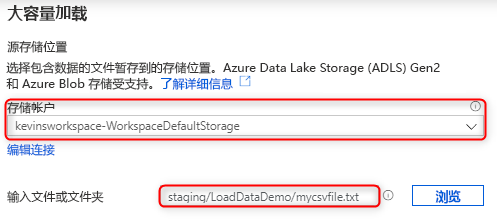
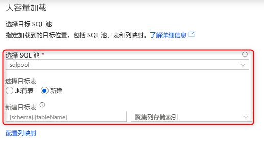
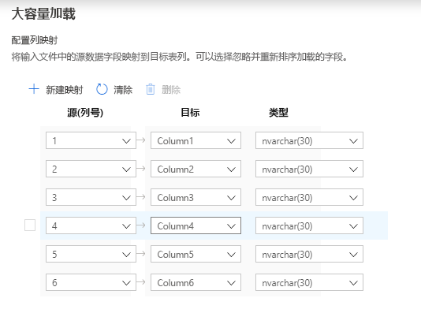
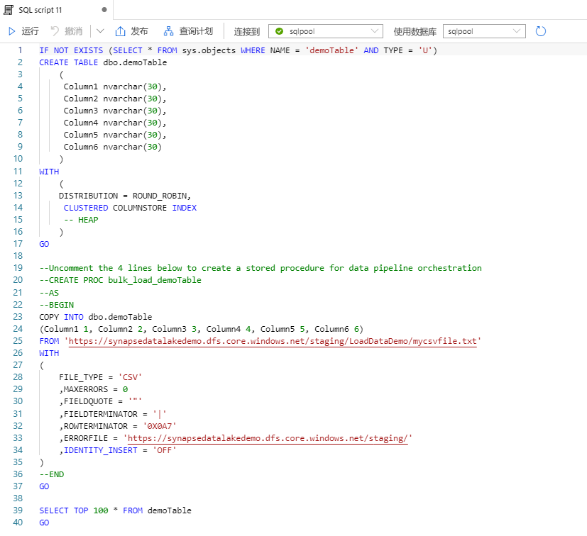

# 使用 Synapse SQL 进行大容量加载

使用 Synapse Studio 中的“大容量加载”向导时，加载数据相当简单。 此向导将引导你使用 [COPY 语句](https://docs.microsoft.com/sql/t-sql/statements/copy-into-transact-sql?view=azure-sqldw-latest)创建 T-SQL 脚本以大容量加载数据。 

## “大容量加载”向导的入口点

现在，只需在 Synapse Studio 中的以下区域单击鼠标右键，即可轻松使用 SQL 池大容量加载数据：

- 已连接到工作区的 Azure 存储帐户中的文件或文件夹 

## 先决条件

- 必须至少具有 ADLS Gen2 帐户的存储 Blob 数据参与者 RBAC 角色才能访问工作区。

- 若要创建一个新表，以便将数据加载到其中，必须具有[使用 COPY 语句的权限](https://docs.microsoft.com/sql/t-sql/statements/copy-into-transact-sql?view=azure-sqldw-latest#permissions)和“创建表”权限。

- 与 ADLS Gen2 帐户关联的链接服务必须能够访问要加载的文件/文件夹。 例如，如果链接服务身份验证机制为“托管标识”，则工作区托管标识必须至少对存储帐户拥有存储 Blob 读取者权限。

- 如果在工作区上启用了 VNet，请确保与源数据和错误文件位置的 ADLS Gen2 帐户链接服务关联的集成运行时已启用交互式创作。 在向导中自动检测架构、预览源文件内容和浏览 ADLS Gen2 存储帐户需要交互式创作。

### 步骤

1. 在“源存储位置”面板上选择要从其加载数据的存储帐户以及文件或文件夹：

2. 选择文件格式设置，包括要在其中写入被拒绝行（错误文件）的存储帐户。 目前仅支持 CSV 和 Parquet 文件。

    

3. 可以单击“预览数据”，了解 COPY 语句如何解析文件，以便配置文件格式设置。 每次更改文件格式设置时单击“预览数据”，了解 COPY 语句将如何使用更新的设置来解析文件： 

4. 选择要用于加载的 SQL 池，并对加载是针对现有表还是新表进行选择：

5. 单击“配置列映射”，以确保具有适当的列映射。 就新表来说，配置列映射对于更新目标列数据类型至关重要：

6. 单击“打开脚本”，此时系统会生成一个可使用 COPY 语句从数据湖加载数据的 T-SQL 脚本：

## 后续步骤

- 有关复制功能的详细信息，请查看 [COPY 语句](https://docs.microsoft.com/sql/t-sql/statements/copy-into-transact-sql?view=azure-sqldw-latest#syntax)一文
- 查看[数据加载概述](https://docs.microsoft.com/azure/synapse-analytics/sql-data-warehouse/design-elt-data-loading#what-is-elt)一文
