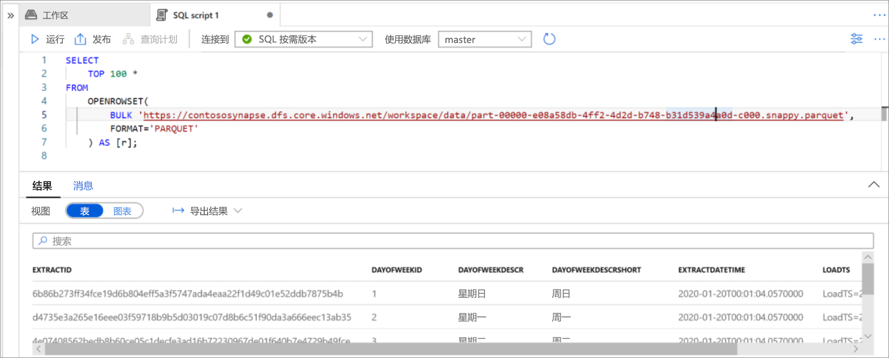

# 快速入门：使用 Synapse Studio（预览版）

本快速入门介绍如何使用 Synapse Studio 来查询文件。

如果没有 Azure 订阅，请在开始之前创建一个[免费](https://azure.microsoft.com/free/)帐户。

## 登录到 Azure 门户

登录 [Azure 门户](https://portal.azure.com/)。

## 先决条件

[创建 Azure Synapse 工作区和关联的存储帐户](quickstart-create-workspace.md)。

## 启动 Synapse Studio

在 Azure 门户的 Azure Synapse 工作区中，单击“启动 Synapse Studio”  。

另外，可以通过单击 [Azure Synapse Analytics](https://web.azuresynapse.net) 并提供相应的租户、订阅和工作区值来启动 Synapse Studio。

## 浏览存储帐户

打开 Synapse Studio 后，浏览到“数据”  ，然后展开“存储帐户”  来查看工作区中的存储帐户。

可以使用工具栏中的链接来创建新文件夹并上传文件，以便组织你的文件。

## 查询存储帐户中的文件

> [!IMPORTANT]
> 你需要是基础存储上 `Storage Blob Reader` 角色的成员才能查询文件。 了解如何[在 Azure 存储上分配**存储 Blob 数据读者**或**存储 Blob 数据参与者** RBAC 权限](../storage/common/storage-auth-aad-rbac-portal.md?toc=/azure/synapse-analytics/toc.json&bc=/azure/synapse-analytics/breadcrumb/toc.json#assign-a-built-in-rbac-role)。

1. 上传一些 `PARQUET` 文件。
2. 选择一个或多个文件，然后创建新的 SQL 脚本或 Spark 笔记本来查看文件内容。 若要创建笔记本，需要[在工作区中创建 Apache Spark 池](quickstart-create-apache-spark-pool.md)。

   

3. 运行生成的查询或笔记本来查看文件内容：

   

4. 可以通过更改查询对结果进行筛选和排序。 在 [SQL 功能概述](sql/overview-features.md)中查找 SQL 按需版本中提供的语言功能。

## 后续步骤

- 通过[在 Azure 存储上分配**存储 Blob 数据读者**或**存储 Blob 数据参与者** RBAC 权限](../storage/common/storage-auth-aad-rbac-portal.md?toc=/azure/synapse-analytics/toc.json&bc=/azure/synapse-analytics/breadcrumb/toc.json#assign-a-built-in-rbac-role)，使 Azure AD 用户能够查询文件。
- [使用 SQL 按需版本查询 Azure 存储中的文件](sql/on-demand-workspace-overview.md)
- [创建 Apache Spark 池](quickstart-create-apache-spark-pool.md)
- [创建有关 Azure 存储中存储的文件的 Power BI 报表](sql/tutorial-connect-power-bi-desktop.md)
