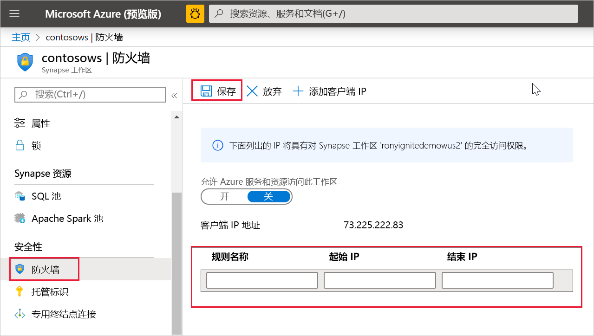

# Azure Synapse Analytics IP 防火墙规则（预览版）

本文将介绍 IP 防火墙规则，并介绍如何在 Azure Synapse Analytics 中配置它们。

## IP 防火墙规则

IP 防火墙规则基于每个请求的来源 IP 地址授予或拒绝对 Synapse 工作区的访问权限。 你可以为工作区配置 IP 防火墙规则。 在工作区级别配置的 IP 防火墙规则应用于工作区的所有公共终结点（SQL 池、SQL 按需版本，以及开发）。

## 创建和管理 IP 防火墙规则

可通过两种方式向 Synapse 工作区添加 IP 防火墙规则。 若要向工作区添加 IP 防火墙，请在创建工作区期间选择“安全 + 网络”，并选中“允许来自所有 IP 地址的连接”。

还可以在创建工作区后向 Synapse 工作区添加 IP 防火墙规则。 在 Azure 门户中，从“安全性”下选择“防火墙”。 若要添加新的 IP 防火墙规则，请为其指定名称、起始 IP 和结束 IP。 完成后，选择“保存”。

## 从你自己的网络连接到 Synapse

可以使用 Synapse Studio 连接到 Synapse 工作区。 还可以使用 SQL Server Management Studio (SSMS) 连接到工作区中的 SQL 资源（SQL 池和 SQL 按需版本）。

请确保你的网络和本地计算机上的防火墙允许 Synapse Studio 在 TCP 端口 80、443 和 1443 上的传出通信。

此外，还需要允许 Synapse Studio 在 UDP 端口 53 上的传出通信。 若要使用 SSMS 和 Power BI 等工具进行连接，必须允许 TCP 端口 1433 上的传出通信。

如果使用默认的重定向连接策略设置，则可能需要允许其他端口上的传出通信。 可在[此处](https://docs.microsoft.com/azure/sql-database/sql-database-connectivity-architecture#connection-policy)了解有关连接策略的详细信息。

## 后续步骤

创建 [Azure Synapse 工作区](../quickstart-create-workspace.md)

创建包含[托管工作区虚拟网络的 Azure Synapse 工作区](./synapse-workspace-managed-vnet.md)