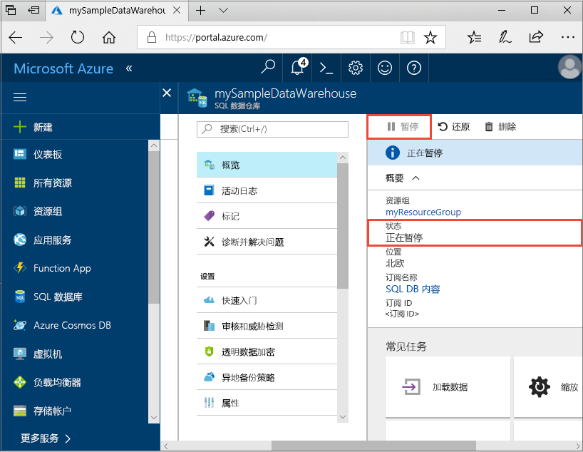

# 快速入门：通过 Azure 门户暂停和恢复 Synapse SQL 池中的计算

可以使用 Azure 门户暂停和恢复 Synapse SQL 池（数据仓库）计算资源。 如果没有 Azure 订阅，请在开始之前创建一个[免费](https://azure.microsoft.com/free/)帐户。

## 登录到 Azure 门户

登录 [Azure 门户](https://portal.azure.com/)。

## 开始之前

参考[创建和连接 - 门户](create-data-warehouse-portal.md)创建名为 **mySampleDataWarehouse** 的 SQL 池。 

## 暂停计算

为了降低成本，可以按需暂停和恢复计算资源。 例如，如果晚上和周末不使用数据库，那么可以在这些时间暂停数据库的使用，然后在白天时恢复使用。 
>[!NOTE]
>数据库暂停时，不对计算资源进行收费。 但是，仍将收取存储费用。 

按照以下步骤暂停 SQL 池：

1. 登录 [Azure 门户](https://portal.azure.com/)。
2. 在 Azure 门户的左侧导航页中单击“Azure Synapse Analytics (前称为 SQL 数据仓库)”。 
2. 在“Azure Synapse Analytics (前称为 SQL 数据仓库)”页中选择“mySampleDataWarehouse”打开 SQL 池。   
3. 在“mySampleDataWarehouse”页中，可看到“状态”显示为“联机”    。

    

4. 若要暂停 SQL 池，请单击“暂停”按钮。  
5. 此时将出现询问是否恢复的确认提问。 单击 **“是”** 。
6. 等待几分钟后，“状态”将更改为“正在暂停”   。

    

7. 完成暂停操作后，状态将显示为“已暂停”，选项按钮变为“恢复”。  
8. SQL 池的计算资源现已脱机。 在恢复服务之前无需为计算付费。

    

## 恢复计算

遵循以下步骤恢复 SQL 池。

1. 在 Azure 门户的左侧页中单击“Azure Synapse Analytics (前称为 SQL 数据仓库)”。 
2. 在“Azure Synapse Analytics (前称为 SQL 数据仓库)”页中选择“mySampleDataWarehouse”打开 SQL 池页。   
3. 在“mySampleDataWarehouse”页中，可看到“状态”显示为“已暂停”    。

    

4. 若要恢复 SQL 池，请单击“恢复”。  
5. 此时将出现询问是否启动的确认提问。 单击 **“是”** 。
6. 可看到“状态”显示为“正在恢复”   。

    

7. SQL 池联机后，状态将显示为“联机”，选项按钮将变为“暂停”。  
8. SQL 池的计算资源现已联机，可以使用该服务。 收取已恢复计算费用。

    

## 清理资源

根据数据仓库单位数和 SQL 池中存储的数据，会向你收取费用。 这些计算和存储资源是分开计费的。 

- 要将数据保存在存储中，请暂停计算。
- 若要避免将来产生费用，可以删除该 SQL 池。 

请按照下列步骤按需清理资源。

1. 登录到 [Azure 门户](https://portal.azure.com)并单击该 SQL 池。

    

1. 要暂停计算，请单击“暂停”  按钮。 

2. 若要删除 SQL 池以免产生计算或存储费用，请单击“删除”。 

3. 若要删除创建的 SQL 服务器，请依次单击“sqlpoolservername.database.windows.net”、“删除”。    

   > [!CAUTION]
   > 请谨慎执行此删除操作，因为删除服务器的同时也会删除分配给该服务器的所有数据库。

5. 要删除资源组，请单击“myResourceGroup”  ，然后单击“删除资源组”  。

## 后续步骤

现已暂停并恢复了 SQL 池的计算。 请继续阅读下一篇文章，详细了解如何[将数据加载到 SQL 池](load-data-from-azure-blob-storage-using-polybase.md)。 有关管理计算功能的其他信息，请参阅[管理计算概述](sql-data-warehouse-manage-compute-overview.md)一文。 

