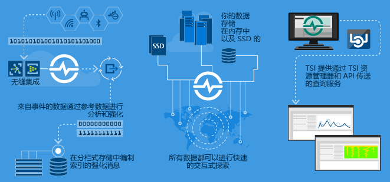
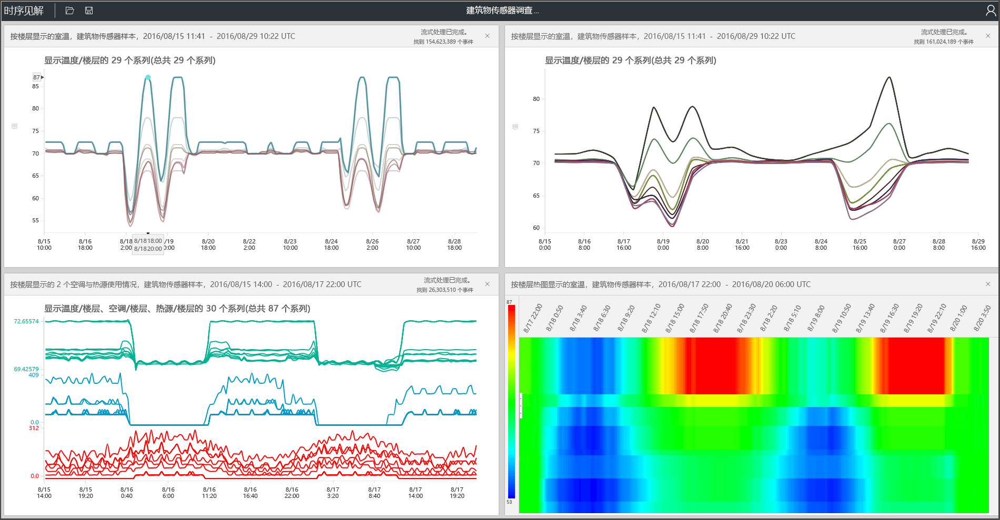

# 什么是 Azure 时序见解 Gen1？

> [!CAUTION]
> 这是一篇 Gen1 文章。

Azure 时序见解用于存储、可视化和查询大量时序数据（例如 IoT 设备所生成的数据）。 如果你想要在云中存储、管理、查询或可视化时序数据，则 Azure 时序见解可能会很适合你。

Azure 时序见解包含四个关键作业：

- 它与 Azure IoT 中心和 Azure 事件中心等云网关完全集成。 它可以轻松连接到这些事件源，并根据消息和结构（在干净的行和列中包含数据）分析 JSON。 它将元数据与遥测数据联接，并在纵栏式存储中对数据编制索引。
- Azure 时序见解管理数据存储。 为确保始终能够轻松访问数据，它将数据存储在内存和 SSD 中长达 400 天。 可以在数秒内以交互方式按需查询数十亿的事件。
- Azure 时序见解通过 Azure 时序见解资源管理器提供现成可用的可视化效果。
- Azure 时序见解通过两种途径提供查询服务，一种是使用 Azure 时序见解资源管理器，另一种是使用可轻松集成的 API 将时序数据嵌入自定义应用程序中。

如果构建供内部使用或供外部客户使用的应用程序，则可将 Azure 时序见解用作后端。 可以使用它来索引、存储和聚合时序数据。 若要在此之上构建自定义可视化效果和用户体验，请使用[客户端 SDK](https://github.com/microsoft/tsiclient/blob/master/docs/API.md)。 Azure 时序见解还配备了多个[查询 API](how-to-shape-query-json.md) 以启用这些自定义方案。

时序数据表示资产或过程是如何随时间变化的。 时序数据按时间戳进行索引，时间是用于组织此类数据的最有意义的轴。 时序数据通常按顺序到达，因此被视为插入，而不是数据库的更新。

在大型卷中存储、索引、查询、分析和可视化时序数据可能很具挑战性。
Azure 时序见解会捕获每一个新事件并将其存储为一行，所做的更改可以在一段时间内进行有效的度量。 因此，可以通过回顾过去的见解来预测未来的更改。

## 视频

### 了解有关基于云的 IoT 分析平台，即 Azure 时序见解的详细信息。 

## 主要方案

- 以可缩放的方式存储时序数据。

   在其核心，Azure 时序见解有一个数据库，是专门围绕时序数据而设计的。 因为是可缩放的和完全托管，所以 Azure 时序见解负责存储和管理事件。

- 以近实时方式浏览数据。

   Azure 时序见解提供了一个资源管理器，用于可视化所有流式传输到环境中的数据。 连接到事件源后不久，便可在 Azure 时序见解中查看、浏览和查询事件数据。 数据可用于验证设备是否按预期方式发出数据，并监视 IoT 资产的运行状况、生产效率和总体效率。

- 进行根本原因分析并检测异常情况

   Azure 时序见解具有模式和透视视图等工具，用于执行和保存多步骤根本原因分析。 Azure 时序见解还可与 Azure 流分析等警报服务结合使用，让你能够在 Azure 时序见解资源管理器中近实时地查看警报和检测到的异常情况。

- 获取从不同位置流式传输的时序数据的全局视图，进行多资产或多站点比较。

   可以将多个事件源连接到 Azure 时序见解环境。 这样就可以近实时地查看从多个不同位置一起流式传输进来的数据。 用户可以利用这种可见性与业务领导者共享数据。 用户还可以与领域专家更好地协作，而这些专家则可以使用其专业技能帮助用户解决问题、应用最佳做法和共享知识。

- 在 Azure 时序见解的基础上构建客户应用程序。

   Azure 时序见解会公开 REST 查询 API，这些 API 可以用来构建使用时序数据的应用程序。

## 功能

- **快速入门**：Azure 时序见解不需前期数据准备，因此你可以在 IoT 中心或事件中心快速连接到数百万事件。 连接以后，即可可视化传感器数据并与之交互，快速验证 IoT 解决方案。 无需编写代码即可与数据交互，也无需学习新的语言。 Azure 时序见解既为高级用户提供精细的自由文本查询图面，又提供点击浏览体验。

- **近乎实时的见解**：Azure 时序见解每天可以引入数百万个传感器事件，只有一分钟的延迟。 可以通过 Azure 时序见解深入分析传感器数据。 可以通过它来发现趋势和异常情况，进行根本原因分析并避免成本高昂的停机。 在实时数据和历史数据之间进行交叉关联，帮助你发现数据中隐藏的趋势。

- **生成自定义解决方案**：将 Azure 时序见解数据嵌入现有应用程序。 也可以通过 Azure 时序见解 REST API 创建新的自定义解决方案。 创建个性化视图，以便通过这种共享方便他人浏览你的见解。

- **可伸缩性**：Azure 时序见解旨在支持大规模 IoT。 时序见解每天可以引入 100 万到 1 亿个事件，默认保留时间为 31 天。 可以通过近实时方式可视化和分析实时数据流以及历史数据。

## 入门

请按照以下步骤开始。

1. 在 Azure 门户中预配 Azure 时序见解环境。
1. 连接到 IoT 中心或事件中心等事件源。
1. 上传参考数据。 这不是一项附加服务。
1. 使用 Azure 时序见解资源管理器在几分钟内查看并显示数据。

## 资源管理器

使用 Azure 时序见解资源管理器查看、分析和发现数据趋势。

了解如何使用 [Azure 时序见解资源管理器](time-series-insights-explorer.md)获取数据趋势。

## 后续步骤

- 浏览 Azure 时序见解 Gen1 [演示环境](./time-series-quickstart.md)。

- 详细了解如何[规划 Azure 时序见解](time-series-insights-environment-planning.md)环境。
