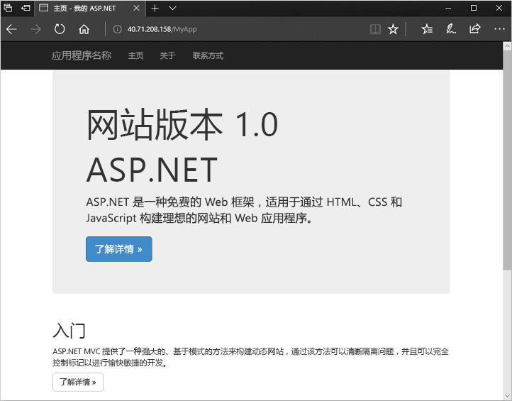

# <a name="quickstart-create-a-virtual-machine-scale-set-with-azure-powershell"></a>快速入门：使用 Azure PowerShell 创建虚拟机规模集


利用虚拟机规模集，可以部署和管理一组相同的、自动缩放的虚拟机。 可以手动缩放规模集中的 VM 数，也可以定义规则，以便根据资源使用情况（如 CPU 使用率、内存需求或网络流量）进行自动缩放。 然后，Azure 负载均衡器会将流量分配到规模集中的 VM 实例。 在本快速入门中，我们将使用 Azure PowerShell 创建虚拟机规模集并部署一个示例应用程序。

如果没有 Azure 订阅，请在开始之前创建一个[免费帐户](https://azure.microsoft.com/free/?WT.mc_id=A261C142F)。

[!INCLUDE [cloud-shell-try-it.md](../../includes/cloud-shell-try-it.md)]


## <a name="create-a-scale-set"></a>创建规模集
创建规模集之前，需使用 [New-AzResourceGroup](/powershell/module/az.resources/new-azresourcegroup) 创建资源组。 以下示例在 eastus 位置创建名为 myResourceGroup 的资源组：  

```azurepowershell-interactive
New-AzResourceGroup -ResourceGroupName "myResourceGroup" -Location "EastUS"
```

现在，使用 [New-AzVmss](/powershell/module/az.compute/new-azvmss) 创建虚拟机规模集。 以下示例创建名为 *myScaleSet* 且使用 *Windows Server 2016 Datacenter* 平台映像的规模集。 虚拟网络、公共 IP 地址和负载均衡器的 Azure 网络资源均会自动创建。 出现提示时，可以针对规模集中的 VM 实例设置自己的管理凭据：

```azurepowershell-interactive
New-AzVmss `
  -ResourceGroupName "myResourceGroup" `
  -Location "EastUS" `
  -VMScaleSetName "myScaleSet" `
  -VirtualNetworkName "myVnet" `
  -SubnetName "mySubnet" `
  -PublicIpAddressName "myPublicIPAddress" `
  -LoadBalancerName "myLoadBalancer" `
  -UpgradePolicyMode "Automatic"
```

创建和配置所有的规模集资源和 VM 需要几分钟时间。


## <a name="deploy-sample-application"></a>部署示例应用程序
若要测试规模集，请安装一个基本的 Web 应用程序。 使用 Azure 自定义脚本扩展下载并运行一个脚本，以便在 VM 实例上安装 IIS。 此扩展适用于部署后配置、软件安装或其他任何配置/管理任务。 有关详细信息，请参阅[自定义脚本扩展概述](../virtual-machines/windows/extensions-customscript.md)。

使用自定义脚本扩展安装基本的 IIS Web 服务器。 应用可安装 IIS 的自定义脚本扩展，如下所示：

```azurepowershell-interactive
# Define the script for your Custom Script Extension to run
$publicSettings = @{
    "fileUris" = (,"https://raw.githubusercontent.com/Azure-Samples/compute-automation-configurations/master/automate-iis.ps1");
    "commandToExecute" = "powershell -ExecutionPolicy Unrestricted -File automate-iis.ps1"
}

# Get information about the scale set
$vmss = Get-AzVmss `
            -ResourceGroupName "myResourceGroup" `
            -VMScaleSetName "myScaleSet"

# Use Custom Script Extension to install IIS and configure basic website
Add-AzVmssExtension -VirtualMachineScaleSet $vmss `
    -Name "customScript" `
    -Publisher "Microsoft.Compute" `
    -Type "CustomScriptExtension" `
    -TypeHandlerVersion 1.8 `
    -Setting $publicSettings

# Update the scale set and apply the Custom Script Extension to the VM instances
Update-AzVmss `
    -ResourceGroupName "myResourceGroup" `
    -Name "myScaleSet" `
    -VirtualMachineScaleSet $vmss
```

## <a name="allow-traffic-to-application"></a>允许流量发往应用程序

 若要允许访问基本的 Web 应用程序，请使用 [New-AzNetworkSecurityRuleConfig](/powershell/module/az.network/new-aznetworksecurityruleconfig) 和 [New-AzNetworkSecurityGroup](/powershell/module/az.network/new-aznetworksecuritygroup) 创建网络安全组。 有关详细信息，请参阅 [Azure 虚拟机规模集的网络](virtual-machine-scale-sets-networking.md)。

 ```azurepowershell-interactive
 # Get information about the scale set
 $vmss = Get-AzVmss `
             -ResourceGroupName "myResourceGroup" `
             -VMScaleSetName "myScaleSet"

 #Create a rule to allow traffic over port 80
 $nsgFrontendRule = New-AzNetworkSecurityRuleConfig `
   -Name myFrontendNSGRule `
   -Protocol Tcp `
   -Direction Inbound `
   -Priority 200 `
   -SourceAddressPrefix * `
   -SourcePortRange * `
   -DestinationAddressPrefix * `
   -DestinationPortRange 80 `
   -Access Allow

 #Create a network security group and associate it with the rule
 $nsgFrontend = New-AzNetworkSecurityGroup `
   -ResourceGroupName  "myResourceGroup" `
   -Location EastUS `
   -Name myFrontendNSG `
   -SecurityRules $nsgFrontendRule

 $vnet = Get-AzVirtualNetwork `
   -ResourceGroupName  "myResourceGroup" `
   -Name myVnet

 $frontendSubnet = $vnet.Subnets[0]

 $frontendSubnetConfig = Set-AzVirtualNetworkSubnetConfig `
   -VirtualNetwork $vnet `
   -Name mySubnet `
   -AddressPrefix $frontendSubnet.AddressPrefix `
   -NetworkSecurityGroup $nsgFrontend

 Set-AzVirtualNetwork -VirtualNetwork $vnet

 # Update the scale set and apply the Custom Script Extension to the VM instances
 Update-AzVmss `
     -ResourceGroupName "myResourceGroup" `
     -Name "myScaleSet" `
     -VirtualMachineScaleSet $vmss
 ```

## <a name="test-your-scale-set"></a>测试规模集
若要查看正在运行的规模集，请在 Web 浏览器中访问示例 Web 应用程序。 使用 [Get-AzPublicIpAddress](/powershell/module/az.network/get-azpublicipaddress) 获取负载均衡器的公共 IP 地址。 以下示例显示在 *myResourceGroup* 资源组中创建的 IP 地址：

```azurepowershell-interactive
Get-AzPublicIpAddress -ResourceGroupName "myResourceGroup" | Select IpAddress
```

将负载均衡器的公共 IP 地址输入到 Web 浏览器中。 负载均衡器将流量分发到某个 VM 实例，如以下示例所示：




## <a name="clean-up-resources"></a>清理资源
如果不再需要资源组、规模集和所有相关的资源，可以使用 [Remove-AzResourceGroup](/powershell/module/az.resources/remove-azresourcegroup) 命令将其删除，如下所示。 `-Force` 参数将确认是否希望删除资源，不会显示询问是否删除的额外提示。 `-AsJob` 参数会使光标返回提示符处，不会等待操作完成。

```azurepowershell-interactive
Remove-AzResourceGroup -Name "myResourceGroup" -Force -AsJob
```


## <a name="next-steps"></a>后续步骤
在本快速入门中，我们已创建一个基本的规模集，并使用自定义脚本扩展在 VM 实例上安装了一个基本的 IIS Web 服务器。 若要了解详细信息，请继续学习有关如何创建和管理 Azure 虚拟机规模集的教程。

> [!div class="nextstepaction"]
> [创建和管理 Azure 虚拟机规模集](tutorial-create-and-manage-powershell.md)
