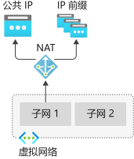
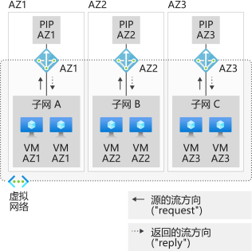

# <a name="what-is-virtual-network-nat-public-preview"></a>什么是虚拟网络 NAT（公共预览版）？

虚拟网络 NAT（网络地址转换）简化了虚拟网络的仅限出站 Internet 连接。 在子网中配置后，所有出站连接将使用指定的静态公共 IP 地址。  无需使用负载均衡器或将公共 IP 地址直接附加到虚拟机，即可建立出站连接。 NAT 是完全托管式的，且具有很高的复原能力。

<!-- 


-->

<p align="center">
  
</p>


图：*虚拟网络 NAT*


>[!NOTE] 
>虚拟网络 NAT 暂时以公共预览版提供。 目前它只能在有限的几个[区域](#region-availability)中使用。 此预览版在提供时没有附带服务级别协议，不建议用于生产工作负载。 某些功能可能不受支持或者受限。 有关详细信息，请参阅 [Microsoft Azure 预览版补充使用条款](https://azure.microsoft.comsupport/legal/preview-supplemental-terms)。

## <a name="static-ip-addresses-for-outbound-only"></a>用于仅限出站连接的静态 IP 地址

可为使用 NAT 的每个子网定义出站连接。  同一虚拟网络中的多个子网可以使用不同的 NAT。 可以通过指定要使用的 [NAT 网关资源](./nat-gateway-resource.md)来配置子网。 任何虚拟机实例中的所有 UDP 和 TCP 出站流都会使用 NAT。 

NAT 与标准 SKU [公共 IP 地址资源](./virtual-network-ip-addresses-overview-arm.md#standard)、[公共 IP 前缀资源](./public-ip-address-prefix.md)或两者的组合相兼容。  可以直接使用公共 IP 前缀，或者在多个 NAT 网关资源之间分配前缀的公共 IP 地址。 NAT 会将所有流量梳理到前缀的 IP 地址范围。  在部署中将任何 IP 加入白名单的过程现在都很简单。

NAT 会自动处理子网的所有出站流量，而无需完成任何客户配置。  不需要指定用户定义的路由。 NAT 优先于其他[出站方案](../load-balancer/load-balancer-outbound-connections.md)，可替代子网的默认 Internet 目标。

## <a name="on-demand-snat-with-multiple-ip-addresses-for-scale"></a>使用具有多个 IP 地址的按需 SNAT 进行缩放

NAT 使用“端口网络地址转换”（PNAT 或 PAT）。建议为大多数工作负荷使用 NAT。 可以通过按需出站流分配来轻松适应动态或分散工作负荷。 避免对出站资源进行开销不菲的预先规划、预先分配及最终的过度预配。 SNAT 端口资源在使用特定 NAT 网关资源的所有子网之间共享并可供其使用；可按需提供这些端口资源。

附加到 NAT 的公共 IP 地址最多为 UDP 和 TCP 提供 64,000 个并发流。 可以先使用单个 IP 地址，然后扩展到 16 个公共 IP 地址。

NAT 允许创建从虚拟网络到 Internet 的流。 在活动流的响应中仅允许来自 Internet 的返回流量。

与负载均衡器出站 SNAT 不同，NAT 对虚拟机实例的哪个专用 IP 可以建立出站连接不设限制。  辅助 IP 配置可与 NAT 建立出站 Internet 连接。

## <a name="coexistence-of-inbound-and-outbound"></a>入站和出站连接的共存

NAT 与以下标准 SKU 资源兼容：

- [负载均衡器](../load-balancer/load-balancer-overview.md)
- [公共 IP 地址](../virtual-network/virtual-network-ip-addresses-overview-arm.md#public-ip-addresses)
- [公共 IP 前缀](../virtual-network/public-ip-address-prefix.md)

与 NAT 一起使用时，这些资源提供与子网的入站 Internet 连接。 NAT 提供来自子网的所有出站 Internet 连接。

NAT 及兼容的标准 SKU 功能可以识别流的启动方向。 入站和出站方案可以共存。 这些方案会收到正确的网络地址转换，因为这些功能可以识别流的方向。 

<!-- 


-->
<p align="center">
  
</p>

图：*虚拟网络 NAT 流方向*

## <a name="fully-managed-highly-resilient"></a>完全托管且具有较高的复原能力

NAT 一开始就已完全横向扩展。 无需执行纵向或横向扩展操作。  Azure 将自动管理 NAT 的操作。  NAT 始终包含具有多个容错域，可以承受多次故障，可避免服务中断。

## <a name="tcp-reset-for-unrecognized-flows"></a>针对无法识别的流重置 TCP

尝试以不存在的 TCP 连接进行通信时，NAT 的专用端会发送 TCP 重置数据包。 例如，已达到空闲超时的连接。 收到的下一个数据包将向专用 IP 地址返回 TCP 重置，以指示此状态并强制关闭连接。

NAT 的公共端不会生成 TCP 重置数据包或其他任何流量。  只会发出客户虚拟网络生成的流量。

## <a name="configurable-idle-timeout"></a>可配置的空闲超时

使用的默认空闲超时为 4 分钟，最大可提高到 120 分钟。 流中的任何活动也可以重置空闲计时器，包括 TCP Keepalive。

## <a name="regional-or-zone-isolation-with-availability-zones"></a>使用可用性区域实现区域隔离或局部区域隔离

NAT 默认是区域性的。 创建[可用性区域](../availability-zones/az-overview.md)方案时，NAT 可以在特定的局部区域（局部区域部署）中隔离。

<!-- 


-->

<p align="center">
  
</p>

图：*使用可用性区域的虚拟网络 NAT*

## <a name="multi-dimensional-metrics-for-observability"></a>用于观察状况的多维指标

可以通过 Azure Monitor 中公开的多维指标来监视 NAT 的运行情况。 这些指标可用于观察使用情况和进行故障排除。  NAT 网关资源公开以下指标：
- 字节
- 数据包数
- 丢弃的数据包数
- SNAT 连接总数
- 每个间隔的 SNAT 连接状态转换次数。

<!-- "ADD when PM is done" Learn more about [NAT gateway metrics](./nat-gateway-metrics.md) -->

## <a name="sla"></a>SLA

在保持一般可用性的条件下，NAT 数据路径的可用性至少为 99.9%。

## <a name = "region-availability"></a>区域可用性

NAT 目前可在以下区域中使用：

- 西欧
- 日本东部
- 美国东部 2
- 美国西部
- 美国西部 2
- 美国中西部

## <a name = "enable-preview"></a>公共预览版参与

必须注册订阅才能参与公共预览版的评估。  需要完成包括两个步骤的过程才能参与，下面提供了适用于 Azure CLI 和 Azure PowerShell 的说明。  激活可能需要几分钟才能完成。

> [!IMPORTANT]
> 在订阅中启用虚拟网络 NAT [预览版](./nat-overview.md#enable-preview)后，使用 https://aka.ms/natportal 访问门户。

### <a name="azure-cli"></a>Azure CLI

1. 注册公共预览版的订阅

    ```azurecli-interactive
      az feature register --namespace Microsoft.Network --name AllowNatGateway
    ```

2. 激活注册

    ```azurecli-interactive
      az provider register --namespace Microsoft.Network
    ```

### <a name="azure-powershell"></a>Azure PowerShell

1. 注册公共预览版的订阅

    ```azurepowershell-interactive
      Register-AzProviderFeature -ProviderNamespace Microsoft.Network -FeatureName AllowNatGateway
    ```

2. 激活注册

    ```azurepowershell-interactive
      Register-AzProviderFeature -ProviderNamespace Microsoft.Network
    ```

## <a name="pricing"></a>定价

NAT 网关通过两个单独的计量器来计费：

| 计量 | 费率 |
| --- | --- |
| 资源小时数 | 0\.045 美元/小时 |
| 已处理的数据 | 0\.045 美元/GB |

资源小时数包括 NAT 网关资源的存在持续时间。
处理的数据包括 NAT 网关资源处理的所有流量。

公共预览版以 50% 的折扣价提供。

## <a name="support"></a>支持

通过正常的支持渠道为 NAT 提供支持。

## <a name="feedback"></a>反馈

我们很想知道如何能够改进该服务。 欢迎分享[有关公共预览版的反馈](https://aka.ms/natfeedback)。  同时，请在 [UserVoice for NAT](https://aka.ms/natuservoice) 上，为我们接下来要开发的功能提供建议和投票。

## <a name="limitations"></a>限制

- NAT 与标准 SKU 公共 IP、公共 IP 前缀和负载均衡器资源兼容。   基本资源（例如基本负载均衡器）以及派生自这些资源的任何产品都与 NAT 不兼容。  必须将基本资源放在未配置 NAT 的子网中。
- 支持 IPv4 地址系列。  NAT 不会与 IPv6 地址系列交互。
- 使用 NAT 发往公共终结点的出站流不遵从子网或 NIC 上的 NSG。
- 使用 NAT 时不支持 NSG 流日志记录。
- 如果虚拟网络包含多个子网，可为每个子网配置不同的 NAT。
- NAT 不能跨多个虚拟网络。

## <a name="next-steps"></a>后续步骤

- 了解 [NAT 网关资源](./nat-gateway-resource.md)。
- [在 UserVoice 中告诉我们接下来你希望开发哪些功能](https://aka/natuservoice)。
- [提供有关公共预览版的反馈](https://aka.ms/natfeedback)。
