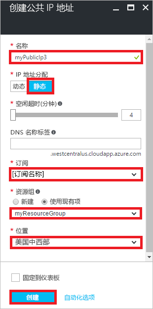

# 使用 Azure 门户将多个 IP 地址分配给虚拟机

>[!INCLUDE [virtual-network-multiple-ip-addresses-intro.md](../../includes/virtual-network-multiple-ip-addresses-intro.md)]
>
本文介绍如何使用 Azure 门户通过 Azure Resource Manager 部署模型创建虚拟机 (VM)。 无法将多个 IP 地址分配到通过经典部署模型创建的资源。 若要详细了解 Azure 部署模型，请阅读 [Understand deployment models](../resource-manager-deployment-model.md)（了解部署模型）一文。

[!INCLUDE [virtual-network-multiple-ip-addresses-template-scenario.md](../../includes/virtual-network-multiple-ip-addresses-scenario.md)]

## 创建具有多个 IP 地址的 VM

若要创建具有多个 IP 地址或一个静态专用 IP 地址的 VM，则必须使用 PowerShell 或 Azure CLI 来创建。 若要了解如何操作，请单击本文顶部的 PowerShell 或 CLI 选项。 可以按照[创建 Windows VM](../virtual-machines/virtual-machines-windows-hero-tutorial.md) 或[创建 Linux VM](../virtual-machines/linux/quick-create-portal.md) 文章中的步骤，使用门户创建具有单个动态专用 IP 地址和（可选）单个公共 IP 地址的 VM。 创建 VM 后，可以按照本文[向 VM 添加 IP 地址](#add)部分中的以下步骤，可使用门户将 IP 地址类型从动态更改为静态并添加其他 IP 地址。

## 将 IP 地址添加到 VM

完成以下步骤即可将专用和公共 IP 地址添加到 NIC。 以下部分中的示例假定用户的 VM 已完成本文[方案](#Scenario)中描述的三项 IP 配置，但这不是必需的。

### 核心步骤

1. 根据需要浏览到 Azure 门户（网址为 https://portal.azure.com）并登录。
2. 在门户中单击“更多服务”> 在筛选框中键入“虚拟机”，并单击“虚拟机”。
3. 在“虚拟机”边栏选项卡中单击要向其添加 IP 地址的 VM。 在显示的虚拟机边栏选项卡中单击“网络接口”，并选择要向其添加 IP 地址的网络接口。 在下图所示的示例中，已从名为“myVM”的 VM 中选定名为“myNIC”的 NIC：

    

4. 在针对所选 NIC 显示的边栏选项卡中，单击“IP 配置”。

根据要添加的 IP 地址的类型完成以下某个部分的步骤。

### **添加专用 IP 地址**

完成以下步骤，添加新的专用 IP 地址：

1. 完成本文[核心步骤](#coreadd)部分的步骤。
2. 单击 **“添加”**。 在显示的“添加 IP 配置”边栏选项卡中，创建名为“IPConfig-4”的 IP 配置，以“10.0.0.7”作为“静态”专用 IP 地址，并单击“确定”。

    > [!NOTE]
    > 在添加静态 IP 地址时，必须在 NIC 连接到的子网中指定未使用的有效地址。 如果所选地址不可用，门户会显示 X 来表示该 IP 地址，用户需另选一个。

3. 单击“确定”后，边栏选项卡会关闭，用户会看到列出的新 IP 配置。 单击“确定”关闭“添加 IP 配置”边栏选项卡。
4. 可以单击“添加”添加其他 IP 配置，也可以关闭所有打开的边栏选项卡，完成添加 IP 地址的操作。
5. 将专用 IP 地址添加到 VM 操作系统，只需完成本文[将 IP 地址添加到 VM 操作系统](#os-config)部分针对操作系统的步骤即可。

### 添加公共 IP 地址

将公共 IP 地址资源关联到新 IP 配置或现有 IP 配置即可添加公共 IP 地址。

> [!NOTE]
> 公共 IP 地址会产生少许费用。 有关 IP 地址定价的详细信息，请阅读 [IP 地址定价](https://azure.microsoft.com/pricing/details/ip-addresses)页。 在一个订阅中可以使用的公共 IP 地址数有限制。 有关限制的详细信息，请阅读 [Azure limits](../azure-subscription-service-limits.md#networking-limits)（Azure 限制）一文。
> 

### 创建公共 IP 地址资源

公共 IP 地址是针对公共 IP 地址资源的一种设置。 如果公共 IP 地址资源目前所关联到的 IP 配置不是你想要关联到的 IP 配置，可跳过以下步骤，根据需要完成后面某个部分的步骤。 如果没有可用的公共 IP 地址资源，可通过以下步骤创建一个：

1. 根据需要浏览到 Azure 门户（网址为 https://portal.azure.com）并登录。
3. 在门户中，单击“新建” > “网络” > “公共 IP 地址”。
4. 在显示的“创建公共 IP 地址”边栏选项卡中，输入一个“名称”，选择一个“IP 地址分配”类型、一个“订阅”、一个“资源组”和一个“位置”，并单击“创建”，如下图所示：

    

5. 完成下面某个部分的步骤，将公共 IP 地址资源关联到某个 IP 配置。

#### 将公共 IP 地址资源关联到新 IP 配置

1. 完成本文[核心步骤](#coreadd)部分的步骤。
2. 单击 **“添加”**。 在显示的“添加 IP 配置”边栏选项卡中，创建名为“IPConfig-4”的 IP 配置。 启用“公共 IP 地址”，并从显示的“选择公共 IP 地址”边栏选项卡中选择一个现有的可用公共 IP 地址资源。

    在选择公共 IP 地址资源后单击“确定”，边栏选项卡会关闭。 如果还没有公共 IP 地址，则可通过完成本文[创建公共 IP 地址资源](#create-public-ip)部分的步骤创建一个。 

3. 查看新 IP 配置。 即使没有向 IP 配置显式分配专用 IP 地址，也会自动分配一个，因为所有 IP 配置都必须有一个专用 IP 地址。
4. 可以单击“添加”添加其他 IP 配置，也可以关闭所有打开的边栏选项卡，完成添加 IP 地址的操作。
5. 将专用 IP 地址添加到 VM 操作系统，只需完成本文[将 IP 地址添加到 VM 操作系统](#os-config)部分针对操作系统的步骤即可。 请勿向操作系统添加公共 IP 地址。

#### 将公共 IP 地址资源关联到现有 IP 配置

1. 完成本文[核心步骤](#coreadd)部分的步骤。
2. 单击其中要添加公共 IP 地址资源的 IP 配置。
3. 在出现的“IPConfig”边栏选项卡中，单击“IP 地址”。
4. 在出现的“选择公共 IP 地址”边栏选项卡中，选择公共 IP 地址。
5. 单击“保存”后，边栏选项卡会关闭。 如果还没有公共 IP 地址，则可通过完成本文[创建公共 IP 地址资源](#create-public-ip)部分的步骤创建一个。
3. 查看新 IP 配置。
4. 可以单击“添加”添加其他 IP 配置，也可以关闭所有打开的边栏选项卡，完成添加 IP 地址的操作。 请勿向操作系统添加公共 IP 地址。

[!INCLUDE [virtual-network-multiple-ip-addresses-os-config.md](../../includes/virtual-network-multiple-ip-addresses-os-config.md)]
