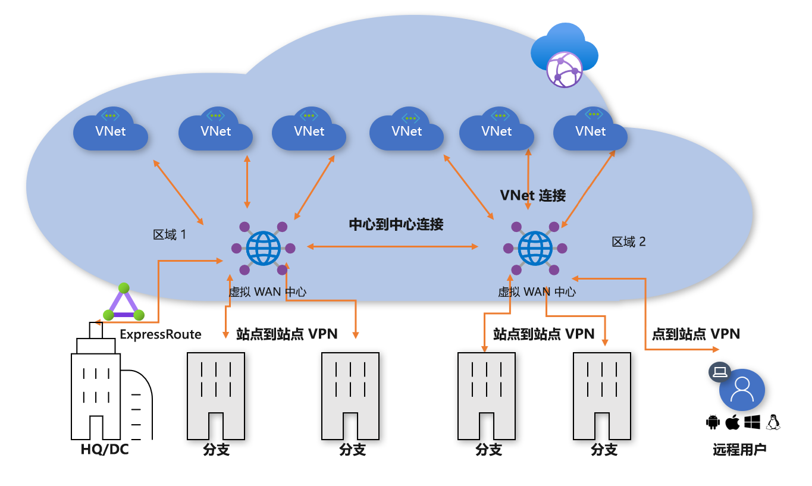
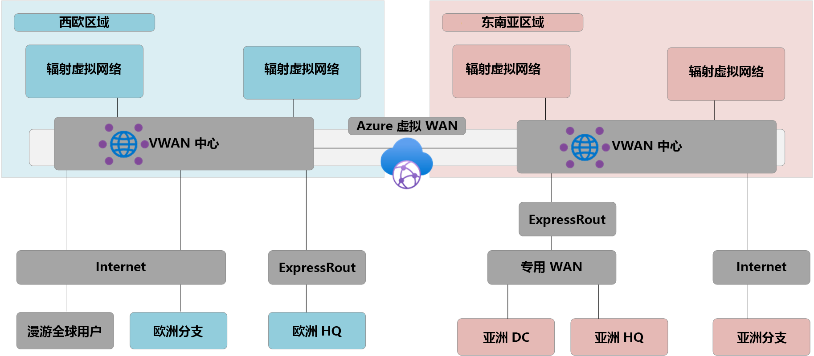
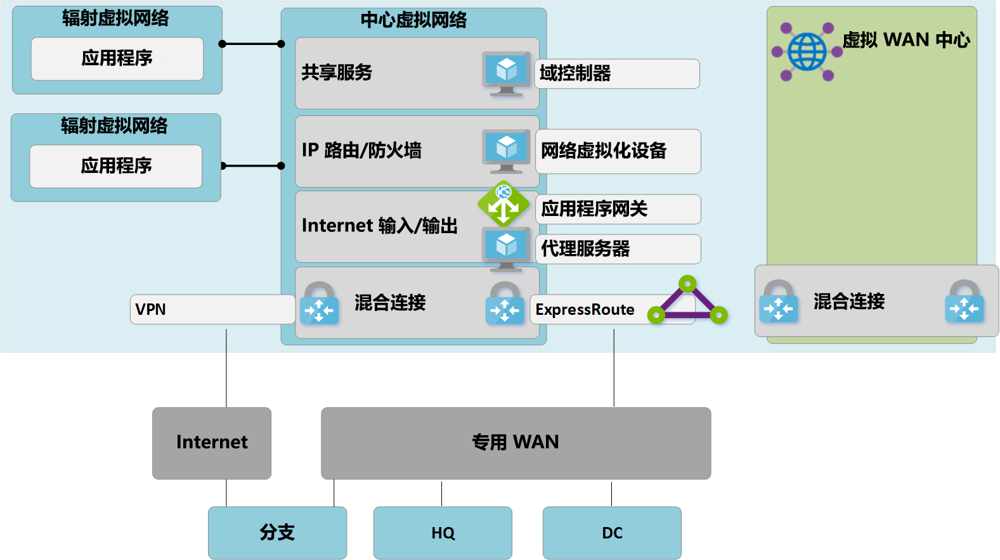
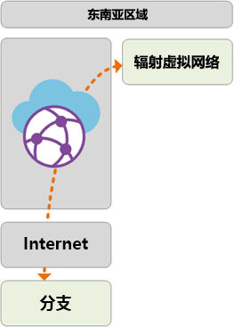
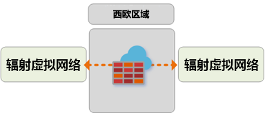

# 迁移到 Azure 虚拟 WAN

Azure 虚拟 WAN 允许公司简化其全球连接，以便从 Microsoft 全球网络的规模中获益。 本文为希望从现有客户管理的中心点和分支拓扑迁移到利用 Microsoft 管理的虚拟 WAN 中心的设计的公司提供了技术详细信息。

有关 Azure 虚拟 WAN 为采用以云为中心的现代企业全球网络的企业带来的优势的信息，请参阅[全球传输网络体系结构和虚拟广域网](virtual-wan-global-transit-network-architecture.md)。

**图：Azure 虚拟广域网**

数千客户采用了 Azure 虚拟数据中心 （VDC） 集线器和分机连接模型，以利用 Azure 网络的默认传输路由行为来构建简单且可扩展的云网络。 Azure 虚拟 WAN 基于这些概念构建，并引入了新功能，不仅允许在本地位置和 Azure 之间实现全局连接拓扑，还允许客户利用 Microsoft 网络的规模来增强其现有的全球网络。

本文演示如何将现有混合环境迁移到虚拟 WAN。

## 方案

Contoso 是一家全球性金融组织，在欧洲和亚洲设有办事处。 他们计划将其现有的应用程序从本地数据中心迁移到 Azure，并基于 VDC 体系结构建立了基础设计，其中包括用于混合连接的区域客户托管中心虚拟网络。 作为向基于云的技术转移的一部分，网络团队的任务是确保其连接针对业务向前发展进行优化。

下图显示了现有全局网络的高级视图，包括连接到多个 Azure 区域。

**图：Contoso 现有网络拓扑**

从现有网络拓扑中可了解以下几点：

- 已在多个区域使用了中心辐射型拓扑，其中包括用于连回到公共专用 WAN 的 ExpressRoute 高级线路。

- 其中一些站点还将 VPN 隧道与 Azure 直接连接，以访问 Microsoft 云中托管的应用程序。

## 要求

网络团队的任务是提供一个全球网络模型，该模型可以支持 Contoso 向云的迁移，且必须在成本、规模和性能方面进行优化。 总而言之，需要满足以下要求：

- 为总部 (HQ) 和分支机构提供云托管应用程序的优化路径。
- 消除对现有本地数据中心 （DC） 的依赖，实现 VPN 终止，同时保留以下连接路径：
  - **分支到 VNet：VPN**连接的办公室必须能够访问迁移到本地 Azure 区域中的云的应用程序。
  - **分支到集线器到集线器到 VNet：VPN**连接的办公室必须能够访问迁移到远程 Azure 区域中的云的应用程序。
  - **分支到分支**：区域 VPN 连接的办事处必须能够相互通信，并快速路由连接 HQ/DC 站点。
  - **分支到集线器到集线器到分支**：全球分离的 VPN 连接办公室必须能够相互通信，并且任何与 ExpressRoute 连接的 HQ/DC 站点。
  - **分支到互联网**：连接的网站必须能够与互联网通信。 必须筛选和记录此流量。
  - **VNet 到 VNet：** 同一区域中的分支虚拟网络必须能够相互通信。
  - **VNet 到集线器到集线器到 VNet：** 不同区域中的分支虚拟网络必须能够相互通信。
- 为 Contoso 漫游用户（笔记本电脑和电话）提供访问公司资源的能力，而不在公司网络上。

## Azure 虚拟广域网架构

下图显示了使用 Azure 虚拟 WAN 更新的目标拓扑的高级视图，以满足上一节中详述的要求。

域网体系结构**图：Azure 虚拟广域网体系结构**

摘要：

- 欧洲 HQ 仍连接 ExpressRoute，而欧洲本地 DC 已完全迁移到 Azure，现已停用。
- 亚洲 DC 和 HQ 仍连接专用 WAN。 Azure 虚拟 WAN 现在用于增强本地运营商网络并提供全局连接。
- 部署在西欧和东南亚 Azure 区域的 Azure 虚拟广域网中心，为 ExpressRoute 和 VPN 连接的设备提供连接中心。
- 中心还通过全球网格网络的 OpenVPN 连接，为使用多种客户端类型的漫游用户提供 VPN 终端，这样，用户不仅可以访问已迁移到 Azure 的应用程序，而且还能访问保留在本地的任何资源。
- Azure 虚拟 WAN 提供的虚拟网络中的资源的 Internet 连接。

同样由 Azure 虚拟 WAN 提供的远程站点 Internet 连接。 通过合作伙伴集成支持的本地 Internet 中断，用于优化对 Office 365 等 SaaS 服务的访问。

## 迁移到虚拟 WAN

本节显示迁移到 Azure 虚拟 WAN 的各种步骤。

### 第 1 步：VDC 中心辐条单个区域

查看体系结构。 下图显示了在推出 Azure 虚拟 WAN 之前 Contoso 的单个区域拓扑：

**图 1：VDC 中心辐条单区域**

根据虚拟数据中心 （VDC） 方法，客户管理的集线器虚拟网络包含多个功能块：

- 共享服务（多个分支所需的任何通用功能）。 示例：Contoso 在基础架构即服务 （IaaS） 虚拟机上使用 Windows Server 域控制器。
- IP/路由防火墙服务由第三方网络虚拟设备提供，可实现辐射网络到辐射网络的第 3 层 IP 路由。
- Internet 入口/出口服务，其中包括用于入站 HTTPS 请求的 Azure 应用程序网关，以及在虚拟机上运行且用于已筛选的 Internet 资源出站访问的第三方代理服务。
- 用于连接到本地网络的 ExpressRoute 和 VPN 虚拟网络网关。

### 第 2 步：部署虚拟广域网集线器

在每个区域部署虚拟广域网中心。 设置具有 VPN 网关和快速路由网关的虚拟 WAN 集线器，如以下文章中所述：

- [教程：使用 Azure 虚拟 WAN 创建站点到站点连接](virtual-wan-site-to-site-portal.md)
- [教程：使用 Azure 虚拟 WAN 创建快速路由关联](virtual-wan-expressroute-portal.md)

> [!NOTE]
> Azure 虚拟 WAN 必须使用标准 SKU 来启用本文中所示的某些流量路径。

网集线器**图 2：VDC 中心与虚拟 WAN 迁移的分机**

### 第 3 步：将远程站点（快速路由和 VPN）连接到虚拟 WAN

将虚拟广域网集线器连接到现有的 ExpressRoute 电路，并通过互联网将站点到站点 VPN 连接到任何远程分支。

> [!NOTE]
> ExpressRoute 线路必须升级为高级 SKU 类型，以便连接到虚拟 WAN 中心。

WAN**图 3：VDC 集线器和分支到虚拟 WAN 迁移**

此时，本地网络设备将开始接收反映分配给虚拟 WAN 管理的集线器 VNet 的 IP 地址空间的路由。 在此阶段，连接 VPN 的远程分支将在辐射虚拟网络中显示两条指向任何现有应用程序的路径。 这些设备应配置为继续使用指向 VDC 中心的隧道，以确保转换阶段的对称路由。

### 第 4 步：通过虚拟 WAN 测试混合连接

在将托管虚拟广域网中心用于生产连接之前，我们建议您设置测试分支虚拟网络和虚拟 WAN VNet 连接。 继续执行后续步骤之前，通过 ExpressRoute 和站点到站点 VPN 验证此测试环境的连接是否正常工作。

测试混合连接图**4：VDC 集线器和 VDC 到虚拟 WAN 迁移**

### 第 5 步：将连接转换为虚拟广域网中心

网中心**图 5：VDC 中心与虚拟 WAN 迁移的分电**

**a**. 从分支虚拟网络到旧 VDC 中心删除现有的对等互连连接。 步骤 a-c 完成之前，无法访问辐射虚拟网络中的应用程序。

**b**. . . 通过 VNet 连接将分支虚拟网络连接到虚拟广域网中心。

**c**. . 删除之前在辐射虚拟网络中使用的用于辐射网络到辐射网络通信的任何用户定义路由 (UDR)。 虚拟 WAN 中心内提供的动态路由现已启用此路径。

**d**. . VDC 中心内的现有 ExpressRoute 和 VPN 网关现已停用，以便执行下一步骤 (e)。

**e**. . 通过新的 VNet 连接将旧 VDC 中心（中心虚拟网络）连接到虚拟 WAN 中心。

### 第 6 步：旧中心成为共享服务分支

现已重新设计了 Azure 网络，使虚拟 WAN 中心成为了新拓扑的中心点。

服务分支**图 6：VDC 中心与虚拟 WAN 迁移**

由于虚拟 WAN 中心是托管实体，不允许部署自定义资源（如虚拟机），因此共享服务块现在作为分支虚拟网络存在，并托管通过 Azure 应用程序网关或网络虚拟化设备。 现在，共享服务环境与后端虚拟机之间的流量在虚拟 WAN 托管的中心内传输。

### 第 7 步：优化本地连接以充分利用虚拟 WAN

在此阶段，Contoso 基本已将业务应用程序迁移到 Microsoft 云，仅少量旧版应用程序保留在本地 DC。

图**7：VDC 中心与虚拟 WAN 迁移的分电**

为利用 Azure 虚拟 WAN 的全部功能，Contoso 决定停用其旧的本地 VPN 连接。 继续访问 HQ 或 DC 网络的任何分支都能够使用 Azure 虚拟 WAN 的内置传输路由在 Microsoft 全球网络中传输。

> [!NOTE]
> 对于希望利用 Microsoft 主干网来补全其现有专用 WAN 的客户，ExpressRoute Global Reach 是替代选项。

## 端状态体系结构和流量路径

**图：双区域虚拟广域网**

本节通过介绍一些示例流量来概述此拓扑如何满足初始要求。

### 路径 1

路径 1 显示了从亚洲 S2S VPN 连接的分支到东南亚区域的 Azure VNet 的流量。

流量按如下方式路由：

- 亚洲分支通过支持弹性 S2S BGP 的隧道连接到东南亚虚拟广域网枢纽。

- 亚洲虚拟 WAN 中心将流量本地路由到连接的 VNet。

### 路径 2

路径 2 显示了从连接欧洲总部的 ExpressRoute 到东南亚区域 Azure VNet 的流量。

流量按如下方式路由：

- 欧洲总部通过高级 ExpressRoute 电路连接到西欧虚拟广域网枢纽。

- 虚拟 WAN 中心到中心全球连接确保流量能够传输到远程区域中连接的 VNet。

### 路径 3

路径 3 显示了从连接到专用广域网到欧洲 S2S 连接分支的亚洲本地 DC 的流量。

流量按如下方式路由：

- 亚洲 DC 连接到本地专用 WAN 运营商。

- 专用广域网中的 ExpressRoute 电路本地终止连接到东南亚虚拟广域网中心。

- 虚拟 WAN 枢纽到枢纽全局连接可实现流量的传输。

### 路径 4

路径 4 显示了从东南亚区域的 Azure VNet 到西欧区域的 Azure VNet 的流量。

流量按如下方式路由：

- 虚拟 WAN 中心之间的全球连接确保无需进一步的用户配置即可本地传输所有连接的 Azure VNet。

### 路径 5

路径 5 显示了从漫游 VPN （P2S） 用户到西欧区域 Azure VNet 的流量。

流量按如下方式路由：

- 笔记本电脑和移动设备用户使用 OpenVPN 客户端在西欧的 P2S VPN 网关进行透明连接。

- 西欧虚拟 WAN 中心将流量本地路由到连接的 VNet。

## 通过 Azure 防火墙的安全和策略控制

Contoso 现已根据本文前面讨论的要求验证了所有分支和 VNet 之间的连接。 为了满足他们对安全控制和网络隔离的要求，他们需要继续通过集线器网络分离和记录流量。 以前，此功能由网络虚拟设备 （NVA） 执行。 Contoso 还希望停用其现有代理服务，并使用本机 Azure 服务进行出站 Internet 筛选。

进行安全和策略控制**图：虚拟 WAN 中的 Azure 防火墙（安全虚拟中心）**

在虚拟 WAN 集线器中引入 Azure 防火墙以启用统一的策略控制点，需要执行以下高级步骤。 有关此过程和安全虚拟中心概念的详细信息，请参阅[Azure 防火墙管理器](../firewall-manager/index.yml)。

1. 创建 Azure 防火墙策略。
2. 将防火墙策略链接到 Azure 虚拟 WAN 中心。 此步骤允许现有虚拟 WAN 中心充当安全虚拟中心，并部署所需的 Azure 防火墙资源。

> [!NOTE]
> 如果 Azure 防火墙部署在标准虚拟广域网集线器 （SKU ： 标准）： V2V、B2V、V2I 和 B2I FW 策略仅在连接到部署 Azure FW 的特定集线器的特定集线器（安全集线器）的 VNet 和分支上强制执行。 来自远程 VNet 和分支的流量连接到同一虚拟广域网中的其他虚拟广域网集线器，即使远程分支和 VNet 通过虚拟广域网中心连接到集线器链路，也不会"防火墙"。 跨中心防火墙支持位于 Azure 虚拟 WAN 和防火墙管理器路线图中。

以下路径显示了通过使用 Azure 保护的虚拟中心启用的连接路径：

### 路径 6

路径 6 显示同一区域内 VNet 之间的安全流量。

流量按如下方式路由：

- 连接到同一安全虚拟中心的虚拟网络现通过 Azure 防火墙路由流量。

- Azure 防火墙可将策略应用这些流量流。

### 路径 7

路径 7 显示了从 Azure VNet 到 Internet 或第三方安全服务的流量。

流量按如下方式路由：

- 连接到安全虚拟中心的虚拟网络使用安全中心作为 Internet 访问的中心点，可以将流量发送到 Internet 上的公共目标位置。

- 此流量可以使用 Azure 防火墙 FQDN 规则在本地进行筛选，或发送到第三方安全服务进行检查。

### 路径 8

路径 8 显示了从分支到 Internet 或第三方安全服务的流量。

流量按如下方式路由：

- 连接到安全虚拟中心的分支机构可以使用安全中心作为 Internet 访问的中心点，将流量发送到 Internet 上的公共目标。

- 此流量可以使用 Azure 防火墙 FQDN 规则在本地进行筛选，或发送到第三方安全服务进行检查。

 

## 后续步骤

详细了解 [Azure 虚拟 WAN](virtual-wan-about.md)
