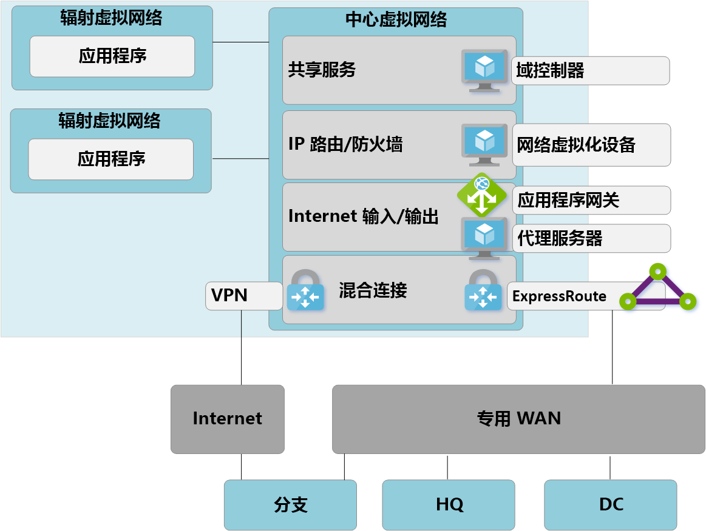
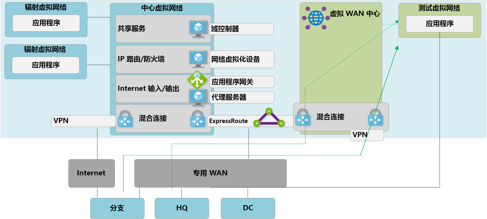
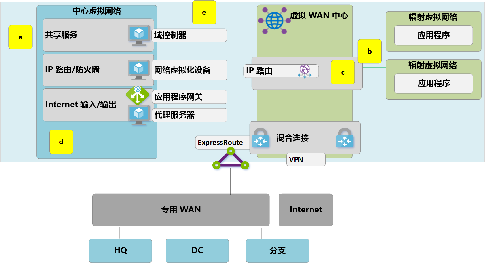
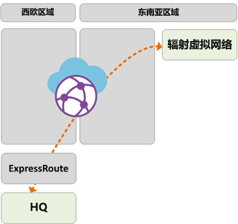
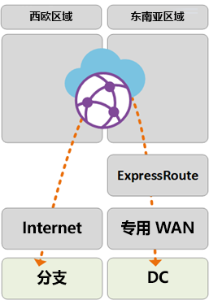
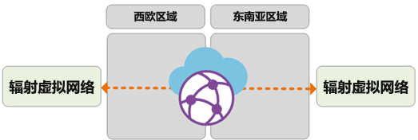
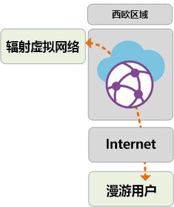
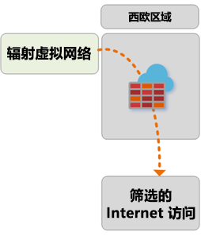
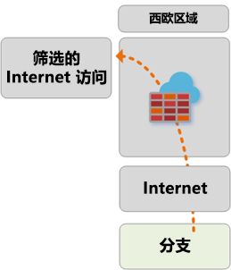

# 迁移到 Azure 虚拟 WAN

Azure 虚拟 WAN 允许公司简化全球连接，以便从 Microsoft 全球网络的规模中获益。 本文提供了要从现有的客户托管的中心辐射型拓扑迁移到利用 Microsoft 托管的虚拟 WAN 中心的设计的技术详细信息。

有关使用以云为中心的新式企业全局网络的企业所能实现的好处的信息，请参阅[全局传输网络体系结构和虚拟 WAN](virtual-wan-global-transit-network-architecture.md)。

**图： Azure 虚拟广域网**

成千上万的客户使用 Azure 虚拟数据中心（VDC）中心辐射型连接模型来利用 Azure 网络的默认可传递的路由行为，以便构建简单且可缩放的云网络。 Azure 虚拟 WAN 基于这些概念构建并引入了新功能，这些功能不仅允许在本地位置和 Azure 之间使用全局连接拓扑，而且还允许客户利用 Microsoft 网络的规模来增强现有的全球网络。

本文介绍如何将现有混合环境迁移到虚拟 WAN。

## 方案

Contoso 是一家全球金融组织，办事处处于欧洲和亚洲。 他们计划将其现有的应用程序从本地数据中心迁移到 Azure，并基于 VDC 体系结构建立了基础设计，其中包括用于混合连接的区域客户托管中心虚拟网络。 作为迁移到基于云的技术的一部分，网络团队已经担负着确保用户的连接对业务发展进行了优化。

下图显示了现有全局网络的高级视图，包括与多个 Azure 区域的连接。

**图： contoso 现有网络拓扑**

从现有网络拓扑中可了解以下几点：

- 已在多个区域使用了中心辐射型拓扑，其中包括用于连回到公共专用 WAN 的 ExpressRoute 高级线路。

- 其中一些站点还将 VPN 隧道与 Azure 直接连接，以访问 Microsoft 云中托管的应用程序。

## 要求

网络团队的任务是提供一个全球网络模型，该模型可以支持 Contoso 向云的迁移，且必须在成本、规模和性能方面进行优化。 总而言之，需要满足以下要求：

- 为总部 (HQ) 和分支机构提供云托管应用程序的优化路径。
- 在保留以下连接路径的同时，消除对用于 VPN 终止的现有本地数据中心（DC）的依赖：
  - **分支到 VNet**： VPN 连接的办公室必须能够访问本地 Azure 区域中已迁移到云中的应用程序。
  - **分支到集线器**到到端的连接： VPN 连接的办公室必须能够访问迁移到远程 Azure 区域中的云中的应用程序。
  - **分支到分支**：区域 VPN 连接的办公室必须能够与其他每个和 ExpressRoute 连接的 HQ 总部站点通信。
  - 从**分支到中心到中心到分支**：全局分隔的 VPN 连接的办公室必须能够彼此通信，并可以与任何 ExpressRoute 连接的 HQ/DC 站点通信。
  - **分支到 Internet**：连接的站点必须能够与 Internet 通信。 必须筛选和记录此流量。
  - **Vnet 到 vnet**：同一区域中的辐射虚拟网络必须能够彼此通信。
  - 从**vnet 到中心**到从的分支到 vnet：不同区域中的辐射虚拟网络必须能够彼此通信。
- 提供 Contoso 漫游用户（便携式计算机和电话）访问公司资源而不是企业网络的能力。

## Azure 虚拟 WAN 体系结构

下图显示了使用 Azure 虚拟 WAN 的更新目标拓扑的高级视图，以满足上一部分中所述的要求。

结构**图： Azure 虚拟 wan 体系结构**

摘要：

- 欧洲 HQ 仍连接 ExpressRoute，而欧洲本地 DC 已完全迁移到 Azure，现已停用。
- 亚洲 DC 和 HQ 仍连接专用 WAN。 现在，Azure 虚拟 WAN 用于增加本地运营商网络，提供全球连接。
- 同时在西欧和南部东亚 Azure 区域中部署的 azure 虚拟 WAN 中心为 ExpressRoute 和 VPN 连接的设备提供连接集线器。
- 中心还通过全球网格网络的 OpenVPN 连接，为使用多种客户端类型的漫游用户提供 VPN 终端，这样，用户不仅可以访问已迁移到 Azure 的应用程序，而且还能访问保留在本地的任何资源。
- Azure 虚拟 WAN 提供的虚拟网络中的资源的 Internet 连接。

同样由 Azure 虚拟 WAN 提供的远程站点 Internet 连接。 通过合作伙伴集成支持的本地 Internet 中断，用于优化对 Office 365 等 SaaS 服务的访问。

## 迁移到虚拟 WAN

本部分介绍迁移到 Azure 虚拟 WAN 的各个步骤。

### 步骤1： VDC 集散单区域

查看体系结构。 下图显示了 Contoso 在推出 Azure 虚拟 WAN 之前的单个区域拓扑：

**图1： VDC 集线器辐射单区域**

为了保持虚拟数据中心（VDC）方法，客户托管的中心虚拟网络包含多个功能块：

- 共享服务（多个轮辐所需的任何常见功能）。 示例： Contoso 在基础结构即服务（IaaS）虚拟机上使用 Windows Server 域控制器。
- IP/路由防火墙服务由第三方网络虚拟设备提供，可实现辐射网络到辐射网络的第 3 层 IP 路由。
- Internet 入口/出口服务，其中包括用于入站 HTTPS 请求的 Azure 应用程序网关，以及在虚拟机上运行且用于已筛选的 Internet 资源出站访问的第三方代理服务。
- 用于连接到本地网络的 ExpressRoute 和 VPN 虚拟网络网关。

### 步骤2：部署虚拟 WAN 中心

在每个区域中部署虚拟 WAN 中心。 按照以下文章中所述，设置包含 VPN 网关和 ExpressRoute 网关的虚拟 WAN 集线器：

- [教程：使用 Azure 虚拟 WAN 创建站点到站点连接](virtual-wan-site-to-site-portal.md)
- [教程：使用 Azure 虚拟 WAN 创建 ExpressRoute 关联](virtual-wan-expressroute-portal.md)

> [!NOTE]
> 若要启用本文中所示的某些流量路径，Azure 虚拟 WAN 必须使用标准 SKU。

**图2： VDC 辐射到虚拟 WAN 迁移**

### 步骤3：将远程站点（ExpressRoute 和 VPN）连接到虚拟 WAN

将虚拟 WAN 集线器连接到现有 ExpressRoute 线路，并通过 Internet 将站点到站点 Vpn 设置为任何远程分支。

> [!NOTE]
> ExpressRoute 线路必须升级为高级 SKU 类型，以便连接到虚拟 WAN 中心。

wan**图3： VDC 辐射到虚拟 wan 迁移**

此时，本地网络设备将开始接收路由，以反映分配给虚拟 WAN 托管集线器 VNet 的 IP 地址空间。 在此阶段，连接 VPN 的远程分支将在辐射虚拟网络中显示两条指向任何现有应用程序的路径。 这些设备应配置为继续使用指向 VDC 中心的隧道，以确保转换阶段的对称路由。

### 步骤4：通过虚拟 WAN 测试混合连接

在将托管虚拟 WAN 中心用于生产连接之前，我们建议你设置测试辐射虚拟网络和虚拟 WAN VNet 连接。 继续执行后续步骤之前，通过 ExpressRoute 和站点到站点 VPN 验证此测试环境的连接是否正常工作。

测试混合连接**图4： VDC 辐射到虚拟 wan 迁移**

### 步骤5：将连接转换到虚拟 WAN 集线器

的连接**图5： VDC 辐射到虚拟 wan 迁移**

**一个**。 删除从辐射虚拟网络到旧 VDC 集线器的现有对等互连。 步骤 a-c 完成之前，无法访问辐射虚拟网络中的应用程序。

**b.** 通过 VNet 连接将辐射虚拟网络连接到虚拟 WAN hub。

**c.** 删除之前在辐射虚拟网络中使用的用于辐射网络到辐射网络通信的任何用户定义路由 (UDR)。 虚拟 WAN 中心内提供的动态路由现已启用此路径。

**d.** VDC 中心内的现有 ExpressRoute 和 VPN 网关现已停用，以便执行下一步骤 (e)。

**e**。 通过新的 VNet 连接将旧 VDC 中心（中心虚拟网络）连接到虚拟 WAN 中心。

### 步骤6：旧集线器成为共享服务辐射

现已重新设计了 Azure 网络，使虚拟 WAN 中心成为了新拓扑的中心点。

**图6： VDC 辐射到虚拟 WAN 迁移**

由于虚拟 WAN 中心是一个托管实体，不允许部署自定义资源（如虚拟机），因此共享服务块现在作为一个辐射虚拟网络存在，并通过 Azure 应用程序网关或网络虚拟化设备来承载 internet 入口等功能。 现在，共享服务环境与后端虚拟机之间的流量在虚拟 WAN 托管的中心内传输。

### 步骤7：优化本地连接以充分利用虚拟 WAN

在此阶段，Contoso 基本已将业务应用程序迁移到 Microsoft 云，仅少量旧版应用程序保留在本地 DC。

**图7： VDC 辐射到虚拟 wan 迁移**

为利用 Azure 虚拟 WAN 的全部功能，Contoso 决定停用其旧的本地 VPN 连接。 继续访问 HQ 或 DC 网络的任何分支都能够使用 Azure 虚拟 WAN 的内置传输路由在 Microsoft 全球网络中传输。

> [!NOTE]
> 对于希望利用 Microsoft 主干网来补全其现有专用 WAN 的客户，ExpressRoute Global Reach 是替代选项。

## 最终状态体系结构和流量路径

**图：双重区域虚拟 WAN**

本节通过介绍一些示例流量来概述此拓扑如何满足初始要求。

### 路径 1

路径1显示从亚太地区的 S2S VPN 连接的分支到南部东亚区域中的 Azure VNet 的流量流。

流量按如下方式路由：

- 亚洲分支通过启用了弹性的 S2S BGP BGP 隧道连接到南部东亚虚拟 WAN 中心。

- 亚洲虚拟 WAN 中心将流量本地路由到连接的 VNet。

### 路径 2

路径2显示从 ExpressRoute 连接的欧洲 HQ 到南部东亚区域中的 Azure VNet 的流量流。

流量按如下方式路由：

- 欧洲总部通过高级 ExpressRoute 线路连接到西欧虚拟 WAN 集线器。

- 虚拟 WAN 中心到中心全球连接确保流量能够传输到远程区域中连接的 VNet。

### 路径 3

路径3显示了从连接到专用广域网的亚洲本地 DC 到欧洲 S2S 连接分支的流量流。

流量按如下方式路由：

- 亚洲 DC 连接到本地专用 WAN 运营商。

- ExpressRoute 线路本地终止于专用 WAN 连接到南部东亚虚拟 WAN 中心。

- 利用虚拟 WAN 集线器到中心全局连接，可以传输流量。

### 路径 4

路径4显示从南部东亚区域中的 Azure VNet 到西欧区域中的 Azure VNet 的流量流。

流量按如下方式路由：

- 虚拟 WAN 中心之间的全球连接确保无需进一步的用户配置即可本地传输所有连接的 Azure VNet。

### 路径 5

路径5显示了从漫游 VPN （P2S）用户到西欧区域中的 Azure VNet 的流量流。

流量按如下方式路由：

- 便携式计算机和移动设备用户使用 OpenVPN 客户端在西欧中的 P2S VPN 网关进行透明连接。

- 西欧虚拟 WAN 中心将流量本地路由到连接的 VNet。

## 通过 Azure 防火墙的安全和策略控制

Contoso 现在已经验证了所有分支和 Vnet 之间的连接性，并满足本文前面所述的要求。 若要满足其安全控制和网络隔离要求，需要继续通过集线器网络分离和记录流量。 以前，此函数是由网络虚拟设备（NVA）执行的。 Contoso 还希望解除其现有的代理服务，并利用本机 Azure 服务进行出站 Internet 筛选。

的安全性和策略控制**图：虚拟 WAN 中的 Azure 防火墙（受保护的虚拟中心）**

需要执行以下高级步骤，将 Azure 防火墙引入到虚拟 WAN 中心，以实现策略控制的统一点。 有关此过程的详细信息以及安全虚拟中心的概念，请参阅[Azure 防火墙管理器](../firewall-manager/index.yml)。

1. 创建 Azure 防火墙策略。
2. 将防火墙策略链接到 Azure 虚拟 WAN 中心。 此步骤允许现有的虚拟 WAN 中心作为受保护的虚拟中心工作，并部署所需的 Azure 防火墙资源。

> [!NOTE]
> 如果 Azure 防火墙部署在标准的虚拟 WAN 中心（SKU：标准）中： V2V、B2V、V2I 和 B2I FW 策略仅适用于源自 Vnet 的流量和连接到部署了 Azure FW 的特定集线器的分支（安全中心）。 源自远程 Vnet 的流量和连接到同一虚拟 WAN 中其他虚拟 WAN 中心的分支将不会 "防火墙处理"，即使远程分支和 VNet 通过虚拟 WAN 中心互连到中心链接也是如此。 跨集线器防火墙支持在 Azure 虚拟 WAN 和防火墙管理器路线图上。

以下路径显示了使用 Azure 安全虚拟中心启用的连接路径：

### 路径 6

路径6显示了同一区域内 Vnet 之间的安全流量流。

流量按如下方式路由：

- 连接到同一安全虚拟中心的虚拟网络现通过 Azure 防火墙路由流量。

- Azure 防火墙可将策略应用这些流量流。

### 路径 7

路径7显示了从 Azure VNet 到 Internet 或第三方安全服务的流量流。

流量按如下方式路由：

- 连接到安全虚拟中心的虚拟网络使用安全中心作为 Internet 访问的中心点，可以将流量发送到 Internet 上的公共目标位置。

- 可以使用 Azure 防火墙 FQDN 规则在本地筛选此流量，或将其发送到第三方安全服务进行检测。

### 路径 8

路径8显示来自分支到 Internet 或第三方安全服务的流量流。

流量按如下方式路由：

- 连接到安全虚拟中心的分支可以通过使用安全中心作为 Internet 访问的中心点，将流量发送到 Internet 上的公共目标。

- 可以使用 Azure 防火墙 FQDN 规则在本地筛选此流量，或将其发送到第三方安全服务进行检测。

 

## 后续步骤

详细了解 [Azure 虚拟 WAN](virtual-wan-about.md)
