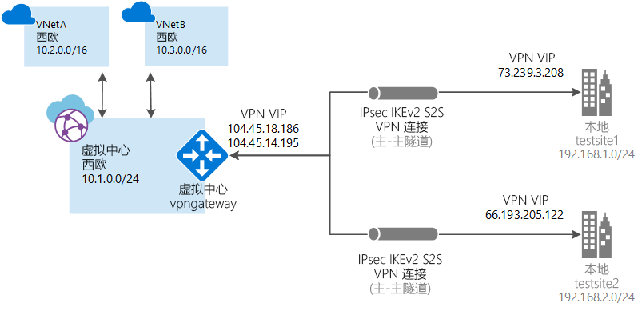

# <a name="tutorial-create-a-site-to-site-connection-using-azure-virtual-wan-preview"></a>教程：使用 Azure 虚拟 WAN（预览版）创建站点到站点连接

本教程介绍如何使用虚拟 WAN 通过 IPsec/IKE (IKEv2) VPN 连接来与 Azure 中的资源建立连接。 此类型的连接要求位于本地的 VPN 设备分配有一个面向外部的公共 IP 地址。 有关虚拟 WAN 的详细信息，请参阅[虚拟 WAN 概述](virtual-wan-about.md)

> [!NOTE]
> 如果你有多个站点，则通常会使用[虚拟 WAN 合作伙伴](https://aka.ms.virtualwan)来创建此配置。 但是，如果你熟悉网络技术并能够熟练配置自己的 VPN 设备，则可以自行创建此配置。
>



本教程介绍如何执行以下操作：

> [!div class="checklist"]
> * 创建 WAN
> * 创建站点
> * 创建中心
> * 将中心连接到站点
> * 将 VNet 连接到中心
> * 下载并应用 VPN 设备配置
> * 查看虚拟 WAN
> * 查看资源运行状况
> * 监视连接

> [!IMPORTANT]
> Azure 虚拟 WAN 目前以托管的公共预览版提供。 若要使用虚拟 WAN，必须[在预览版中注册](#enroll)。
>
> 此公共预览版在提供时没有附带服务级别协议，不应该用于生产工作负荷。 某些功能可能不受支持或受到约束，或者不一定在所有 Azure 位置都可用。 有关详细信息，请参阅 [Microsoft Azure 预览版补充使用条款](https://azure.microsoft.com/support/legal/preview-supplemental-terms/)。

## <a name="before-you-begin"></a>开始之前

在开始配置之前，请验证你是否符合以下条件：

* 确保有一台可以使用 IKEv2 的、基于路由的兼容 VPN 设备，并且可对其进行配置。 如果使用虚拟 WAN 合作伙伴，则系统会自动创建配置设置，你无需考虑如何如何手动配置设备。
* 确认 VPN 设备有一个面向外部的公共 IPv4 地址。 此 IP 地址不得位于 NAT 之后。
* 如果已有一个要连接的虚拟网络，请确认本地网络的任何子网都不与要连接到的虚拟网络重叠。 虚拟网络不需要网关子网，并且不能包含任何虚拟网络网关。 如果没有虚拟网络，可以使用本文中的步骤创建一个。
* 获取中心区域的 IP 地址范围。 中心是一个虚拟网络，为中心区域指定的地址范围不能与要连接到的任何现有虚拟网络重叠。 此外，它也不能与本地连接到的地址范围重叠。 如果不熟悉本地网络配置中的 IP 地址范围，则需咨询能够提供此类详细信息的人员。
* 如果没有 Azure 订阅，请在开始之前创建一个[免费帐户](https://azure.microsoft.com/free/?WT.mc_id=A261C142F)。

## <a name="enroll"></a>1.在预览版中注册

在配置虚拟 WAN 之前，必须先在预览版中注册订阅。 否则无法在门户中使用虚拟 WAN。 若要注册，请向 **azurevirtualwan@microsoft.com** 发送一封包含订阅 ID 的电子邮件。 注册订阅后，你会收到电子邮件。

## <a name="vnet"></a>2.创建虚拟网络

如果没有 VNet，可以使用 PowerShell 快速创建一个。 也可以使用 Azure 门户创建虚拟网络。

* 请务必确认创建的 VNet 的地址空间不与要连接到的其他 Vnet 的任何地址范围或者本地网络地址空间重叠。 
* 如果已有一个 VNet，请确认它符合所需的条件，并且不包含虚拟网络网关。

单击本文中的“试用”打开 PowerShell 控制台，即可轻松创建 VNet。 请调整值，然后复制命令并将其粘贴到控制台窗口中。

### <a name="create-a-resource-group"></a>创建资源组

调整 PowerShell 命令，然后创建一个资源组。

```azurepowershell-interactive
New-AzureRmResourceGroup -ResourceGroupName WANTestRG -Location WestUS
```

### <a name="create-a-vnet"></a>创建 VNet

调整 PowerShell 命令以创建与环境兼容的 VNet。

```azurepowershell-interactive
$fesub1 = New-AzureRmVirtualNetworkSubnetConfig -Name FrontEnd -AddressPrefix "10.1.0.0/24"
$vnet   = New-AzureRmVirtualNetwork `
            -Name WANVNet1 `
            -ResourceGroupName WANTestRG `
            -Location WestUS `
            -AddressPrefix "10.1.0.0/16" `
            -Subnet $fesub1
```

## <a name="wan"></a>3.创建虚拟 WAN

1. 从浏览器导航到 [Azure 门户](https://portal.azure.com)并使用 Azure 帐户登录。
2. 此时，可以通过导航到“所有服务”并搜索“虚拟 WAN”找到虚拟 WAN。 或者，可以在 Azure 门户顶部的搜索框中搜索“虚拟 WAN”。 单击“虚拟 WAN”打开相应的页。
3. 单击“创建”打开“创建 WAN”页。 如果未显示该页，则表示你尚未获批使用此预览版。

  
4. 在“创建 WAN”页上填写以下字段。

  * **名称** - 选择 WAN 的名称。
  * **订阅** - 选择要使用的订阅。
  * **资源组** - 新建资源组或使用现有的资源组。
  * **资源位置** - 从下拉列表中选择资源位置。 WAN 是一个全局资源，不会驻留在某个特定区域。 但是，必须选择一个区域才能更轻松地管理和查找所创建的 WAN 资源。
5. 单击“创建”以创建 WAN。

## <a name="site"></a>4.创建站点

创建任意数目的与物理位置对应的站点。 例如，如果你在纽约、伦敦和洛杉矶各有一个分支机构，请创建三个独立的站点。 这些站点包含本地 VPN 设备终结点。 目前，只能为站点指定一个专用地址空间。

1. 导航到“所有资源”。
2. 单击创建的虚拟 WAN。
3. 单击页面顶部的“+ 创建站点”打开“创建站点”页。

  
4. 在“创建站点”页上填写以下字段：

  *  **名称** - 本地站点的名称。
  *  **公开 IP 地址** - 驻留在本地站点中的 VPN 设备的公共 IP 地址。
  *  **专用地址空间** - 位于本地站点的 IP 地址空间。 发往此地址空间的流量将路由到本地站点。
  *  **订阅** - 验证订阅。
  *  **资源组** - 要使用的资源组。
5. 单击“显示高级”查看其他设置。 可以**启用 BGP**（可选字段），这会在 Azure 中针对为此站点创建的所有连接启用此功能。 还可以输入**设备信息**（可选字段）。 这有助于 Azure 团队更好地了解你的环境，以便将来添加更多的可用优化选项，或帮助你进行故障排除。

  
6. 单击“确认”以创建站点。
7. 针对要创建的每个站点重复这些步骤。

## <a name="hub"></a>5.创建中心并连接站点

1. 在虚拟 WAN 的页面上，单击“站点”。
2. 在“未关联的站点”下，可以看到尚未连接到中心的站点列表。
3. 选择要关联的站点。
4. 在下拉列表中，选择中心已关联到的区域。 应该将中心关联到要连接的 VNet 所在的区域。
5. 单击“确认”。 如果你在此区域中没有中心，系统会自动创建一个虚拟中心 VNet。 在这种情况下，会显示“创建区域中心”页。
6. 在“创建区域中心”页上，输入中心 VNet 的地址范围。 这是包含中心服务的 VNet。 在此处输入的范围必须是专用 IP 地址范围，并且不能与任何本地地址空间或 VNet 地址空间重叠。 后续的 VPN 终结点将在中心 VNet 中创建。 （只能在门户中创建自动中心和网关。）
7. 单击“创建”。

## <a name="vnet"></a>6.将 VNet 连接到中心

此步骤在中心与 VNet 之间创建对等互连。 针对要连接的每个 VNet 重复这些步骤。

1. 在虚拟 WAN 的页面上，单击“虚拟网络连接”。
2. 在虚拟网络连接页上，单击“+添加连接”。
3. 在“添加连接”页上填写以下字段：

    * **连接名称** - 为连接命名。
    * **中心** - 选择要与此连接关联的中心。
    * **订阅** - 验证订阅。
    * **虚拟网络** - 选择要连接到此中心的虚拟网络。 此虚拟网络不能包含现有的虚拟网络网关。

## <a name="device"></a>7.下载 VPN 配置

使用 VPN 设备配置来配置本地 VPN 设备。

1. 在虚拟 WAN 的页面上，单击“概述”。
2. 在“概述”页的顶部，单击“下载 VPN 配置”。 Azure 会在资源组“microsoft-network-[location]”中创建一个存储帐户，其中，location 是 WAN 的位置。 将配置应用到 VPN 设备后，可以删除此存储帐户。
3. 完成创建文件后，可以单击相应的链接下载该文件。
4. 将配置应用到 VPN 设备。

### <a name="understanding-the-vpn-device-configuration-file"></a>了解 VPN 设备配置文件

设备配置文件包含配置本地 VPN 设备时要使用的设置。 查看此文件时，请留意以下信息：

* **vpnSiteConfiguration** - 此节表示当站点连接到虚拟 WAN 时设置的设备详细信息。 它包含分支设备的名称和公共 IP 地址。
* **vpnSiteConnections** - 此节提供以下信息：

    * 虚拟中心 VNet 的**地址空间**<br>示例：
 
        ```
        "AddressSpace":"10.1.0.0/24"
        ```
    * 已连接到中心的 VNet 的**地址空间**<br>示例：

         ```
        "ConnectedSubnets":["10.2.0.0/16","10.30.0.0/16"]
         ```
    * 虚拟中心 vpngateway 的 **IP 地址**。 由于 vpngateway 的每个连接由采用主动-主动配置的 2 个隧道构成，因此，此文件中列出了这两个 IP 地址。 在此示例中，可以看到为每个站点指定了“Instance0”和“Instance1”。<br>示例：

        ``` 
        "Instance0":"104.45.18.186"
        "Instance1":"104.45.13.195"
        ```
    * **Vpngateway 连接配置详细信息**，例如 BGP、预共享密钥，等等。PSK 是自动生成的预共享密钥。 始终可以在“概述”页中为自定义 PSK 编辑连接。
  
### <a name="example-device-configuration-file"></a>示例设备配置文件

  ```
  { 
      "configurationVersion":{ 
         "LastUpdatedTime":"2018-07-03T18:29:49.8405161Z",
         "Version":"r403583d-9c82-4cb8-8570-1cbbcd9983b5"
      },
      "vpnSiteConfiguration":{ 
         "Name":"testsite1",
         "IPAddress":"73.239.3.208"
      },
      "vpnSiteConnections":[ 
         { 
            "hubConfiguration":{ 
               "AddressSpace":"10.1.0.0/24",
               "Region":"West Europe",
               "ConnectedSubnets":[ 
                  "10.2.0.0/16",
                  "10.30.0.0/16"
               ]
            },
            "gatewayConfiguration":{ 
               "IpAddresses":{ 
                  "Instance0":"104.45.18.186",
                  "Instance1":"104.45.13.195"
               }
            },
            "connectionConfiguration":{ 
               "IsBgpEnabled":false,
               "PSK":"bkOWe5dPPqkx0DfFE3tyuP7y3oYqAEbI",
               "IPsecParameters":{ 
                  "SADataSizeInKilobytes":102400000,
                  "SALifeTimeInSeconds":3600
               }
            }
         }
      ]
   },
   { 
      "configurationVersion":{ 
         "LastUpdatedTime":"2018-07-03T18:29:49.8405161Z",
         "Version":"1f33f891-e1ab-42b8-8d8c-c024d337bcac"
      },
      "vpnSiteConfiguration":{ 
         "Name":" testsite2",
         "IPAddress":"66.193.205.122"
      },
      "vpnSiteConnections":[ 
         { 
            "hubConfiguration":{ 
               "AddressSpace":"10.1.0.0/24",
               "Region":"West Europe"
            },
            "gatewayConfiguration":{ 
               "IpAddresses":{ 
                  "Instance0":"104.45.18.187",
                  "Instance1":"104.45.13.195"
               }
            },
            "connectionConfiguration":{ 
               "IsBgpEnabled":false,
               "PSK":"XzODPyAYQqFs4ai9WzrJour0qLzeg7Qg",
               "IPsecParameters":{ 
                  "SADataSizeInKilobytes":102400000,
                  "SALifeTimeInSeconds":3600
               }
            }
         }
      ]
   },
   { 
      "configurationVersion":{ 
         "LastUpdatedTime":"2018-07-03T18:29:49.8405161Z",
         "Version":"cd1e4a23-96bd-43a9-93b5-b51c2a945c7"
      },
      "vpnSiteConfiguration":{ 
         "Name":" testsite3",
         "IPAddress":"182.71.123.228"
      },
      "vpnSiteConnections":[ 
         { 
            "hubConfiguration":{ 
               "AddressSpace":"10.1.0.0/24",
               "Region":"West Europe"
            },
            "gatewayConfiguration":{ 
               "IpAddresses":{ 
                  "Instance0":"104.45.18.187",
                  "Instance1":"104.45.13.195"
               }
            },
            "connectionConfiguration":{ 
               "IsBgpEnabled":false,
               "PSK":"YLkSdSYd4wjjEThR3aIxaXaqNdxUwSo9",
               "IPsecParameters":{ 
                  "SADataSizeInKilobytes":102400000,
                  "SALifeTimeInSeconds":3600
               }
            }
         }
      ]
   }
  ```

### <a name="configuring-your-vpn-device"></a>配置 VPN 设备

>[!NOTE]
> 如果使用虚拟 WAN 合作伙伴解决方案，则 VPN 设备配置会自动发生，此时，设备控制器会从 Azure 获取配置文件，并将其应用到设备以便与 Azure 建立连接。 这意味着，无需知道如何手动配置 VPN 设备。
>

如需有关如何配置设备的说明，可以使用 [VPN 设备配置脚本页](~/articles/vpn-gateway/vpn-gateway-about-vpn-devices.md#configscripts)中的说明，并注意以下事项：

* VPN 设备页上的说明不是针对虚拟 WAN 编写的，但你可以使用配置文件中的虚拟 WAN 值来手动配置 VPN 设备。 
* 适用于 VPN 网关的可下载设备配置脚本并不适用于虚拟 WAN，因为配置不同。
* 虚拟 WAN 只能使用 IKEv2，而不能使用 IKEv1。
* 虚拟 WAN 只能使用基于路由的 VPN 设备和设备说明。

## <a name="viewwan"></a>8.查看虚拟 WAN

1. 导航到虚拟 WAN。
2. 在“概述”页上，地图中的每个点表示一个中心。 将鼠标悬停在任一点上可以查看中心运行状况的摘要。
3. 在“中心和连接”部分，可以查看中心状态、站点、区域、VPN 连接状态和传入与传出字节数。

## <a name="viewhealth"></a>9.查看资源运行状况

1. 导航到 WAN。
2. 在“WAN”页上的“支持 + 故障排除”部分，单击“运行状况”并查看资源。

## <a name="connectmon"></a>10.监视连接

创建一个连接，用于监视 Azure VM 与远程站点之间的通信。 有关如何设置连接监视器的信息，请参阅[监视网络通信](~/articles/network-watcher/connection-monitor.md)。 源字段是 Azure 中的 VM IP，目标 IP 是站点 IP。

## <a name="cleanup"></a>11.清理资源

如果不再需要这些资源，可以使用 [Remove-AzureRmResourceGroup](/powershell/module/azurerm.resources/remove-azurermresourcegroup) 删除资源组及其包含的所有资源。 将“myResourceGroup”替换为资源组的名称，并运行以下 PowerShell 命令：

```azurepowershell-interactive
Remove-AzureRmResourceGroup -Name myResourceGroup -Force
```

## <a name="feedback"></a>预览版反馈

如能提供反馈，我们将不胜感激。 请向 <azurevirtualwan@microsoft.com> 发送电子邮件以报告问题，或提供有关虚拟 WAN 的反馈（正面或负面）。 请在主题行中添加你的公司名称（用“[ ]”括起来）。 若要报告问题，还请添加订阅 ID。

## <a name="next-steps"></a>后续步骤

本教程介绍了如何：

> [!div class="checklist"]
> * 创建 WAN
> * 创建站点
> * 创建中心
> * 将中心连接到站点
> * 将 VNet 连接到中心
> * 下载并应用 VPN 设备配置
> * 查看虚拟 WAN
> * 查看资源运行状况
> * 监视连接

若要详细了解虚拟 WAN，请参阅[虚拟 WAN 概述](virtual-wan-about.md)页。