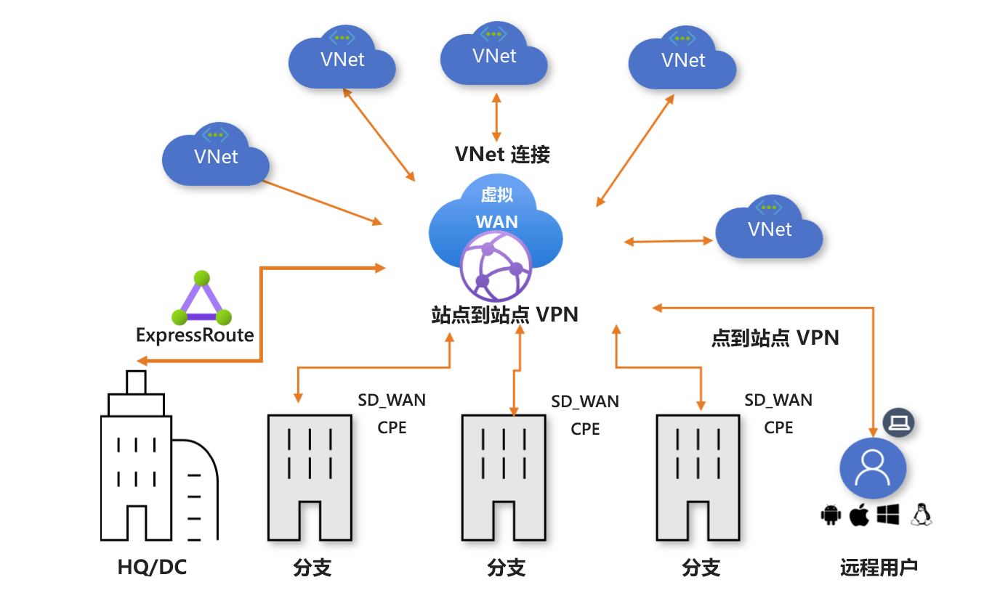

# Azure 虚拟 WAN 和支持远程工作

>[!NOTE]
>本文介绍了如何利用 Azure 虚拟 WAN、Azure、Microsoft 网络和 Azure 合作伙伴生态系统远程工作，并减少因 COVID-19 危机而面临的网络问题。
>

是否要为远程用户提供连接？
您是否突然就您的需求而不是您计划的用户提供支持？
你是否需要用户在家连接，而不仅访问云，还能够访问本地？
是否需要远程用户能够访问专用广域网后面的资源？
是否需要用户访问云资源，而无需在区域之间建立连接？
由于此全局流行病在我们的周围产生了前所未有的更改，因此，Azure 虚拟 WAN 团队将为你提供满足你的连接需求的要求。

Azure 虚拟 WAN 是一种网络服务，它将许多网络、安全性和路由功能组合在一起，以提供单个操作接口。 这些功能包括分支连接（通过虚拟 WAN 伙伴设备的连接自动化，如 SD-WAN 或 VPN CPE）、站点到站点 VPN 连接、远程用户 VPN （点到站点）连接、专用（ExpressRoute）连接、云连接（虚拟网络的可传递连接）、VPN ExpressRoute 互连、路由、Azure 防火墙、专用连接加密等。无需所有这些用例即可开始使用虚拟 WAN。 你只需一个用例即可开始，并在你的网络演变时进行调整。

现在，让我们来谈谈远程用户，让我们看看您的网络启动和运行所需的操作：

## 设置远程用户连接

通过 IPsec/IKE (IKEv2) 或 OpenVPN 连接可以连接到 Azure 中的资源。 此类型的连接要求为远程用户配置 VPN 客户端。 此客户端可以是[AZURE VPN 客户](https://go.microsoft.com/fwlink/?linkid=2117554)端或 OpenVPN 客户端，也可以是支持 IKEv2 的任何客户端。 有关详细信息，请参阅[创建点到站点连接](virtual-wan-point-to-site-portal.md)。

## 从远程用户到本地的连接

这里有两个选项：

* 设置与任何现有 VPN 设备之间的站点到站点连接。 将 IPsec VPN 设备连接到 Azure 虚拟 WAN 中心时，点到站点用户 VPN （远程用户）和站点到站点 VPN 之间的互连是自动进行的。 若要详细了解如何在本地 VPN 设备和 Azure 虚拟 WAN 之间设置站点到站点 VPN，请参阅[使用虚拟 Wan 创建站点到站点连接](virtual-wan-site-to-site-portal.md)。

* 将 ExpressRoute 线路连接到虚拟 WAN 集线器。 连接 ExpressRoute 线路需要在虚拟 WAN 中部署 ExpressRoute 网关。 部署一个后，点到站点用户 VPN 与 ExpressRoute 用户之间的互连是自动进行的。 若要创建 ExpressRoute 连接，请参阅[使用虚拟 WAN 创建 expressroute 连接](virtual-wan-expressroute-portal.md)。 可以使用现有 ExpressRoute 线路连接到 Azure 虚拟 WAN。

## 现有的基本虚拟 WAN 客户

基本虚拟 WAN 仅提供站点到站点 VPN。 为了使远程用户能够连接，需要将虚拟 WAN 升级到标准虚拟 WAN。 有关升级虚拟 WAN 的步骤，请参阅[将虚拟 wan 从基本升级到标准](upgrade-virtual-wan.md)

## 其他信息

虚拟 WAN 支持每个区域/位置有一个中心。 有关位置信息，请参阅[虚拟 WAN 合作伙伴和位置](virtual-wan-locations-partners.md)一文。 每个集线器最多支持10000个远程用户连接、1000分支连接、四个 ExpressRoute 线路和最多500个虚拟网络连接。 增加远程用户时，如果有任何疑问，请通过向发送电子邮件来azurevirtualwan@microsoft.com寻求帮助。 如果需要技术支持，请确保从 Azure 门户中打开支持票证，并提供帮助。

## 常见问题解答

[!INCLUDE [Virtual WAN FAQ](../../includes/virtual-wan-faq-include.md)]

## 后续步骤

有关虚拟 WAN 的详细信息，请参阅[虚拟 wan 概述](virtual-wan-about.md)