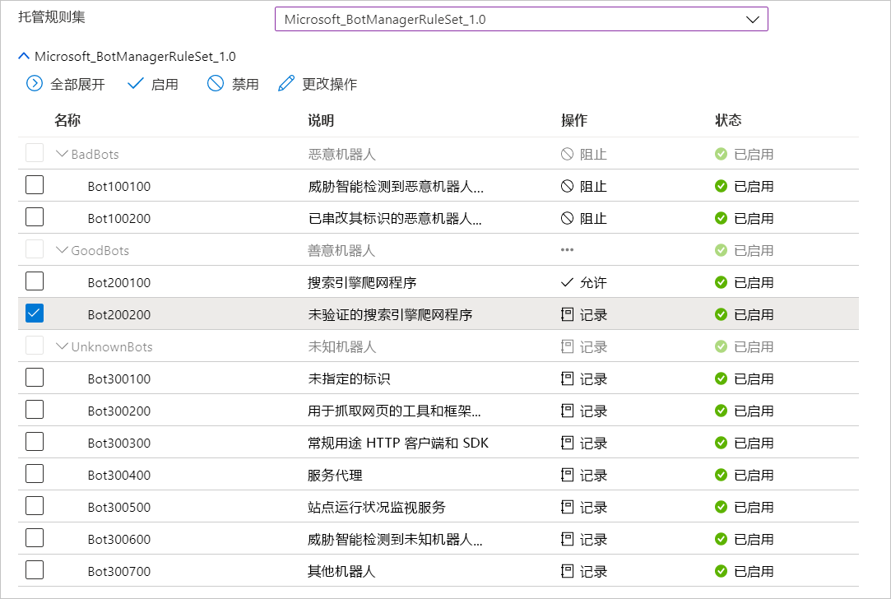

# Azure Front Door 上的 Azure Web 应用程序防火墙

Azure Front Door 上的 Azure Web 应用程序防火墙 (WAF) 为使用 Azure Front Door 进行全球交付的 Web 应用程序提供集中保护。 设计和运行此防火墙的目的是保护 Web 服务免受常见的攻击和漏洞的危害，使服务对你的用户高度可用，另外还帮助你满足符合性要求。

Front Door 上的 WAF 是一个全球性的集中式解决方案。 它部署在全球的 Azure 网络边缘位置，并且 Front Door 所交付的启用了 WAF 的 Web 应用程序的每个传入请求都在网络边缘进行检查。 这样，WAF 就可以在恶意攻击进入虚拟网络之前预防邻近攻击源的恶意攻击，并在不牺牲性能的情况下提供大规模的全球保护。 WAF 策略可以轻松地链接到订阅中的任何 Front Door 配置文件，并且新规则可以在数分钟内部署完毕，这样即可快速响应不断变化的威胁模式。

## WAF 策略和规则

可以配置一个 WAF 策略，然后将该策略与一个或多个 Front Door 前端关联，以提供保护。 WAF 策略包含两种类型的安全规则：

- 客户创作的自定义规则。

- 托管规则集，即由 Azure 托管的预配置规则设置的集合。

如果两者均存在，则先处理自定义规则，然后处理托管规则集中的规则。 规则由匹配条件、优先级和操作组成。 支持的操作类型包括：允许、阻止、记录和重定向。 可以组合托管规则和自定义规则以创建满足特定应用程序保护要求的完全自定义策略。

按优先顺序处理策略中的规则，且顺序的优先级是定义规则处理顺序的唯一整数。 整数值越小表示优先级越高，并且评估顺序先于整数值较大的规则。 匹配规则后，规则中定义的相应操作将应用于请求。 处理此类匹配后，不再进一步处理优先级较低的规则。

Front Door 交付的 Web 应用程序一次只能与一个 WAF 策略关联。 但可以使用 Front Door 配置，且无需将其与任何 WAF 策略关联。 如果 WAF 策略存在，它将复制到所有边缘位置，以确保全球的安全策略保持一致。

## WAF 模式

WAF 策略可配置为在以下两种模式下运行：

- **检测模式：** 在检测模式下运行时，WAF 除进行监视并将请求及其匹配的 WAF 规则记录到 WAF 日志中以外，不会执行任何其他操作。 可为 Front Door 启用日志记录诊断（使用门户时，可转到 Azure 门户中的“诊断”部分来实现这一点）  。

- **阻止模式：** 配置为在阻止模式下运行时，如果请求与规则匹配且找到了匹配，则 WAF 会执行指定操作，不会进一步评估优先级较低的其他规则。 任何匹配的请求也会记录在 WAF 日志中。

## WAF 操作

如果请求匹配规则的条件，WAF 客户可以选择运行其中某个操作：

- **允许：** 请求通过 WAF 传递并转发到后端。 没有其他优先级较低的规则可以阻止此请求。
- **阻止：** 请求受阻，WAF 将响应发送到客户端，且不会将请求转发到后端。
- **记录：** 请求记录在 WAF 日志中，且 WAF 继续评估优先级较低的规则。
- **重定向：** WAF 将请求重定向到指定的 URI。 指定的 URI 是策略级别设置。 配置后，与“重定向”操作匹配的所有请求都将发送到该 URI  。

## WAF 规则

WAF 策略可以由安全规则（由客户创作的自定义规则）和托管规则集（由 Azure 托管的预配置规则集）这两种类型组成。

### 自定义创作规则

可按如下方式配置自定义规则 WAF：

- **IP 允许列表和阻止列表：** 可对自定义规则进行配置，基于客户端 IP 地址列表或 IP 地址范围来控制对 Web 应用程序的访问权限。 支持 IPv4 和 IPv6 地址类型。 可将此列表配置为阻止或允许源 IP 与列表中的 IP 匹配的请求。

- **基于地理位置的访问控制：** 可对自定义规则进行配置，基于与客户端 IP 地址相关联的国家/地区代码来控制对 Web 应用程序的访问权限。

- **基于 HTTP 参数的访问控制：** 可基于匹配 HTTP/HTTPS 请求参数的字符串（如查询字符串、POST 参数、请求 URI、请求标头和请求正文）配置自定义规则。

- **基于请求方法的访问控制：** 可基于 HTTP 请求的请求方法（如 GET、PUT 或 HEAD）来配置自定义规则。

- **大小约束：** 可基于请求的特定部分的长度（如查询字符串、URI 或请求正文）来配置自定义规则。

- **速率限制规则：** 速率控制规则用于限制任何客户端 IP 发出的异常高的流量。 对于客户端 IP 在一分钟内允许的 Web 请求数，可以配置一个阈值。 这与基于 IP 列表的允许/阻止自定义规则不同，后者允许或阻止客户端 IP 的所有请求。 速率限制可以与其他匹配条件（例如用于粒度速率控制的 HTTP(S) 参数匹配）结合使用。

### Azure 托管的规则集

Azure 托管的规则集可轻松针对一组常见的安全威胁来部署保护。 由于此类规则集由 Azure 托管，因此这些规则会根据需要进行更新以预防新的攻击签名。 在公共预览版中，Azure 托管的默认规则集包含针对以下威胁类别的规则：

- 跨站点脚本
- Java 攻击
- 本地文件包含
- PHP 注入攻击
- 远程命令执行
- 远程文件包含
- 会话固定
- SQL 注入保护
- 协议攻击者

将新的攻击签名添加到规则集时，默认规则集的版本号将递增。
默认规则集在 WAF 策略的检测模式下默认启用。 可以禁用或启用默认规则集内的各个规则以满足应用程序要求。 还可以根据规则设置特定操作（允许/阻止/重定向/记录）。 默认操作为“阻止”。 此外，如果想要绕过默认规则集中的任何预配置规则，可以在同一 WAF 策略中配置自定义规则。
在评估默认规则集中的规则之前，自定义规则始终适用。 如果请求与自定义规则匹配，则应用相应的规则操作，并且请求将受阻或传递到后端，且无需调用任何其他自定义规则或默认规则集中的规则。 此外，可以选择删除 WAF 策略中的默认规则集。

### 机器人防护规则（预览版）

可为 WAF 启用托管机器人防护规则集，以便针对来自已知恶意 IP 地址的请求采取自定义操作。 IP 地址源自 Microsoft 威胁智能源。 [Intelligent Security Graph](https://www.microsoft.com/security/operations/intelligence) 为 Microsoft 威胁智能助力，它已得到 Azure 安全中心等多项服务的运用。

> [!IMPORTANT]
> 机器人防护规则集当前为公共预览版，并提供预览版服务级别协议。 某些功能可能不受支持或者受限。  有关详细信息，请参阅 [Microsoft Azure 预览版补充使用条款](https://azure.microsoft.com/support/legal/preview-supplemental-terms/)。

如果启用了机器人防护，则与恶意机器人的客户端 IP 匹配的传入请求将记录在 FrontdoorWebApplicationFirewallLog 日志中。 可从存储帐户、事件中心或日志分析访问 WAF 日志。 

## 配置

完全支持使用 Azure 门户、REST API、Azure 资源管理器模板和 Azure PowerShell 来配置和部署所有 WAF 规则类型。

## 监视

在 Front Door 监视 WAF 与 Azure Monitor 集成，以便跟踪警报并轻松监视流量趋势。

## 后续步骤

- 了解 [Azure 应用程序网关上的 Web 应用程序防火墙](../ag/ag-overview.md)