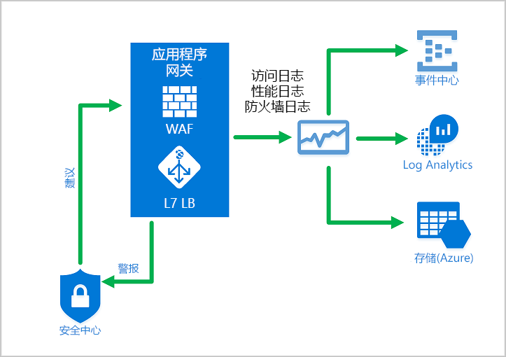
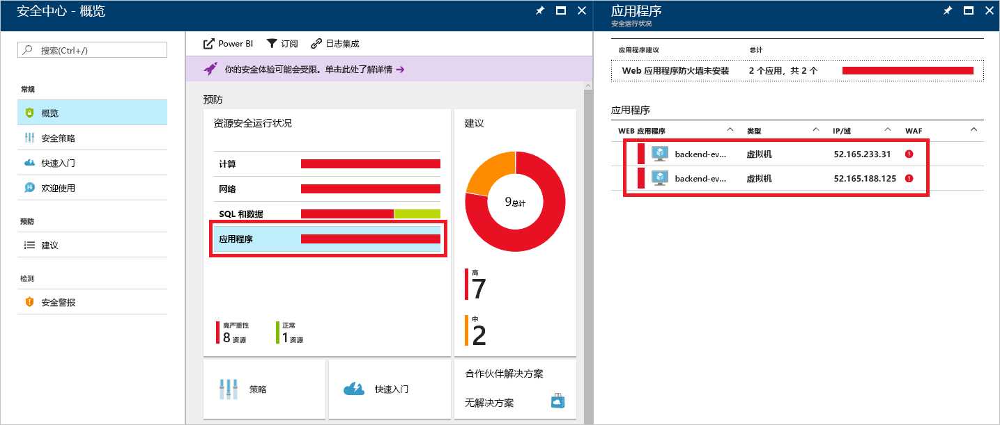
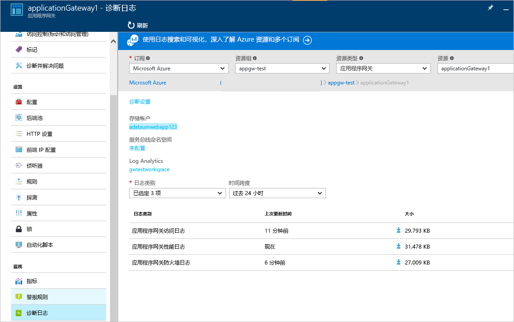

# <a name="what-is-azure-web-application-firewall-on-azure-application-gateway"></a>什么是 Azure 应用程序网关上的 Azure Web 应用程序防火墙？

Azure 应用程序网关提供的 Azure Web 应用程序防火墙 (WAF) 可以对 Web 应用程序进行集中保护，避免其受到常见的攻击和漏洞伤害。 Web 应用程序已逐渐成为利用常见已知漏洞的恶意攻击的目标。 SQL 注入和跨站点脚本是最常见的攻击。

应用程序网关上的 WAF 基于开放 Web 应用程序安全项目 (OWASP) 中的[核心规则集 (CRS)](https://owasp.org/www-project-modsecurity-core-rule-set/) 3.1、3.0 或 2.2.9。 WAF 会自动更新以包含针对新漏洞的保护，而无需其他配置。 

下面列出了 WAF 策略中存在的所有 WAF 功能。 可以创建多个策略，并可将它们与应用程序网关或应用程序网关上的单个侦听器或基于路径的路由规则相关联。 这样，如果需要，你可以为应用程序网关后面的每个站点提供单独的策略。 有关 WAF 策略的详细信息，请参阅[创建 WAF 策略](create-waf-policy-ag.md)。

   > [!NOTE]
   > 每个 URI 的 WAF 策略均为公共预览版。 这意味着此功能受 Microsoft 补充使用条款的约束。 有关详细信息，请参阅 [Microsoft Azure 预览版补充使用条款](https://azure.microsoft.com/support/legal/preview-supplemental-terms/)。


应用程序网关作为应用程序传送控制器 (ADC) 运行。 它提供了传输层安全性 (TLS)（以前称为安全套接字层 (SSL)）、终止、基于 Cookie 的会话相关性、轮循负载分发、基于内容的路由、托管多个网站的功能，以及安全增强功能。

应用程序网关安全增强功能包括 TLS 策略管理和端到端 TLS 支持。 将 WAF 集成到应用程序网关，从而增强了应用程序的安全性。 此集成可以保护 Web 应用程序免受常见漏洞的侵害。 它还提供了易于配置的中央位置来进行管理。

## <a name="benefits"></a>优点

本部分介绍 WAF 应用程序网关上 WAF 提供的核心优势。

### <a name="protection"></a>保护

* 无需修改后端代码即可保护 Web 应用程序免受 Web 漏洞和攻击的威胁。

* 同时保护多个 Web 应用程序。 应用程序网关的实例最多可以托管 40 个受 Web 应用程序防火墙保护的网站。

* 为同一 WAF 后面的不同站点创建自定义 WAF 策略 

* 利用 IP 信誉规则集保护 Web 应用程序免受恶意机器人的攻击（预览版）

### <a name="monitoring"></a>监视

* 使用实时 WAF 日志监视 Web 应用程序受到的攻击。 此日志与 [Azure Monitor](../../azure-monitor/overview.md) 相集成，让你可以跟踪 WAF 警报并轻松监视趋势。

* 应用程序网关 WAF 已与 Azure 安全中心集成。 安全中心可集中查看所有 Azure 资源的安全状态。

### <a name="customization"></a>自定义

* 根据应用程序的要求自定义 WAF 规则和规则组，并消除误报。

* 为 WAF 后面的每个站点关联 WAF 策略，以允许进行特定于站点的配置

* 根据应用程序的需求创建自定义规则

## <a name="features"></a>功能

- SQL 注入保护。
- 跨站点脚本保护。
- 其他常见 Web 攻击防护，例如命令注入、HTTP 请求走私、HTTP 响应拆分和远程文件包含。
- 防止 HTTP 协议违反行为。
- 防止 HTTP 协议异常行为（例如缺少主机用户代理和接受标头）。
- 防范爬网程序和扫描程序。
- 检测常见应用程序错误配置（例如 Apache 和 IIS 等）。
- 具有下限和上限的可配置请求大小限制。
- 排除列表允许你忽略 WAF 评估中的某些请求属性。 常见示例是 Active Directory 插入的令牌，这些令牌用于身份验证或密码字段。
- 根据应用程序的具体需求创建自定义规则。
- 按地理位置筛选流量，以允许或阻止从特定的国家/地区访问你的应用程序。 （预览版）
- 使用机器人缓解规则集防范应用程序遭到机器人攻击。 （预览版）

## <a name="waf-policy-and-rules"></a>WAF 策略和规则

若要在应用程序网关上启用 Web 应用程序防火墙，必须创建 WAF 策略。 此策略是指存在所有托管规则、自定义规则、排除项和其他自定义项（如文件上传限制）的位置。

可以配置一个 WAF 策略，然后将该策略与一个或多个应用程序网关相关联，以提供保护。 WAF 策略包含两种类型的安全规则：

- 你创建的自定义规则

- 托管规则集，即由 Azure 托管的预配置规则集的集合

如果两者均存在，则先处理自定义规则，然后处理托管规则集中的规则。 规则由匹配条件、优先级和操作组成。 支持的操作类型包括：ALLOW、BLOCK 和 LOG。 可以组合托管规则和自定义规则以创建满足特定应用程序保护要求的完全自定义策略。

策略中的规则按优先顺序进行处理。 “优先级”是唯一的整数，定义规则的处理顺序。 整数值越小表示优先级越高，这些规则的评估顺序先于整数值较大的规则。 匹配规则后，规则中定义的相应操作将应用于请求。 处理此类匹配后，不再进一步处理优先级较低的规则。

由应用程序网关提供的 Web 应用，可以在全局级别、每个站点级别或每个 URI 级别与 WAF 策略关联。

### <a name="core-rule-sets"></a>核心规则集

应用程序网关支持三个规则集：CRS 3.1、CRS 3.0 和 CRS 2.2.9。 这些规则保护 Web 应用程序免受恶意活动的攻击。

有关详细信息，请参阅 [Web 应用程序防火墙 CRS 规则组和规则](application-gateway-crs-rulegroups-rules.md)。

### <a name="custom-rules"></a>自定义规则

应用程序网关也支持自定义规则。 使用自定义规则，可以创建自己的规则，将针对通过 WAF 传递的每个请求评估这些规则。 这些规则的优先级高于托管规则集中的其余规则。 如果满足一组条件，则执行操作以进行允许或阻止。 

自定义规则的 geomatch 运算符现以公共预览版提供。 有关详细信息，请参阅 [geomatch 自定义规则](custom-waf-rules-overview.md#geomatch-custom-rules-preview)。

> [!NOTE]
> 自定义规则的 geomatch 运算符当前为公共预览版，并提供预览版服务级别协议。 某些功能可能不受支持或者受限。 有关详细信息，请参阅 [Microsoft Azure 预览版补充使用条款](https://azure.microsoft.com/support/legal/preview-supplemental-terms/)。

有关自定义规则的详细信息，请参阅[应用程序网关的自定义规则](custom-waf-rules-overview.md)。

### <a name="bot-mitigation-preview"></a>机器人缓解（预览版）

可以为 WAF 启用托管机器人防护规则集，以便阻止或记录来自已知恶意 IP 地址的请求以及托管规则集。 IP 地址源自 Microsoft 威胁智能源。 Intelligent Security Graph 为 Microsoft 威胁智能助力，它已得到 Azure Security Center 等多项服务的运用。

> [!NOTE]
> 机器人防护规则集当前为公共预览版，并提供预览版服务级别协议。 某些功能可能不受支持或者受限。 有关详细信息，请参阅 [Microsoft Azure 预览版补充使用条款](https://azure.microsoft.com/support/legal/preview-supplemental-terms/)。

如果启用了机器人防护，则与恶意机器人的客户端 IP 匹配的传入请求将记录在防火墙日志中。有关详细信息，请参阅下文。 可以从存储帐户、事件中心或日志分析访问 WAF 日志。 

### <a name="waf-modes"></a>WAF 模式

应用程序网关 WAF 可配置为在以下两种模式中运行：

* **检测模式**：监视和记录所有威胁警报。 在“诊断”部分打开应用程序网关的日志记录诊断。 还必须确保已选择并打开 WAF 日志。 在检测模式下运行时，Web 应用程序防火墙不会阻止传入的请求。
* **阻止模式**：阻止规则检测到的入侵和攻击。 攻击者会收到“403 未授权访问”异常，且连接会结束。 阻止模式会在 WAF 日志中记录此类攻击。

> [!NOTE]
> 建议在生产环境中的短时间内，在检测模式下运行新部署的 WAF。 这样，在转换为阻止模式之前，便有机会获取[防火墙日志](../../application-gateway/application-gateway-diagnostics.md#firewall-log)并更新任何异常或[自定义规则](./custom-waf-rules-overview.md)。 这有助于减少意外阻止流量的发生次数。

### <a name="anomaly-scoring-mode"></a>异常评分模式

OWASP 有两种模式，用于决定是否阻止流量：传统模式和异常评分模式。

在传统模式下，与任何规则匹配的流量被视为独立于任何其他规则匹配。 此模式易于理解。 但其局限在于，未提供相关信息以表明与特定请求匹配的规则数。 因此，引入了异常评分模式。 这是 OWASP 3.x 的默认模式。

在异常评分模式下，当防火墙处于阻止模式时，不会立即阻止与任何规则匹配的流量。 规则具有一定的严重性：“严重”、“错误”、“警告”或“通知”。 此严重性会影响请求的数值，该数值称为异常分数。 例如，一个“警告”规则匹配对应的分数为 3。 一个“严重”规则匹配对应的分数为 5。

|严重性  |Value  |
|---------|---------|
|严重     |5|
|错误        |4|
|警告      |3|
|通知       |2|

异常分数的阈值为 5，用于阻止流量。 因此，单个“严重”规则匹配足以让应用程序网关 WAF 阻止请求，即使在阻止模式下也是如此。 但一个“警告”规则匹配仅使异常分数增加 3，而这并不足以阻止流量。

> [!NOTE]
> WAF 规则匹配流量时记录的消息包括操作值“已阻止”。 但实际上只会在异常分数为 5 或更高时阻止流量。  

### <a name="waf-monitoring"></a>WAF 监视

监视应用程序网关的运行状况非常重要。 通过与 Azure 安全中心、Azure Monitor 和 Azure Monitor 日志相集成，可以监视 Web 应及其保护的应用程序的运行状况。



#### <a name="azure-monitor"></a>Azure Monitor

应用程序网关日志与 [Azure Monitor](../../azure-monitor/overview.md) 相集成。 这样，便可以跟踪包括 WAF 警报和日志在内的诊断信息。 可以在门户中应用程序网关资源的“诊断”选项卡上访问此功能，也可以通过 Azure Monitor 直接访问此功能。 若要详细了解如何启用日志，请参阅[应用程序网关诊断](../../application-gateway/application-gateway-diagnostics.md)。

#### <a name="azure-security-center"></a>Azure 安全中心

[安全中心](../../security-center/security-center-intro.md)可帮助防范、检测和应对威胁。 它可提高对 Azure 资源安全性的可见性和控制力度。 应用程序网关已[与安全中心集成](../../application-gateway/application-gateway-integration-security-center.md)。 安全中心会扫描环境以检测未受保护的 Web 应用程序。 它可以建议应用程序网关 WAF 保护这些易受攻击的资源。 直接从安全中心创建防火墙。 这些 WAF 实例已与安全中心集成。 他们将警报和运行状况信息发送到安全中心以进行报告。



#### <a name="azure-sentinel"></a>Azure Sentinel

Microsoft Azure Sentinel 是可缩放的云原生安全信息事件管理 (SIEM) 和安全业务流程自动响应 (SOAR) 解决方案。 Azure Sentinel 在整个企业范围内提供智能安全分析和威胁智能，为警报检测、威胁可见性、主动搜寻和威胁响应提供单一解决方案。

使用内置的 Azure WAF 防火墙事件工作簿可以大致了解 WAF 中的安全事件。 这包括事件、匹配和阻止的规则，以及在防火墙日志中记录的其他所有内容。 参阅下面有关日志记录的详细信息。 


#### <a name="azure-monitor-workbook-for-waf"></a>用于 WAF 的 Azure Monitor 工作簿

此工作簿支持跨多个可筛选面板自定义与安全相关 WAF 事件的可视化。 它适用于所有 WAF 类型，包括应用程序网关、Front Door 和 CDN，并且可以根据 WAF 类型或特定 WAF 实例进行筛选。 通过 ARM 模板或库模板导入。 若要部署此工作簿，请参阅 [WAF 工作簿](https://github.com/Azure/Azure-Network-Security/tree/master/Azure%20WAF/Azure%20Monitor%20Workbook)。

#### <a name="logging"></a>日志记录

应用程序网关 WAF 提供有关检测到的每个威胁的详细报告。 日志记录已与 Azure 诊断日志集成。 警报以 json 格式记录。 这些日志可与 [Azure Monitor 日志](../../azure-monitor/insights/azure-networking-analytics.md)集成。



```json
{
  "resourceId": "/SUBSCRIPTIONS/{subscriptionId}/RESOURCEGROUPS/{resourceGroupId}/PROVIDERS/MICROSOFT.NETWORK/APPLICATIONGATEWAYS/{appGatewayName}",
  "operationName": "ApplicationGatewayFirewall",
  "time": "2017-03-20T15:52:09.1494499Z",
  "category": "ApplicationGatewayFirewallLog",
  "properties": {
    {
      "instanceId": "ApplicationGatewayRole_IN_0",
      "clientIp": "52.161.109.145",
      "clientPort": "0",
      "requestUri": "/",
      "ruleSetType": "OWASP",
      "ruleSetVersion": "3.0",
      "ruleId": "920350",
      "ruleGroup": "920-PROTOCOL-ENFORCEMENT",
      "message": "Host header is a numeric IP address",
      "action": "Matched",
      "site": "Global",
      "details": {
        "message": "Warning. Pattern match \"^[\\\\d.:]+$\" at REQUEST_HEADERS:Host ....",
        "data": "127.0.0.1",
        "file": "rules/REQUEST-920-PROTOCOL-ENFORCEMENT.conf",
        "line": "791"
      },
      "hostname": "127.0.0.1",
      "transactionId": "16861477007022634343"
      "policyId": "/subscriptions/1496a758-b2ff-43ef-b738-8e9eb5161a86/resourceGroups/drewRG/providers/Microsoft.Network/ApplicationGatewayWebApplicationFirewallPolicies/globalWafPolicy",
      "policyScope": "Global",
      "policyScopeName": " Global "
    }
  }
} 

```

## <a name="application-gateway-waf-sku-pricing"></a>应用程序网关 WAF SKU 定价

WAF_v1 和 WAF_v2 SKU 的定价模型不同。 有关详细信息，请参阅[应用程序网关定价](https://azure.microsoft.com/pricing/details/application-gateway/)页。 

## <a name="whats-new"></a>新增功能

若要了解 Azure Web 应用程序防火墙的新增功能，请参阅 [Azure 更新](https://azure.microsoft.com/updates/?category=networking&query=Web%20Application%20Firewall)。

## <a name="next-steps"></a>后续步骤

- 详细了解 [WAF 托管规则](application-gateway-crs-rulegroups-rules.md)
- 详细了解[自定义规则](custom-waf-rules-overview.md)
- 了解 [Azure Front Door 上的 Web 应用程序防火墙](../afds/afds-overview.md)
