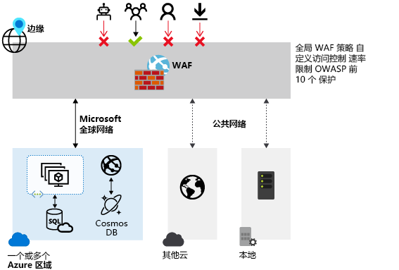

# 什么是 Azure Web 应用程序防火墙？

Web 应用程序防火墙 (WAF) 为 Web 应用程序提供集中保护，使其免受常见攻击和漏洞的侵害。 Web 应用程序已逐渐成为利用常见已知漏洞的恶意攻击的目标。 SQL 注入和跨站点脚本是最常见的攻击。

在应用程序代码中防止此类攻击非常困难。 这可能需要在应用程序拓扑的多个层进行严格的维护、修补和监视。 集中式 Web 应用程序防火墙有助于大幅简化安全性管理。 WAF 还能使应用程序管理员更有把握地防范威胁和入侵。

相较保护每个单独的 Web 应用程序，WAF 解决方案可以通过在中心位置修补已知漏洞，更快地对安全威胁做出反应。

可将 WAF 与 Azure 应用程序网关和 Azure Front Door 服务一同部署。 目前，WAF 提供针对每个特定服务自定义的功能。 有关适用于每个服务的 WAF 功能的详细信息，请参阅每个服务的概述。

## 后续步骤

- 有关应用程序网关上的 Web 应用程序防火墙的详细信息，请参阅 [Azure 应用程序网关上的 Web 应用程序防火墙](./ag/ag-overview.md)。
- 有关 Azure Front Door 服务上的 Web 应用程序防火墙的详细信息，请参阅 [Azure Front Door 服务上的 Web 应用程序防火墙](./afds/afds-overview.md)。
