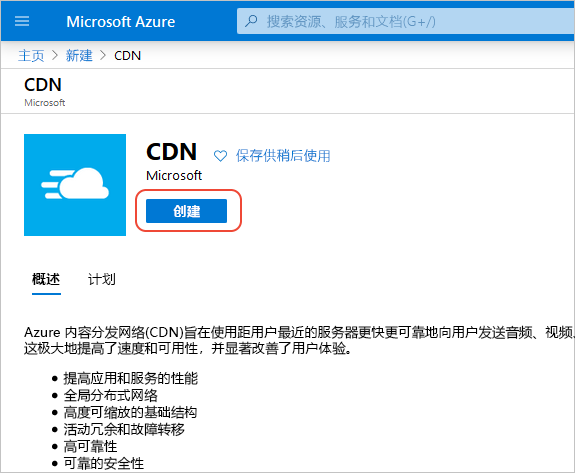
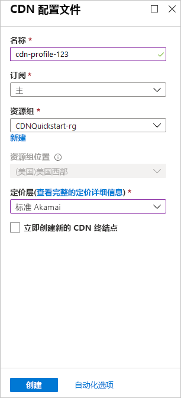

## 创建新的 CDN 配置文件

CDN 配置文件是适用于 CDN 终结点的容器，用于指定定价层。

1. 在 Azure 门户的左上角，选择“创建资源”。  
    
    此时会显示“新建”窗格。 
   
2. 选择“Web + 移动”  ，然后选择“CDN”。 
   
    

    此时会显示“CDN 配置文件”窗格。 

3. 对于 CDN 配置文件设置，请使用下表中指定的值：
   
    | 设置  | 值 |
    | -------- | ----- |
    | **名称** | 输入 *my-cdn-profile-123* 作为配置文件名称。 此名称必须全局唯一；如果此名称已在使用，则可输入其他名称。 |
    | **订阅** | 从下拉列表中选择一个 Azure 订阅。 |
    | **资源组** | 选择“新建”，然后输入 *my-resource-group-123* 作为资源组名称。  该名称必须全局唯一。 如果它已被使用，可以输入一个不同的名称，也可以选择“使用现有”  并从下拉列表中选择 **my-resource-group-123**。 | 
    | **资源组位置** | 从下拉列表中选择“美国中部”。  |
    | **定价层** | 从下拉列表中选择“标准 Verizon”。  |
    | **立即创建新的 CDN 终结点** | 保持未选中状态。 |  
   
    

4. 选择“固定到仪表板”  ，以便在创建配置文件以后将其保存到仪表板。
    
5. 选择“创建”  以创建该配置文件。 

    仅就**来自 Microsoft 的 Azure CDN 标准版**配置文件而言，配置文件通常可在两个小时内完成。 

