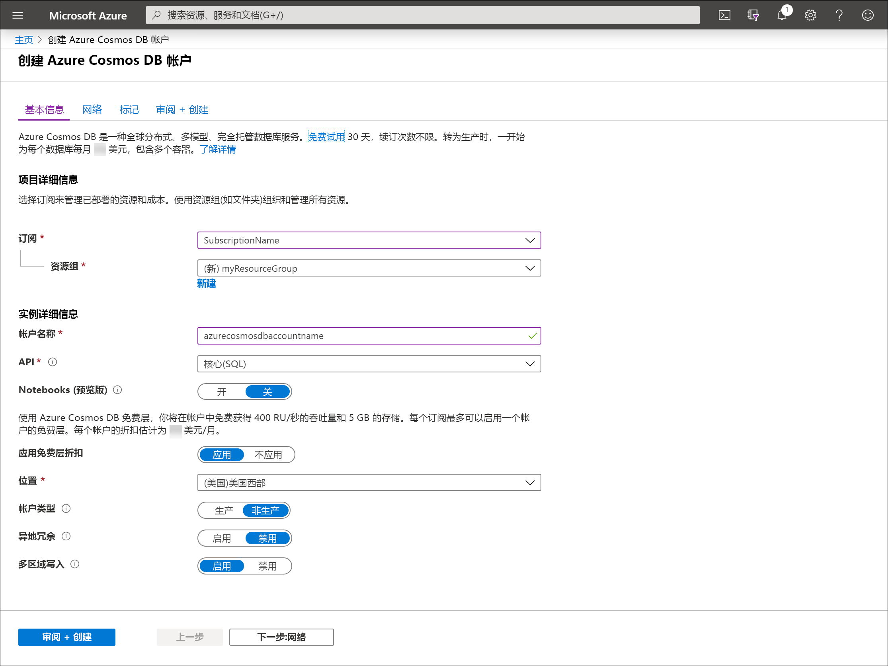
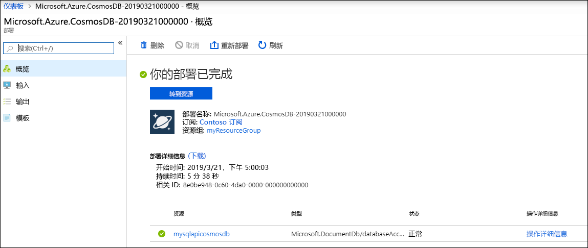
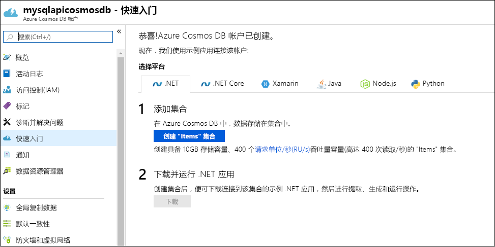

1. 在 Azure 门户菜单或主页中，选择“创建资源” 。

1. 在“新建”页面中搜索“Azure Cosmos DB”，然后选择它。 

1. 在“Azure Cosmos DB”页上，选择“创建”。

1. 在“创建 Azure Cosmos DB 帐户”页上，输入新 Azure Cosmos 帐户的基本设置。 

    |设置|值|说明 |
    |---|---|---|
    |订阅|订阅名称|选择要用于此 Azure Cosmos 帐户的 Azure 订阅。 |
    |资源组|资源组名称|选择一个资源组，或者选择“新建”，然后输入新资源组的唯一名称。 |
    |帐户名|唯一的名称|输入标识此 Azure Cosmos 帐户的名称。 由于 documents.azure.com 将追加到所提供的名称以创建 URI，因此，请使用唯一的名称。  名称只能包含小写字母、数字和连字符 (-)。 它的长度必须介于 3-44 个字符之间。|
    |API|要创建的帐户的类型|选择“Core (SQL)”，以便使用 SQL 语法创建文档数据库并进行查询。   API 确定要创建的帐户的类型。 Azure Cosmos DB 提供五种 API：适用于文档数据的 Core (SQL) 和 MongoDB、适用于图形数据的 Gremlin、Azure 表和 Cassandra。 目前，你必须为每种 API 创建单独的帐户。   [详细了解 SQL API](../articles/cosmos-db/documentdb-introduction.md)。|
    |应用免费层折扣|应用或不应用|使用 Azure Cosmos DB 免费层，你将在帐户中获得每秒的前 400 RU 免费的吞吐量和 5 GB 的免费存储。 了解[免费层](https://azure.microsoft.com/pricing/details/cosmos-db/)的详细信息。|
    |位置|离用户最近的区域|选择用于托管 Azure Cosmos DB 帐户的地理位置。 使用离用户最近的位置，使他们能够以最快的速度访问数据。|
    |帐户类型|生产或非生产|如果帐户将用于生产工作负荷，请选择“生产”。 如果帐户将用于非生产环境（例如开发、测试、QA 或过渡），请选择“非生产”。 这是一个 Azure 资源标记设置，用于调整门户体验，但不会影响基础 Azure Cosmos DB 帐户。 可以随时更改此值。|

    > [!NOTE]
    > 每个 Azure 订阅最多可以有一个免费层 Azure Cosmos DB 帐户，并且你必须在创建帐户时选择加入使用。 如果看不到用于应用免费层折扣的选项，这意味着订阅中的另一个帐户已启用免费层。
   
   

1. 选择“查看 + 创建”。 可以跳过“网络”和“标记”部分 。

1. 检查帐户设置，然后选择“创建”。 创建帐户需要几分钟时间。 等待门户页显示“你的部署已完成”消息。 

    

1. 选择“转到资源”，转到 Azure Cosmos DB 帐户页。 

    
