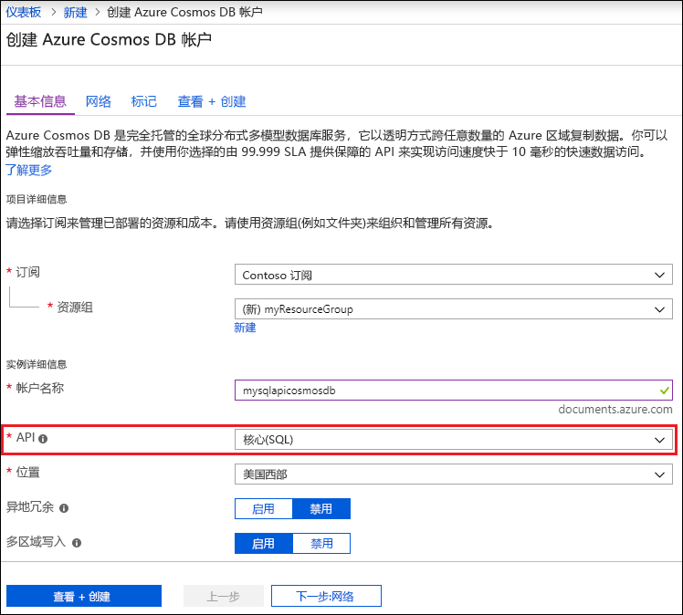

1. 登录到 [Azure 门户](https://portal.azure.com/)。
1. 选择“创建资源”   >   “数据库” >   “Azure Cosmos DB”。
   
   

1. 在“创建 Azure Cosmos DB 帐户”页上，输入新 Azure Cosmos 帐户的基本设置  。 
 
    |设置|值|Description |
    |---|---|---|
    |Subscription|订阅名称|选择要用于此 Azure Cosmos 帐户的 Azure 订阅。 |
    |资源组|资源组名称|选择一个资源组，或者选择“新建”，然后输入新资源组的唯一名称。  |
    | 帐户名|输入唯一的名称|输入标识此 Azure Cosmos 帐户的名称。 由于 documents.azure.com  字符串将追加到所提供的 ID 以创建 URI，因此，请使用唯一的 ID。  ID 只能包含小写字母、数字和连字符 (-) 字符。 它的长度必须介于 3 到 31 个字符之间。|
    | API|Core (SQL)|API 确定要创建的帐户的类型。 Azure Cosmos DB 提供五种 API：适用于文档数据的 Core (SQL) 和 MongoDB、适用于图形数据的 Gremlin、Azure 表和 Cassandra。 目前，你必须为每种 API 创建单独的帐户。   选择“Core (SQL)”，以便使用 SQL 语法创建文档数据库并进行查询  。   [详细了解 SQL API](../articles/cosmos-db/documentdb-introduction.md)。|
    | 位置|选择离用户最近的区域|选择用于托管 Azure Cosmos DB 帐户的地理位置。 使用离用户最近的位置，使他们能够以最快的速度访问数据。|
   
   

1. 选择“查看 + 创建”  。 可以跳过“网络”和“标记”部分   。 

1. 检查帐户设置，然后选择“创建”。  创建帐户需要几分钟时间。 等待门户页显示“你的部署已完成”  消息。 

    

1. 选择“转到资源”，转到 Azure Cosmos DB 帐户页。  

    
