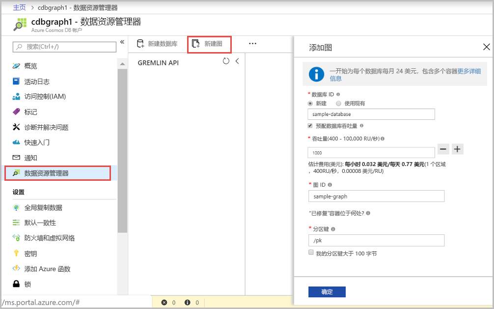

现在可以在 Azure 门户中使用数据资源管理器工具来创建图形数据库。 

1. 依次单击“数据资源管理器”   > “新图形”  。

    此时，最右侧显示“添加图形”  区域，可能需要向右滚动才能看到。

    

2. 在“添加图形”  页上，输入新图形的设置。

    设置|建议的值|说明
    ---|---|---
    数据库 ID|sample-database|输入“sample-database”  作为新数据库的名称。 数据库名称的长度必须为 1 到 255 个字符，不能包含 `/ \ # ?` 或尾随空格。
    图形 ID|sample-graph|输入“sample-graph”  作为新集合的名称。 图形名称与数据库 ID 的字符要求相同。
    存储容量|固定 (10 GB)|保留默认值为“固定 (10 GB)”  。 此值是数据库的存储容量。
    Throughput|400 RU|将吞吐量更改为每秒 400 个请求单位 (RU/s)。 如果想要减少延迟，以后可以增加吞吐量。

3. 填写表单后，请单击“确定”  。
