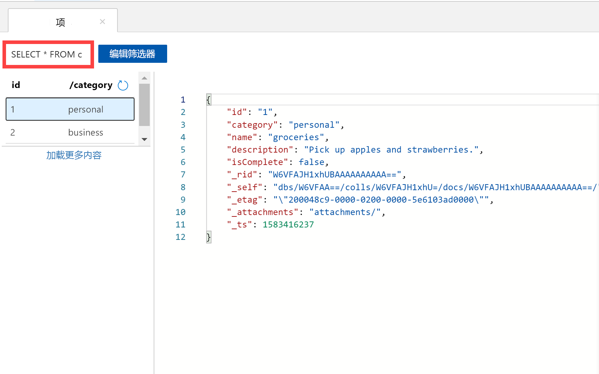
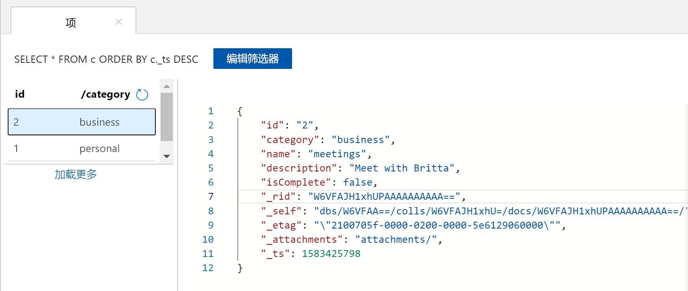

可以在数据资源管理器中使用查询来检索和筛选数据。

1. 在数据资源管理器的“文档”选项卡顶部，查看默认查询 `SELECT * FROM c`。 此查询按 ID 顺序检索并显示集合中的所有文档。 
   
   
   
1. 若要更改查询，请选择“编辑筛选器”，将默认查询替换为 `ORDER BY c._ts DESC`，然后选择“应用筛选器”。
   
   

   此修改后的查询根据文档的时间戳按降序显示文档，所以现在最先列出的是第二个文档。 
   
   

如果熟悉 SQL 语法，可以在查询谓词框中输入任何受支持的 [SQL 查询](../articles/cosmos-db/sql-api-sql-query.md)。 还可以使用数据资源管理器创建存储过程、UDF 和触发器以执行服务器端业务逻辑。 

数据资源管理器可以通过 Azure 门户轻松访问 API 中提供的所有内置编程数据访问功能。 也可通过门户缩放吞吐量、获取密钥和连接字符串，以及查看 Azure Cosmos DB 帐户的指标和 SLA。 

