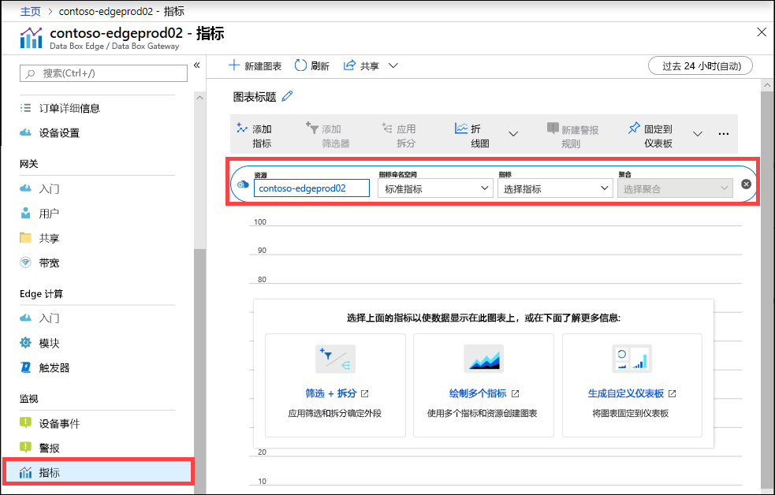
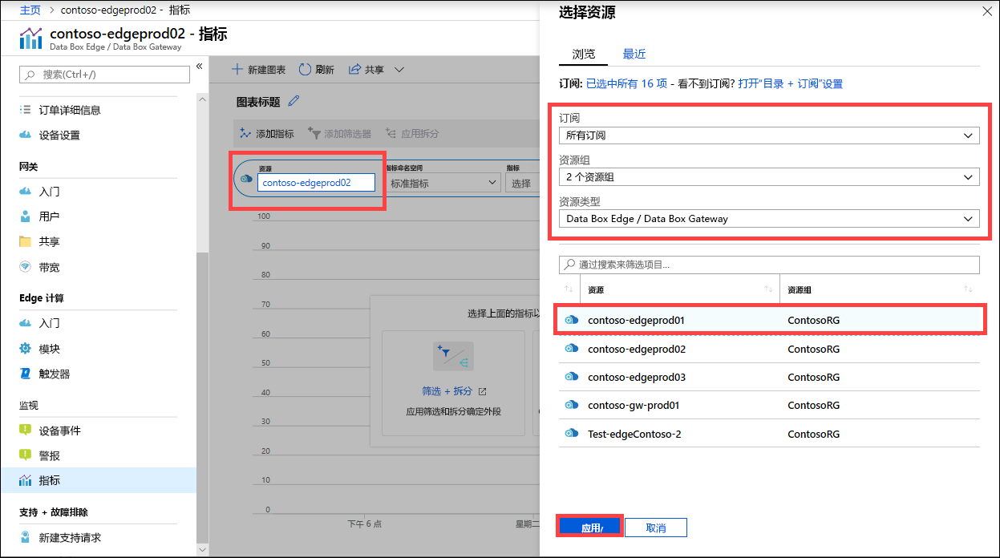
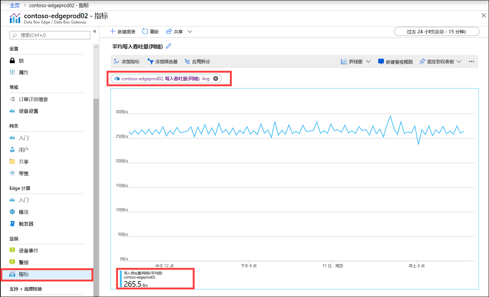
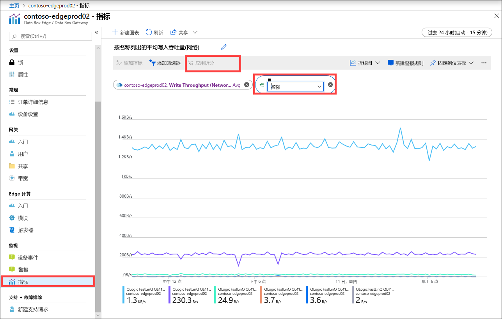
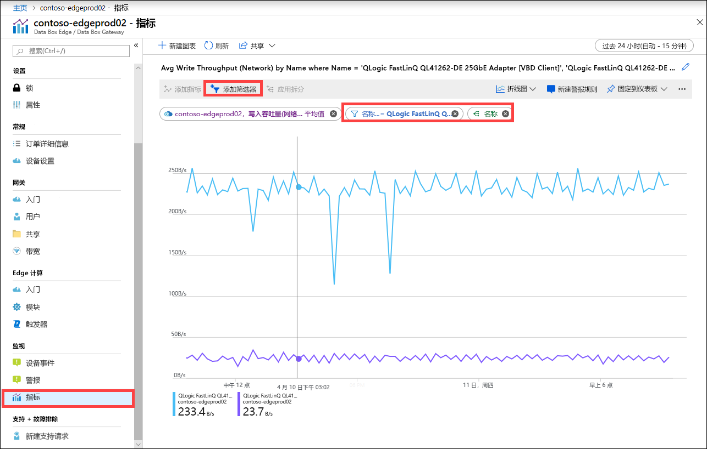

还可以查看指标以监视设备的性能，并在某些情况下排除设备故障。

在 Azure 门户中执行以下步骤，为所选择的设备指标创建图表。

1. 在 Azure 门户中的资源处，转到“监视”>“指标”，然后选择“添加指标”********。

    

2. 将自动填充资源。  

    

    若要指定其他资源，请选择该资源。 在“选择资源”边栏选项卡上，选择想查看其指标的订阅、资源组、资源类型和特定的资源，然后选择“应用”********。

    

3. 在下拉列表中选择用于监视设备的指标。 指标可以是“容量指标”或“事务指标”********。 容量指标与设备的容量有关。 事务指标与对 Azure 存储执行的读取和写入操作有关。

    |容量度量值                     |说明  |
    |-------------------------------------|-------------|
    |**可用容量**               | 指的是能向设备写入的数据量。 也就是设备上可用的容量。   通过删除在设备和云中都有副本的文件的本地副本，可以释放设备容量。        |
    |**总容量**                   | 指的是设备上能写入的数据的总字节数。 也称为本地缓存的总大小。    通过添加数据磁盘，可以提升现有虚拟设备的容量。 通过虚拟机监控程序管理为 VM 添加数据磁盘，然后重启 VM。 网关设备的本地存储池将进行扩展，以容纳新添加的数据磁盘。   若要了解详细信息，请转到[为 Hyper-V 虚拟机添加硬盘](https://www.youtube.com/watch?v=EWdqUw9tTe4)。 |
    
    |事务度量值              | 说明         |
    |-------------------------------------|---------|
    |**已上传的云字节数（设备）**    | 在设备上的所有共享中上传的所有字节数之和        |
    |**已上传的云字节数（共享）**     | 每个共享中上传的字节数。 这可以是：    平均值，即（每个共享中上传的字节数之和/共享数），    最大值，一个共享中上传的字节数量的最大值   最小值，一个共享中上传的字节数量的最小值      |
    |**云下载吞吐量（共享）**| 每个共享中下载的字节数。 这可以是：    平均值，即（每个共享中下载的字节数之和/共享数）    最大值，一个共享中下载的字节数量的最大值   以及最小值，一个共享中下载的字节数量的最小值  |
    |**云读取吞吐量**            | 在设备上的所有共享中从云读取的所有字节数之和     |
    |**云上传吞吐量**          | 在设备上的所有共享中写入云的所有字节数之和     |
    |**云上传吞吐量（共享）**  | 在共享中写入云的所有字节数之和/共享数得出的是平均值、每个共享的最大值和最小值      |
    |**读取吞吐量（网络）**           | 包括从云中读取的所有字节数的系统网络吞吐量。 此视图可以包含不限于共享的数据。   使用拆分功能，可以显示设备上所有网络适配器上的流量。 包括未连接和未启用的适配器。      |
    |**写入吞吐量（网络）**       | 包括写入云的所有字节数的系统网络吞吐量。 此视图可以包含不限于共享的数据。   使用拆分功能，可以显示设备上所有网络适配器上的流量。 包括未连接和未启用的适配器。          |
    |**Edge 计算 - 内存使用**      | 此指标不适用于 Data Box Gateway，所以不填充。          |
    |**Edge 计算 - CPU 百分比**    | 此指标不适用于 Data Box Gateway，所以不填充。         |

4. 当在下拉列表中选择指标后，即可定义聚合。 聚合指的是在指定时间范围内聚合的实际值。 聚合值可以为平均值、最小值或最大值。 从平均值、最大值或最小值中选择聚合。

    

5. 如果所选指标有多个实例，则可以使用拆分选项。 选择“应用拆分”，然后选择要按其显示明细图表的值****。

    

6. 如果现在只想查看少数实例的明细图表，可以对数据进行筛选。 例如，在这种情况下，如果想查看两个连接到设备的网络接口的网络吞吐量，可以筛选这些接口。 选择“添加筛选器”，并指定要筛选的网络接口名称****。

    

7. 还可以将图表固定至仪表板，以便访问。

    

8. 若要将图表数据导出为 Excel 电子表格或者获取用于共享的图表链接，请在命令栏中选择共享选项。

    