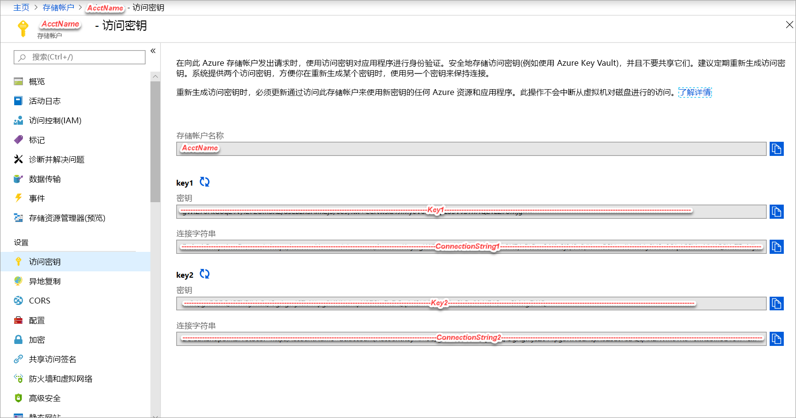

## <a name="prerequisites"></a>先决条件

### <a name="azure-subscription"></a>Azure 订阅
如果没有 Azure 订阅，请在开始之前创建一个[免费帐户](https://azure.microsoft.com/free/)。

### <a name="azure-roles"></a>Azure 角色
若要创建数据工厂实例，用于登录到 Azure 的用户帐户必须属于参与者或所有者角色，或者是 Azure 订阅的管理员。 若要查看你在订阅中拥有的权限，请在 Azure 门户中，选择右上角的用户名，然后选择“权限”。 如果可以访问多个订阅，请选择相应的订阅。 

若要为数据工厂创建和管理子资源（包括数据集、链接服务、管道、触发器和集成运行时），以下要求适用：
- 若要在 Azure 门户中创建和管理子资源，你必须属于资源组级别或更高级别的**数据工厂参与者**角色。
- 若要使用 PowerShell 或 SDK 创建和管理子资源，资源级别或更高级别的**参与者**角色已足够。

有关如何将用户添加到角色的示例说明，请参阅[添加角色](../articles/billing/billing-add-change-azure-subscription-administrator.md)一文。

有关详细信息，请参阅以下文章：
- [数据工厂参与者角色](../articles/role-based-access-control/built-in-roles.md#data-factory-contributor)
- [Azure 数据工厂的角色和权限](../articles/data-factory/concepts-roles-permissions.md)

### <a name="azure-storage-account"></a>Azure 存储帐户
在本快速入门中，使用通用的 Azure 存储帐户（具体说来就是 Blob 存储）作为源和目标数据存储。 如果没有通用的 Azure 存储帐户，请参阅[创建存储帐户](../articles/storage/common/storage-quickstart-create-account.md)创建一个。 

#### <a name="get-the-storage-account-name-and-account-key"></a>获取存储帐户名称和帐户密钥
在本快速入门中，将需要 Azure 存储帐户的名称和密钥。 以下过程提供的步骤用于获取存储帐户的名称和密钥： 

1. 在 Web 浏览器中转到 [Azure 门户](https://portal.azure.com)。 使用 Azure 用户名和密码登录。 
2. 在左侧菜单中选择“所有服务”，使用“存储”关键字进行筛选，然后选择“存储帐户”。

   
3. 在存储帐户列表中，通过筛选找出你的存储帐户（如果需要），然后选择你的存储帐户。 
4. 在“存储帐户”页上的菜单中选择“访问密钥”。

   
5. 将“存储帐户名称”和“密钥 1”框的值复制到剪贴板。 将这些值粘贴到记事本或任何其他编辑器中，然后保存。 本快速入门后面会用到它们。   

#### <a name="create-the-input-folder-and-files"></a>创建 input 文件夹和文件
本部分介绍如何在 Azure Blob 存储中创建名为 **adftutorial** 的 Blob 容器。 在容器中创建名为 **input** 的文件夹，然后将示例文件上传到 input 文件夹。 

1. 在“存储帐户”页中切换到“概述”，然后选择“Blob”。 

   
2. 在“Blob 服务”页中，选择工具栏上的“+ 容器”。 

       
3. 在“新建容器”对话框中，输入 **adftutorial** 作为名称，然后选择“确定”。 

   
4. 在容器列表中选择“adftutorial”。 

   
5. 在“容器”页中，选择工具栏上的“上传”。  

   
6. 在“上传 Blob”页中，选择“高级”。

   
7. 启动**记事本**，创建包含以下内容的名为 **emp.txt** 的文件。 将此文件保存在 **c:\ADFv2QuickStartPSH** 文件夹中。 创建 **ADFv2QuickStartPSH** 文件夹（如果不存在）。
    
   ```
   John, Doe
   Jane, Doe
   ```    
8. 在 Azure 门户中的“上传 Blob”页上，浏览并选择 **emp.txt** 文件，以填充“文件”框。 
9. 在“上传到文件夹”框中输入 **input** 作为值。 

        
10. 确认文件夹是 **input**、文件是 **emp.txt**，然后选择“上传”。
    
    应该会在列表中看到 **emp.txt** 文件和上传状态。 
12. 通过单击边角处的“X”关闭“上传 Blob”页。 

    
1. 使“容器”页保持打开状态。 在本快速入门结束时可以使用它来验证输出。