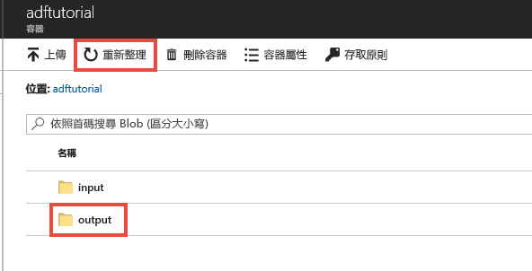
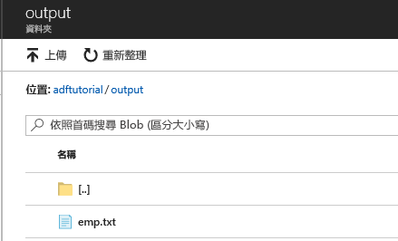

## <a name="verify-the-output"></a>验证输出
该管道自动在 adftutorial Blob 容器中创建 output 文件夹， 然后将 emp.txt 文件从 input 文件夹复制到 output 文件夹。 

1. 在 Azure 门户的“adftutorial”容器页中单击“刷新”，查看输出文件夹。   
    
    
2. 单击文件夹列表中的“output”。  
2. 确认 **emp.txt** 已复制到 output 文件夹。 

    

## <a name="clean-up-resources"></a>清理资源
可以通过两种方式清理在快速入门中创建的资源。 可以删除 [Azure 资源组](../articles/azure-resource-manager/management/overview.md)，其中包括资源组中的所有资源。 若要使其他资源保持原封不动，请仅删除在此教程中创建的数据工厂。

删除资源组时会删除所有资源，包括其中的数据工厂。 运行以下命令可以删除整个资源组： 
```powershell
Remove-AzResourceGroup -ResourceGroupName $resourcegroupname
```

请注意：删除资源组可能需要一些时间。 请耐心等待此过程完成

如果只需删除数据工厂，不需删除整个资源组，请运行以下命令： 

```powershell
Remove-AzDataFactoryV2 -Name $dataFactoryName -ResourceGroupName $resourceGroupName
```