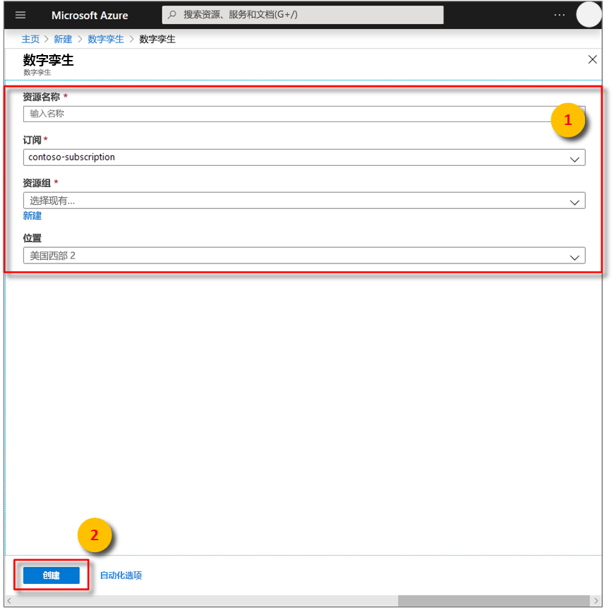
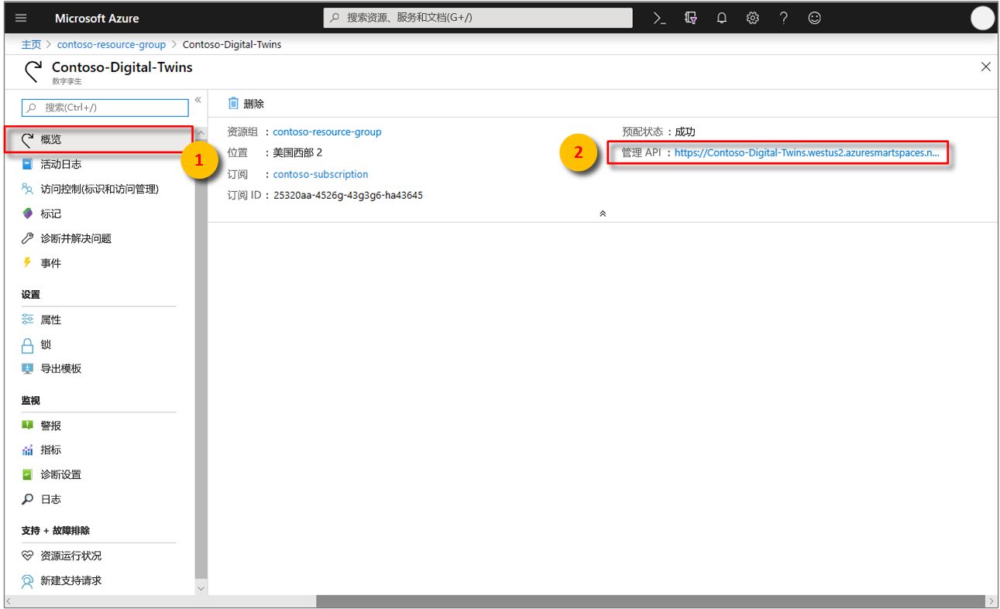

1. 登录到 [Azure 门户](http://portal.azure.com)。

1. 在左侧导航窗格中，单击“创建资源”。 搜索“数字孪生”，选择“数字孪生(预览版)”。 单击“创建”启动部署过程。

    

1. 在“数字孪生”窗格中，输入以下信息：
   * **资源名称**：为数字孪生实例创建一个唯一名称。
   * **订阅**：选择需要将其用于创建此数字孪生实例的订阅。 
   * **资源组**：为数字孪生实例选择或创建[资源组](https://docs.microsoft.com/azure/azure-resource-manager/resource-group-overview#resource-groups)。
   * **位置**：选择离你的设备最近的位置。

    

1. 查看数字孪生信息，然后单击“创建”。 创建数字孪生实例可能需要数分钟。 可在“通知”窗格中监视进度。

1. 打开数字孪生实例的“概览”窗格。 记下在“管理 API”下显示的链接。

    1. **管理 API** URL 的格式为：**_https://yourDigitalTwinsName.yourLocation.azuresmartspaces.net/management/swagger_**。 此 URL 将引导你到适用于实例的 Azure 数字孪生 REST API 文档。 阅读[如何使用 Azure 数字孪生 Swagger](../articles/digital-twins/how-to-use-swagger.md)，了解如何阅读和使用此 API 文档。

    1. 将**管理 API** URL 修改成此格式：**_https://yourDigitalTwinsName.yourLocation.azuresmartspaces.net/management/api/v1.0/_**。 应用程序将使用此修改过的 URL 作为基 URL 来访问实例。 将此修改过的 URL 复制到一个临时文件。 下一部分将需要它。

    