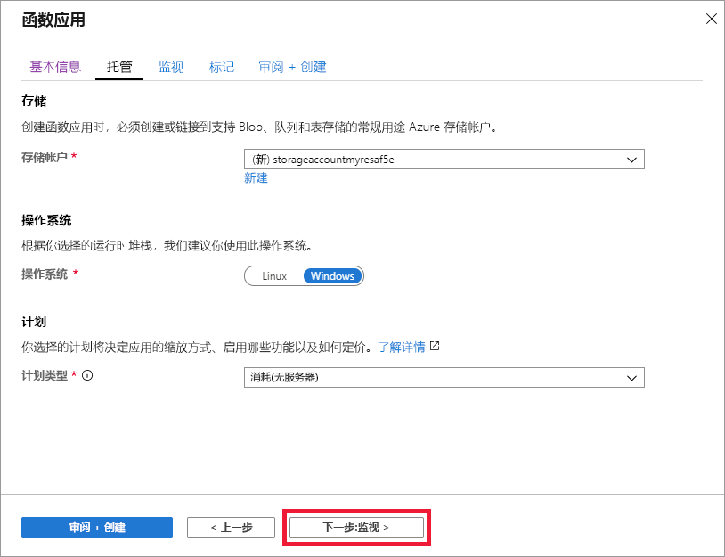
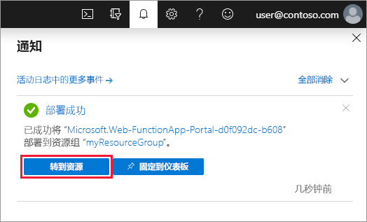

1. 在 Azure 门户菜单或“主页”页中，选择“创建资源”**** ****。

1. 在 **“新建”** 页面，选择 **“计算”**  >  **“函数应用”** 。

1. 在“基本信息”页上，使用下表中指定的函数应用设置。****

    | 设置      | 建议的值  | 说明 |
    | ------------ | ---------------- | ----------- |
    | **订阅** | 你的订阅 | 要在其下创建此新函数应用的订阅。 |
    | **[资源组](../articles/azure-resource-manager/management/overview.md)** |  *myResourceGroup* | 要在其中创建 Function App 的新资源组的名称。 |
    | **函数应用名称** | 全局唯一名称 | 用于标识新 Function App 的名称。 有效字符为 `a-z`（不区分大小写）、`0-9` 和 `-`。  |
    |****| 代码 | 用于发布代码文件或 Docker 容器的选项。 |
    | **运行时堆栈** | 首选语言 | 选择支持你喜欢的函数编程语言的运行时。 对于 C# 和 F# 函数，选择 **.NET Core**。 |
    |**版本**| 版本号 | 选择已安装的运行时的版本。  |
    |**区域**| 首选区域 | 选择离你近或离函数访问的其他服务近的[区域](https://azure.microsoft.com/regions/)。 |

    

1. **选择“下一步:** 托管”。 在“托管”**** 页上，输入以下设置。

    | 设置      | 建议的值  | 说明 |
    | ------------ | ---------------- | ----------- |
    | ****[存储帐户](../articles/storage/common/storage-account-create.md) |  全局唯一名称 |  创建函数应用使用的存储帐户。 存储帐户名称必须为 3 到 24 个字符，并且只能包含数字和小写字母。 也可使用现有帐户，但该帐户必须符合[存储帐户要求](../articles/azure-functions/functions-scale.md#storage-account-requirements)。 |
    |**操作系统**| 首选操作系统 | 系统会根据你的运行时堆栈选择为你预先选择一个操作系统，但你可以根据需要更改该设置。 |
    | **[计划](../articles/azure-functions/functions-scale.md)** | **消耗(无服务器)** | 定义如何将资源分配给 Function App 的托管计划。 在默认的**消耗**计划中，根据函数需求动态添加资源。 在此[无服务器](https://azure.microsoft.com/overview/serverless-computing/)托管中，只需为函数运行时间付费。 按应用服务计划运行时，必须管理[函数应用的缩放](../articles/azure-functions/functions-scale.md)。  |

    

1. **选择“下一步:** 监视”。 在“监视”**** 页上，输入以下设置。

    | 设置      | 建议的值  | 说明 |
    | ------------ | ---------------- | ----------- |
    | **[Application Insights](../articles/azure-functions/functions-monitoring.md)** | 默认 | 在最近的受支持的区域中，创建一个具有相同应用名称的 Application Insights 资源。 通过展开此设置或选择“新建”，可以更改 Application Insights 名称或在 [Azure 地理位置](https://azure.microsoft.com/global-infrastructure/geographies/)中选择要存储数据的其他区域。 |

    

1. 选择“查看 + 创建”，以便查看应用配置选择。

1. 在“查看 + 创建”页上查看设置，然后选择“创建”来预配并部署函数应用 。

1. 选择门户右上角的“通知”图标，留意是否显示了“部署成功”消息。 

1. 选择“转到资源”，查看新的函数应用。 还可选择“固定到仪表板”。 固定可以更轻松地从仪表板返回此函数应用资源。

    