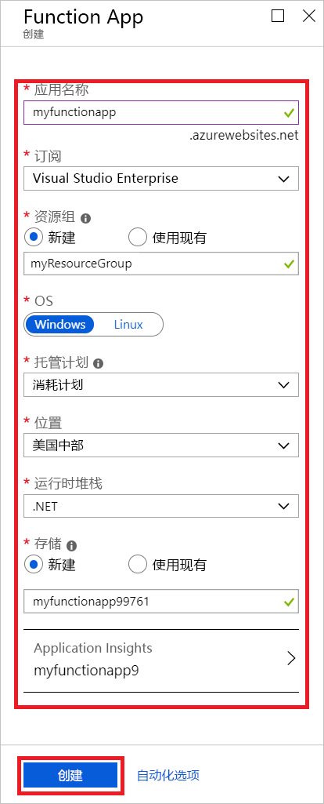
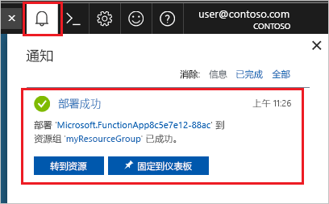

1. 选择 Azure 门户左上角的“新建”按钮，然后选择“计算” > “Function App”。 

    

2. 使用图像下面的表格中指定的函数应用设置。

    

    | 设置      | 建议的值  | Description                                        |
    | ------------ |  ------- | -------------------------------------------------- |
    | **应用名称** | 全局唯一名称 | 用于标识新 Function App 的名称。 有效的字符是 `a-z`、`0-9` 和 `-`。  | 
    | **订阅** | 订阅 | 要在其下创建此新函数应用的订阅。 | 
    | [资源组](../articles/azure-resource-manager/resource-group-overview.md) |  myResourceGroup | 要在其中创建 Function App 的新资源组的名称。 | 
    | **OS** | Windows | 仅当在 Windows 上运行时，才能使用无服务器托管。 对于 Linux 托管，请参阅[使用 Azure CLI 创建第一个在 Linux 上运行的函数](../articles/azure-functions/functions-create-first-azure-function-azure-cli-linux.md)。 |
    | [托管计划](../articles/azure-functions/functions-scale.md) | 消耗量计划 | 定义如何将资源分配给 Function App 的托管计划。 在默认的**消耗计划**中，根据函数需求动态添加资源。 在此[无服务器](https://azure.microsoft.com/overview/serverless-computing/)托管中，只需为函数运行时间付费。 按应用服务计划运行时，必须管理[函数应用的缩放](../articles/azure-functions/functions-scale.md)。  |
    | **位置** | 西欧 | 选择离你近或离函数访问的其他服务近的[区域](https://azure.microsoft.com/regions/)。 |
    | [存储帐户](../articles/storage/common/storage-create-storage-account.md#create-a-storage-account) |  全局唯一名称 |  Function App 使用的新存储帐户的名称。 存储帐户名称必须为 3 到 24 个字符，并且只能包含数字和小写字母。 也可使用现有帐户，但该帐户必须符合[存储帐户要求](../articles/azure-functions/functions-scale.md#storage-account-requirements)。 |

3. 选择“创建”以预配和部署函数应用。

4. 选择门户右上角的“通知”图标，留意是否显示“部署成功”消息。 

    

5. 选择“转到资源”，查看新的函数应用。

> [!TIP]
> 如果在门户中找不到函数应用，请尝试[将 Function App 添加到 Azure 门户中的收藏夹](../articles/azure-functions/functions-how-to-use-azure-function-app-settings.md#favorite)。   
