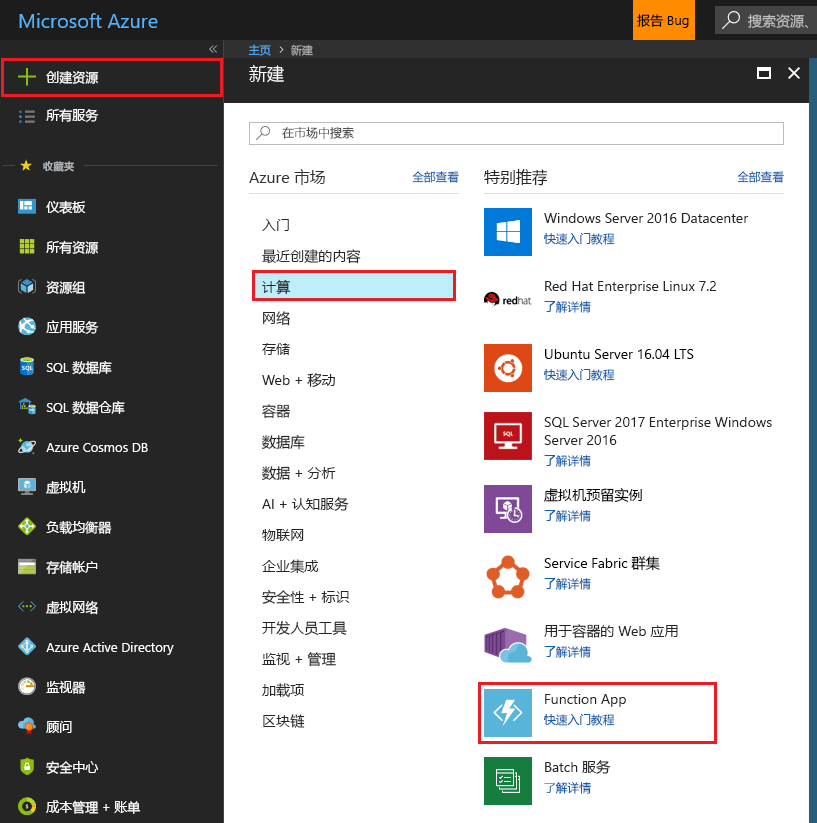

1. 单击 Azure 门户左上角的“新建”按钮。

2. 单击“计算” > “Function App”，选择你的“订阅”，键入用于标识函数应用的唯一“应用名称”，然后指定以下设置：
   
   * **[资源组](../articles/azure-resource-manager/resource-group-overview.md)**：选择“新建”并为新的资源组输入名称。 
   * **[托管计划](../articles/app-service/azure-web-sites-web-hosting-plans-in-depth-overview.md)**，可以是下列计划之一： 
     * **使用计划**：Azure Functions 的默认计划类型。 选择使用计划时，还必须选择“位置”。  
     * **应用服务计划**：应用服务计划要求创建**应用服务计划/位置**或选择现有应用服务计划/位置。 这些设置将确定与应用关联的[位置、功能、成本和计算资源](https://azure.microsoft.com/pricing/details/app-service/)。  
   * **存储帐户**：每个 Function App 都需要存储帐户。 可以选择现有存储帐户，也可以[创建一个存储帐户](../articles/storage/storage-create-storage-account.md#create-a-storage-account)。 
     
    

3. 单击“创建”来预配和部署新的 Function App。  
