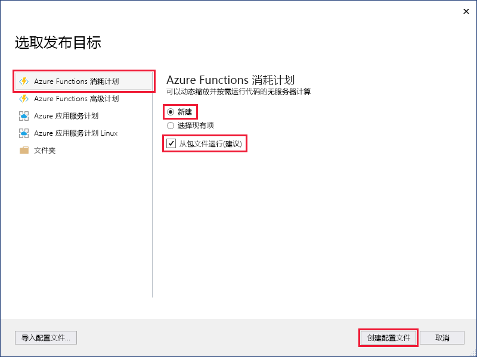
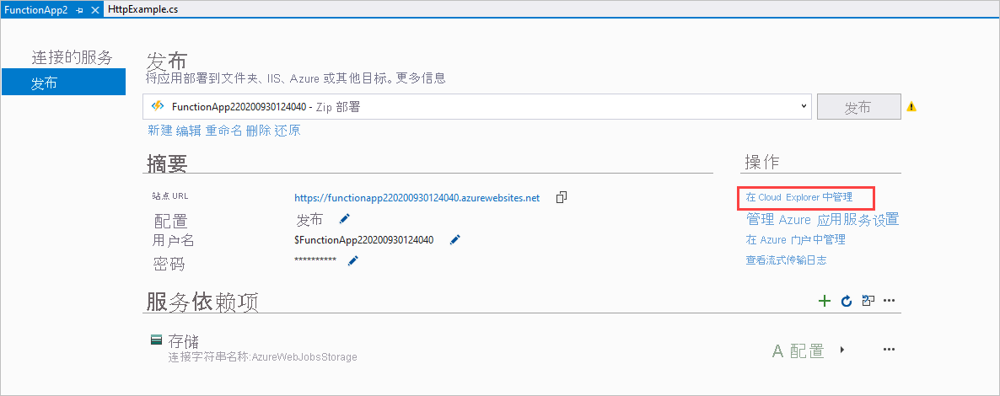

1. **在“解决方案资源管理器”** 中，右键单击该项目并选择“发布”  。

2. 在“选取发布目标”  中，使用下表中指定的发布选项： 

    | 选项      | 说明                                |
    | ------------ |  -------------------------------------------------- |
    | **Azure 函数应用** | 在 Azure 云环境中创建一个函数应用。 | 
    | **新建** | 在 Azure 中创建具有相关资源的新函数应用。  如果选择“选择现有”  ，则 Azure 中现有函数应用中的所有文件都会被本地项目中的文件覆盖。 只有在将更新重新发布到现有函数应用时，才使用此选项。 |
    | **从包文件运行** | 启用[从包运行](../articles/azure-functions/run-functions-from-deployment-package.md)模式，函数应用将使用 [Zip 部署](../articles/azure-functions/functions-deployment-technologies.md#zip-deploy)进行部署。 此部署可以提高性能，建议通过它来运行函数。  如果不使用此选项，请确保在将函数应用项目发布到 Azure 之前，先停止其在本地的运行。 |

    

3. 选择“发布”  。 如果尚未从 Visual Studio 登录到 Azure 帐户，请选择“登录”  。 也可以创建免费 Azure 帐户。

4. 在“Azure 应用服务:  新建”中，使用下表中指定的值：

    | 设置      | 值  | 说明                                |
    | ------------ |  ------- | -------------------------------------------------- |
    | **名称** | 全局唯一名称 | 用于唯一标识新 Function App 的名称。 接受此名称或输入新名称。 有效的字符是 `a-z`、`0-9` 和 `-`。 |
    | **订阅** | 订阅 | 要使用的 Azure 订阅。 接受此订阅，或从下拉列表中选择一个新订阅。 |
    |  [资源组](../articles/azure-resource-manager/management/overview.md) | 资源组的名称 |  要在其中创建函数应用的资源组。 从下拉列表中选择现有资源组，或者选择“新建”来创建新的资源组。 |
    | **[托管计划](../articles/azure-functions/functions-scale.md)** | 托管计划的名称 | 选择“新建”即可配置一个无服务器计划。  确保在“大小”下选择“消耗量”。   将项目发布到在[消耗计划](../articles/azure-functions/functions-scale.md#consumption-plan)中运行的函数应用时，只需为函数应用的执行付费。 其他托管计划会产生更高的成本。 如果在“消耗”之外的计划中运行，则必须管理[函数应用的缩放](../articles/azure-functions/functions-scale.md)。  在靠近你或者靠近函数访问的其他服务的[区域](https://azure.microsoft.com/regions/)中选择一个**位置**。  |
    | **[Azure 存储](../articles/storage/common/storage-account-create.md)** | 常规用途存储帐户 | Functions 运行时需要 Azure 存储帐户。 选择“新建”即可配置常规用途存储帐户。  也可选择一个符合[存储帐户要求](../articles/azure-functions/functions-scale.md#storage-account-requirements)的现有帐户。  |

    

5. 选择“创建”  ，使用这些设置在 Azure 中创建函数应用及其相关的资源，并部署函数项目代码。 

6. 完成部署后，请记下“站点 URL”  值，这是函数应用在 Azure 中的地址。

    
